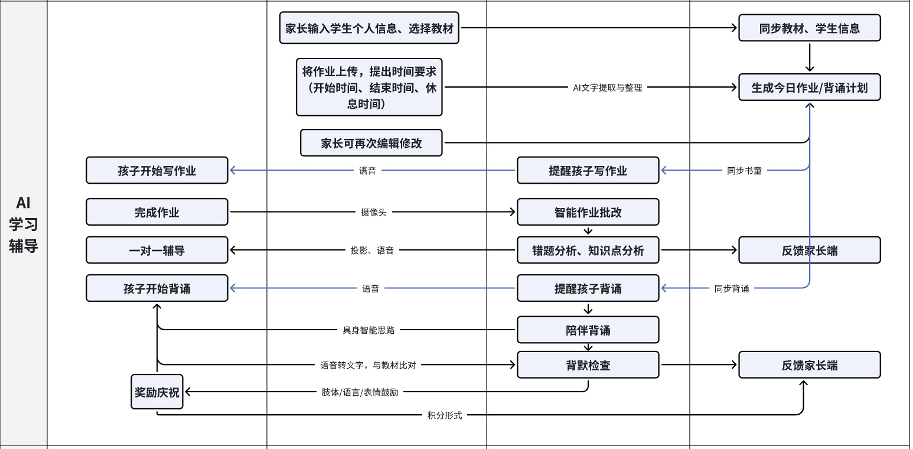

# 锐盟半导体
入职时间：2025.9.26

离职时间：

上班时间：周一到周五

## 公司介绍
公司是一家初创企业，依托于锐盟半导体（类似于子公司），主要做的是面向小学 1 - 3 年级辅导相关的具身智能产品，产品形态是一个台灯，内置了摄像头、麦克风、扬声器等硬件，可以通过语音和图像识别技术与学生进行互动，帮助学生完成作业和背诵课文等任务

## 实习产出
一共就三点，主 agent 重构和背诵 agent 是最主要的两个产出，一定要做到能记录多细就记录多细，比如重构前后的架构是什么样的、为什么要重构、重构之后的好处是什么、背诵 agent 的功能点有哪些、是怎么具体实现的（表的字段怎么设计、计划如何变化）、遇到了什么问题、是怎么解决的，等等

第三点的其他可以相对泛一些，但前两点一定要能经得起深挖

### 主 agent 重构 —— 编排器 + Workflow
彻底重构后台项目架构，加入了编排器和工作流，优化各个 agent 之间的调用关系，提升系统的可维护性和扩展性（进行中）

### 背诵 agent 完整开发
独立负责背诵 agent 从设计、开发、测试和上线的完整流程，完成了背诵检查、错误分析与记忆强化、复习计划和个性化报告等功能

#### 业务场景
面向小学 1 - 3 年级学生的古诗文和英语课文背诵场景，为学生提供背诵相关的检查、纠错、复习，为家长提供背诵总结/周报/日报等功能

#### 完整功能
##### 背诵检查

##### 错误分析与记忆强化

##### 复习计划

##### 个性化报告

具体需求：

提醒开始背诵-背诵检查-背诵辅导（有错的地方做提醒）-如果正确率大于85%就不需要再次背诵，如果正确率小于85%当学生再次背诵，直到大于85%-给出鼓励-结束（提供家长背诵时间、背诵准确率）

记忆优化：
针对性纠错
记忆存储：将学生错误分类成高频错误：“字音错”“漏内容”“记混顺序”
优化功能：若同类错误仅出现 1 次：简单提醒正确答案即可；若同类错误重复出现（≥2 次）：补充错误原因和记忆方法（补充 “趣味记忆法”，且内容要短、具象。比如 “字音错” 重复 2 次，除了正确读音，附加 “口诀记忆”（如 “苹果的‘苹’，和‘瓶子’的‘瓶’发音一样哦”）
记忆曲线复习
记忆存储：记录学生每段内容的首次达标时间（如 3 月 1 日背熟《春晓》）、后续复习的正确率变化（如 3 月 3 日复习正确率 90%，3 月 7 日复习正确率 82%）
功能逻辑：根据“艾宾浩斯记忆曲线”，自动计算下次复习时间（如首次达标后 1 天、3 天、7 天），到点提醒复习；若某次复习正确率下降，缩短下次复习间隔
生成个性化背诵报告
记忆存储：汇总学生 日/ 周 背诵数据（今日/本周背诵 5 次，平均正确率 88%）、进步 / 薄弱点（今日/本周 英语单词正确率从 75% 提升到 92%，古文背诵仍常错）
功能输出：结束时生成报告。

独立设计、开发并上线了一个全新的背诵 agent，完成了背诵检查和陪读功能（跟第六点一样产品那边有给完整的需求）

根据产品新需求，为背诵 agent 加入记忆、针对性复习和总结功能（5、6 两点一起，相当于一个独立的大需求）

背诵 agent 新需求开发（进行中）

### 其他
重新启用 Alembic 迁移工具，解决现有脚本在不同环境不同机器部署时出现的问题，优化项目 Readme 启动项目步骤中数据库相关指引流程（待具体化细节）

优化监督 agent 提示词，提高监督 agent 的识别准确率，解决实际运行中出现的误判问题（待量化数据）

将聊天 agent 接入主 agent，使得聊天 agent 不再独立对外暴露接口，由主 agent 统一调度（小幅度重构）

优化客户端语音播放逻辑，用加全局锁的方式解决语音播放冲突和打断问题（相对跟后端关系不大，或者可以包装一下）

## 问题记录
要记录完整的问题和解决方案，要能讲清楚前因后果

* HTTP 自调用问题
* 主 agent 状态问题
* 数据库迁移工具 Alembic 使用问题

## 后端技术栈

* 编程语言：Python

* 框架：FastAPI

* 数据库：MySQL
  * ORM：SQLAlchemy
  * 迁移工具：Alembic

* 缓存：Redis

* 接口文档管理：Swagger

* 代码评审和项目管理：GitHub

## 我的工作

* **2025.9.26**：搭建后台环境，跑通后台项目业务流程

* **2025.9.28**：搭建跑通客户端项目，了解公司业务完整流程，输出业务流程反馈

* **2025.9.29-9.30**：研究主 agent 架构改进，体验业务全流程，从业务的角度思考改进方向，熟悉后台代码仓

* **2025.10.9-10.11**：请假

* **2025.10.13-10.15**：**修改监督 agent 提示词**，在实际 demo 台灯机上测试提示词效果，思考如何改进监督 agent，查看实际运行日志以判断每次不同的具体情况，熟悉后台项目中监督 agent 的相关代码

* **2025.10.16**：**解决监督 agent 监督识别不精确的问题**，思考后台项目重构方向

* **2025.10.17，10.21，10.23**：请假

* **2025.10.20，10.22**：**跟 mentor 和同事交流后台重构方案**，明确当前以业务为主的方向，先小规模重构，调研 FastAPI 框架以及 python 的优劣，思考是否要以 go 语言重构后台并加入 gRPC；**将聊天 agent 接入了主 agent**，二者不再独立，聊天 agent 不再直接对外暴露接口，一切调用均由主 agent 决定

* **2025.10.24**：修改客户端代码，**使客户端语音按时序播放，不再冲突、覆盖和打断**，主要实现方式是在已有队列基础上加异步锁，测试无误后提了 pr

* **2025.10.27-10.31，11.3**：**开发了一个全新的背诵 agent，主要功能是背诵检查和陪读**，完成了基本功能接口的开发之后本地测试无误，再在实机上结合客户端测试，梳理了背诵流程逻辑以及主 agent、聊天 agent 基本逻辑后和产品对齐体验流程，修复背诵和监督流程的冲突后提交了 pr

* **2025.11.4-11.5**：背诵 agent **代码 review 优化**，主要是将不同 agent 的调用方式修改为 API 调用

* **2025.11.6-11.7，11.10-11.14**：**背诵 agent 记忆和总结相关需求开发**，具体需求如下：

背诵agent加上记忆优化：
1. **针对性纠错**
记忆存储：将学生错误分类成高频错误：“字音错”“漏内容”“记混顺序”
优化功能：若同类错误仅出现 1 次：简单提醒正确答案即可；若同类错误重复出现（≥2 次）：补充错误原因和记忆方法（补充 “趣味记忆法”，且内容要短、具象。比如 “字音错” 重复 2 次，除了正确读音，附加 “口诀记忆”（如 “苹果的‘苹’，和‘瓶子’的‘瓶’发音一样哦”）
2. **记忆曲线复习**
记忆存储：记录学生每段内容的首次达标时间（如 3 月 1 日背熟《春晓》）、后续复习的正确率变化（如 3 月 3 日复习正确率 90%，3 月 7 日复习正确率 82%）
功能逻辑：根据“艾宾浩斯记忆曲线”，自动计算下次复习时间（如首次达标后 1 天、3 天、7 天），到点提醒复习；若某次复习正确率下降，缩短下次复习间隔
3. **生成个性化背诵报告**
记忆存储：汇总学生 日/ 周 背诵数据（今日/本周背诵 5 次，平均正确率 88%）、进步 / 薄弱点（今日/本周 英语单词正确率从 75% 提升到 92%，古文背诵仍常错）
功能输出：结束时生成报告。

* **2025.11.15**：请假

* **2025.11.17-11.18**：**记忆和总结相关需求产品验收**，实测无误后提交了 pr

* **2025.11.19**：将背诵 agent 的周报日报总结数据**集成到前端**中

* **2025.11.20-11.21**：背诵 agent **代码 review 优化**，并实机测试，产品验收无误后已上线

* **2025.11.24**：**重新讨论彻底重构主 agent 架构方案**，确定引入编排器和工作流，优化各个 agent 之间的调用关系

* **2025.11.25-11.28**：**开始进行主 agent 架构重构**，搭建编排器和工作流的基础框架，将背诵 agent **先接入**到现有的另一版主 agent 优化方案中

