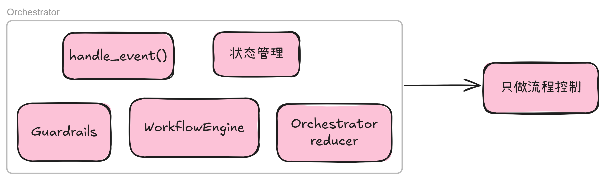
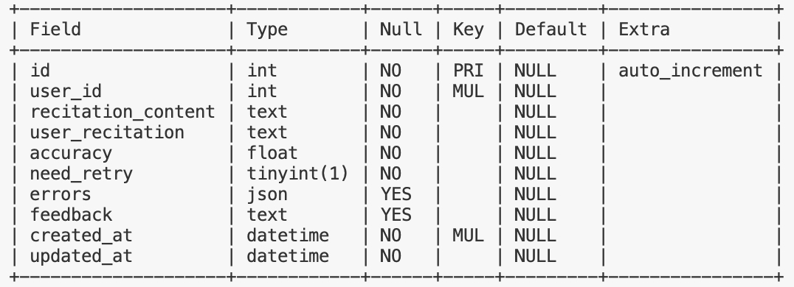
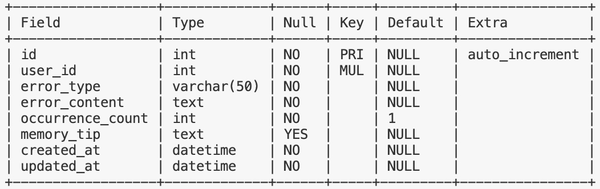
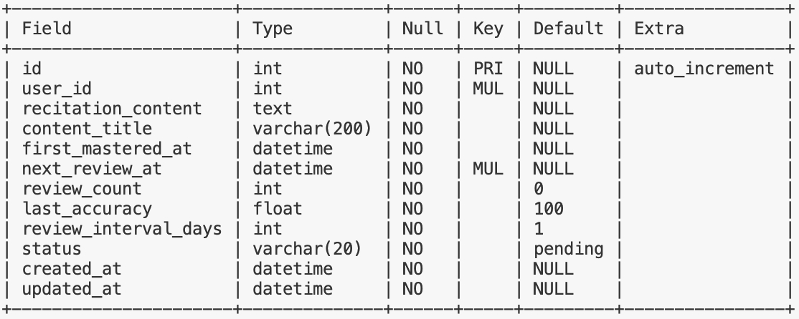
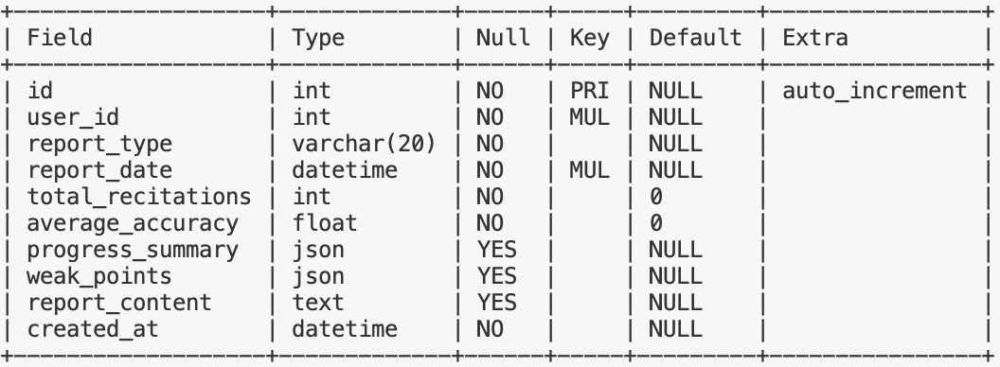
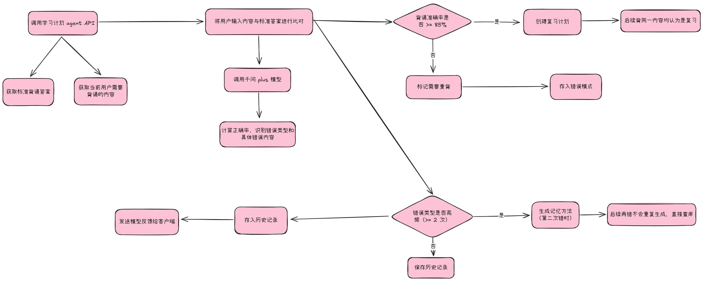

# 锐盟半导体
入职时间：2025.9.26

离职时间：2025.12.22

上班时间：周一到周五

## 公司介绍
公司是一家初创企业，依托于锐盟半导体（类似于子公司），主要做的是面向小学 1 - 3 年级辅导相关的具身智能产品，产品形态是一个台灯，内置了摄像头、麦克风、扬声器、投影仪等硬件，可以通过语音和图像识别技术与学生进行互动，帮助学生完成作业和背诵课文等任务

## 实习产出
---
### 主 agent 重构 —— 编排器 + Workflow + 工具化
#### 原始架构和痛点

原本的完整链路：

客户端通过 websocket 发送请求到主 agent 对应接口 —— 后端解析音频或图片 —— 主 agent 创建主任务并识别意图处理逻辑 —— 根据意图通过 http 自调用对应的子 agent 并修改状态 —— 子 agent 创建子任务执行逻辑 —— 子 agent 通过 websocket 直接返回执行结果并修改状态

**主 agent 直接全权负责路由的决策**，它会从 shortMemory（未引入 redis）读取用户上下文，获得当前的状态，状态包括 `idle`、`pre_agent_name`、`doing_agent_name`，主 agent 不负责子 agent 执行完逻辑后的状态修改，需要子 agent 自行将状态修改回聊天 agent 的 idle

主 agent 调用 qwen3-max 模型，以批改作业为例，输出的 JSON 格式如下：

```json
{
    "recognition": "识别到用户想要批改作业",
    "intention": "用户意图是获取作业批改结果",
    "decision": "切换到批改状态并调用批改 Agent",
    "execution": "调用homework_correct Agent",
    "Agent_calling_protocol": [
        "homework_correct",
        "learning_progress"
    ],
    "new_state": "correct_homework"
}
```

状态更新主要通过提取 `new_state` 字段，更新 shortMemory，再触发实际状态变化来完成，即 `idle -> pre -> doing -> idle` 的状态机

任务管理器主要通过异步方式调用子 agent 的接口来完成任务的创建和执行

项目采用的是 FastAPI，业务模块都在 modules 目录下，包括 agents、asr、user 等，shared 作为公共模块，存放了配置管理、数据库、api 和中间件等目录，每个 agent 都有自己的服务逻辑和路由接口，具体分层为 api、service、repository、prompt、utils 和 errors

主 agent 和子 agent 都在 src/modules/agents 目录下，每个 agent 都有自己的路由和服务逻辑，agent 列表：

* chat_companion —— 聊天 agent
* homework_correct —— 作业批改 agent
* homework_solver —— 作业解题 agent
* homework_summary —— 作业总结 agent
* homework_tutor —— 作业辅导 agent
* learning_companion —— 主 agent
* learning_progress —— 学习进度 agent
* learning_scheduler —— 学习计划 agent
* learning_status_supervisor —— 学习状态监督 agent1
* recitation —— 背诵 agent

主 agent 通过 ACP（Agent Calling Protocol）协议来管理子 agent

背诵业务流程示例：

```bash
用户: "我要开始背古诗了"
  ↓
[主Agent决策]
  → 识别意图: 背诵古诗
  → 调用Agent: recitation
  ↓
[recitation执行]
  1. 获取背诵内容
     - 从学习计划中获取今日背诵任务
     - 生成标准答案

  2. 对比分析
     - 将用户输入与标准答案进行对比
     - 计算背诵正确率
     - 识别错误位置和类型

  3. 错误模式识别
     - 查询历史: error_pattern 表
     - 判断某个错误是否重复犯
     - 更新错误频次

  4. 生成记忆方法
     IF occurrence_count >= 2:
       → 调用 VL 模型生成记忆技巧

  5. 反馈生成
     - 首次错误: "加油,再试一次!"
     - 重复错误: "这个字已经错2次了,记忆方法: ..."
  ↓
[保存记录]
  - 表: recitation_history
  - 表: recitation_error_pattern
  - 用于周报、月报分析
  ↓
[返回用户]
  {
    "accuracy": 95,
    "errors": [
      {
        "position": "第2句",
        "expected": "疑是",
        "actual": "移是",
        "tip": "记忆方法..."
      }
    ]
  }
```

由于主 agent 直接负责路由决策和状态管理，导致了主 agent 和整体架构存在以下问题：

* 性能差
  * 实际体验时延较高，简单的输入也需要主 agent 对不同场景做判断决策，响应等待时间长
  * agent 之间互相 HTTP 自调用，无微服务、部署相关准备
* 可维护性差
  * 主 agent 代码臃肿，逻辑复杂，难以维护和扩展
  * 主 agent 某个文件上千行，新增一个场景要在同一个函数里加好几段逻辑
* 扩展性
  * 新增一个 agent / 新的业务流程时，需要改主 agent和多个子 agent 的调用逻辑
  * 很难做到配置一个 workflow 就上线一个新场景
  * 业务场景逻辑不清晰，各个子 agent 的功能边界模糊、职责未工具化，难以对新需求进行快速迭代
  * 难以灵活编排不同场景下的细分逻辑，即没有有向无环图编排，无法根据不同场景灵活调整子 agent 调用顺序和条件，无法并行调用多个子 agent
* 状态与上下文管理混乱
  * 主 agent 和子 agent 都需要修改状态，容易出现状态不一致的问题
  * 上下文信息分散在 shortMemory 和各个 agent 中，难以统一管理，状态的定义也未能满足复杂场景需求
  * 会话状态、学习进度、task_id 分散在本地缓存、数据库多个地方，出了 bug 很难排查
  * 主 agent 路由决策准确度难以保障和调优，由于主 agent 需要同时处理路由决策和业务逻辑，导致模型负担过重，难以专注于路由决策，且缺乏置信度和 guardrails 机制
* 可观测性差
  * 一次完整学习流程涉及多个接口，很难一眼看出某个孩子从开始写作业到生成报告中间经过了哪些步骤
  * 日志管理混乱，难以追踪和分析问题，错误处理不统一，有的场景超时重试，有的直接抛 500

重构前：


当前：

* 引入编排器
  * 对外作为后台统一的入口，由 /api/orchestrator/process 作为系统唯一入口接收客户端通过 websocket 发起的请求，并通过编排器统一返回 websocket 响应
  * 对内负责路由决策和业务逻辑编排，调用工作流

#### 重构目标和整体方案

**路由决策、业务逻辑调度和具体业务实现彻底解耦**，意图识别和路由决策分离，增加置信度，降低模型不确定性对路由的影响，**重新定义状态模型**，建立统一会话状态模型与状态存储，支持跨轮对话、场景切换与恢复，**统一响应结构、日志与 trace_id**，提升可观测性与问题定位效率，可扩展的**工作流**将业务流程从 agent 内部抽离，新增业务场景时只需定义工作流状态机和节点调用，**业务功能工具化**，子 agent 不同功能、机械臂动作、表情等均拆分成独立的工具，每个工具都是在某个节点上做的一次原子操作

* 引入编排器（Orchestrator）
  * 编排器对外暴露 /api/orchestrator/process 接口作为系统唯一入口，接收客户端通过 websocket 发起的请求
  * 对内负责状态管理（引入 Redis）、路由决策（引入 Guardrails）和工作流调用
* 引入工作流（Workflow）
  * 面向业务，不同场景内部有子状态，通过状态机推进逻辑流程
  * 进行具体的业务流程编排和细节处理，通过 tools 层调用不同工具
* 工具化
  * 各个 agent 只暴露工具化的 API 接口，一个接口只负责某个细分的业务功能，如 LLM 具体调用与原子工具执行
  * tools 层是对于 agent 暴露的接口和硬件相关工具的统一封装

**调用链路：**

客户端通过 websocket 调用编排器的 process 接口 —— 编排器调用输入解析器解析音频和图片 —— 编排器读取当前状态 —— 编排器调用主 agent 识别意图 —— 编排器将主 agent 返回结果给 Guardrails 执行真正路由决策 —— 编排器根据决策调用不同业务场景下工作流 —— 工作流按业务状态机调用不同子 agent 的工具执行业务逻辑 —— 编排器接收结果更新状态和上下文 —— 编排器返回结果给客户端

```bash
Client
  -> /orchestrator/process (src/core/orchestrator/api/orchestrator_router.py)
    -> OrchestratorService.process (src/core/orchestrator/orchestrator_service.py)
      -> InputParser (src/shared/input/input_parser.py)
      -> StateStore (Redis) (src/core/orchestrator/state/state_store.py)
      -> AgentCaller.classify_intent -> learning-companion (src/modules/agents/learning_companion/...)
      -> GuardrailsEngine.decide (src/core/orchestrator/guardrails/guardrails_engine.py)
      -> WorkflowExecutor.execute_scene_workflow (src/core/workflow/workflow_executor.py)
        -> ChatWorkflow / RecitationWorkflow (src/core/workflow/*.py)
          -> AgentCaller (src/core/tools/agent_caller.py)
            -> chat-companion / recitation Agent API
          -> StateStore.update_phase / update_scene
      -> ResponseBuilder (src/core/orchestrator/response_builder.py)
      -> WebSocket push (src/modules/agents/shared/websocket/websocket_repository.py)
```

**预期重构后完整架构图：**


#### 关键设计和实现细节

编排器包含了 Guardrails（`src/core/orchestrator/guardrails/guardrails_engine.py`）和状态管理（`src/core/orchestrator/state/*`）这两大工具，而 `src/core/orchestrator/orchestrator_service.py` 作为编排器的核心，包含了 `process` 作为统一处理输入输出、`_handle_scene_switch` 处理场景切换、`_process_in_scene` 委派具体场景工作流，这三个最主要的函数

"""
OrchestratorService - 编排器服务

统一的用户请求处理入口，负责：
1. 解析输入（通过共享 InputParser）
2. 管理会话状态（通过 StateStore）
3. 调用主 Agent 进行意图分类（快速，低时延）
4. 通过 Guardrails 独立评估置信度并做路由决策
5. 调用工作流执行器执行业务逻辑
6. 返回响应

架构原则（参考 Anthropic Building Effective Agents）：
- Router (主 Agent): 只做分类，不做决策，低时延
- Guardrails: 独立计算置信度 + 做路由决策
- Orchestrator: 执行决策，调用工作流
- 不把所有决策都丢给大模型
"""

"""
StateStore - 状态存储服务

职责：
1. 管理 SessionState 的 Redis 存取
2. 提供状态更新的原子操作
3. 在获取状态时自动验证状态合理性

架构原则：
- 状态验证在获取时自动执行
- 跨天或程序重启后的非 chat 状态会被重置
"""

"""
StateValidator - 状态验证器

职责：
1. 程序启动时检查状态合理性
2. 确保状态处于正确的初始状态
3. 清理无效或过期的场景状态
"""

{
  "user_id": 123,
  "session_id": "user_123",
  "active_scene": "chat | recite | homework",
  "scene_state": {
     "phase": "...",                    # 场景内部工作流阶段
     "learning_schedule": {...},        # 学习计划
     "context": {...}                   # 场景上下文数据
  },
  "pending_switch": {                   # 待确认的场景切换
     "target": "recite",
     "slots": {...},
     "age_turns": 0
  },
  "ttl_deadline": 1732456789,           # 场景粘滞截止时间
  "last_intent": {                      # 上一次意图
     "intent": "...",
     "confidence": "HIGH/MID/LOW"
  },
  "last_activity": "2025-12-22T10:00:00",  # 最后活动时间
  "created_at": "...",
  "updated_at": "..."
}

"""
Guardrails Engine - 护栏引擎（决策中心）

设计原则：
1. 主 Agent 负责分类 + 评分
2. Guardrails 基于模型评分做校验和决策
3. 场景切换需要谨慎，用 pending 机制二次确认

职责分离：
- 主 Agent: 分类意图 + 给出置信度评分
- Guardrails: 校验评分 + 做出路由决策
- Orchestrator: 执行决策，调用工作流
"""

{
    "action": "continue | switch | exit | reject",
    "scene": "本轮交给哪个 workflow 处理",
    "target_scene": "最终的 active_scene",
    "reason": "决策原因",
    "confidence": "HIGH | MID | LOW",
    "message": "给用户的消息（可选）",
    "slots": {...}
}

"""
Response Builder - 响应构建器

负责统一构建 Orchestrator 的输出响应
"""

{
    "success": True,
    "content": {
        "type": "text",
        "text": "...",
        "voice_url": None,
        "card_data": None
    },
    "trace_id": "...",
    "session_id": "...",
    "scene": "chat",
    "phase": "idle",
    "suggested_actions": [],
    "need_tts": False,
    "error": None,
    "processing_time_ms": 150,
    "timestamp": "2025-12-22T10:00:00",
    "debug_info": {...}
}

"""
Orchestrator Router - 编排器路由

所有用户请求统一入口
"""

"""
工作流执行器 - Workflow Executor

根据场景和决策结果执行对应的工作流
委托给各场景的独立工作流

架构原则：
- 工作流执行器接收 Orchestrator 传入的上下文（含学习计划）
- 委托给具体场景工作流执行
- 学习计划由 Orchestrator 统一管理，通过此执行器传递给工作流
"""

scene: str                          # 场景名称
user_id: int
session_id: str
input_data: Dict[str, Any]
intent_result: Dict[str, Any]
trace_id: str
learning_schedule: Optional[Dict]   # 由 Orchestrator 传入
pending_switch: Optional[Dict]      # 待确认切换

"""
聊天场景工作流 - Chat Workflow

状态机：
- idle: 空闲状态，正常对话
- clarify: 需要澄清用户意图
- handoff_wait: 等待场景切换确认

工作流职责：
1. 根据当前阶段调用对应的 Agent 工具
2. 管理状态转换
3. 加载并传递工具定义给LLM
4. 返回响应给 Orchestrator

架构原则：
- 学习计划由 Orchestrator 统一管理传入
- 工具定义由工作流加载并传递给Agent
- 工作流只是使用学习计划，不负责获取
"""

"""
Agent Caller - Agent 通用调用器

通过 HTTP API 调用各个 Agent 的工具化接口
这是工作流调用 Agent 的统一入口

架构原则：
- Agent = 纯原子工具，无业务逻辑
- Workflow = 业务编排，组装工具
- Agent Caller = 工作流调用 Agent 的统一入口

使用示例：
    from src.core.tools.agent_caller import agent_caller

    # 聊天场景
    result = await agent_caller.chat(user_id, session_id, "你好")
    result = await agent_caller.clarify(user_id, session_id, "背诵")
    result = await agent_caller.confirm_handoff(user_id, session_id, True, "recite")

    # 背诵场景 - 原子工具
    result = await agent_caller.compare_text(expected_text, user_text)
    result = await agent_caller.generate_feedback(accuracy, passed, round_num)
    result = await agent_caller.generate_memory_tips(errors)
    result = await agent_caller.generate_summary(material_id, ...)
    result = await agent_caller.save_recitation_history(user_id, material_id, ...)
"""

"""
Chat Companion Agent Router - 聊天Agent路由

聊天场景状态机：
- idle: 空闲状态，正常对话
- clarify: 需要澄清用户意图
- handoff_wait: 等待场景切换确认

工具化接口：
- POST /chat: 对话
- POST /clarify: 意图澄清
- POST /confirm-handoff: 确认场景切换
"""

"""
Chat Companion Service - 聊天Agent服务

聊天场景状态机：
- idle: 空闲状态，正常对话
- clarify: 需要澄清用户意图  
- handoff_wait: 等待场景切换确认

职责：
1. 处理用户对话
2. 管理对话历史
3. 处理意图澄清
4. 处理场景切换确认
"""

"""
Recitation Agent Router - 背诵Agent路由

**重构后的设计原则**：
- 只提供原子化工具接口
- 工具内部调用大模型完成实际工作
- 不包含任何业务逻辑编排
- 所有需要的数据由调用方（工作流）传入

工具化接口：
- POST /compare-and-evaluate: 调用大模型对比文本并生成评估
- POST /generate-memory-tips: 调用大模型生成记忆技巧
- POST /save-history: 保存背诵历史
"""

"""
Recitation Service - 背诵Agent服务

**重构后的设计原则**：
- Agent 提供原子化工具接口
- 工具内部调用大模型完成实际工作（文本比对、反馈生成、记忆技巧）
- 不在内部调用其他 Agent 或查询学习计划
- 所有需要的数据由工作流传入

工具列表：
- compare_and_evaluate: 调用大模型对比文本并生成评估（核心工具）
- generate_memory_tips: 调用大模型生成记忆技巧
- save_history: 保存背诵历史
"""

"""
背诵场景工作流 - Recitation Workflow

架构原则：
- 编排器持有场景的子状态，主agent和guardrails只负责场景决策（调用哪个工作流）
- 工作流内部管理自己的状态机，编排器不对子状态做路由
- Workflow = 业务编排层，组装原子工具  
- Agent = 原子工具，内部调用大模型完成实际工作

状态机设计（三个状态）：
- idle: 初始化和模糊输入的统一处理
  * 调用模型判断用户输入意图
  * 如果是背诵意图：phase更新到listening，生成背诵鼓励内容
  * 如果不是背诵意图：生成对用户输入的响应（如建议接下来做什么）

- listening: 执行背诵业务逻辑（核心阶段）
  * 调用模型判断输入是否是实际背诵内容
  * 如果是：走正常的正确率比对、错误分类、记忆技巧生成等流程
  * 如果不是：phase切回idle，让idle处理后再决定phase
  * 正常完成后：phase更新到done

- done: 完成处理
  * 背诵记录写库
  * 根据正确率生成背诵复习计划
  * phase更新回idle

工作流职责：
1. 从 Orchestrator 获取学习计划中的背诵任务
2. 调用 Agent 的原子工具（工具内部调用大模型）
3. 管理状态转换和业务流程
4. 控制硬件（机械臂、LCD）
5. 返回响应给 Orchestrator
"""

用户请求
    ↓
[OrchestratorRouter] /orchestrator/process
    ↓
[OrchestratorService.process()]
    ↓
1. InputParser.parse() ─────────────→ 解析输入
    ↓
2. StateStore.get() ────────────────→ 获取状态（自动验证、重置）
    ↓
3. agent_caller.classify_intent() ──→ 意图分类（主 Agent）
    ↓
4. GuardrailsEngine.decide() ───────→ 路由决策
    ↓                                   ├─ 输入合法性检查
    ↓                                   ├─ pending TTL 维护
    ↓                                   ├─ 处理 exit
    ↓                                   ├─ 处理 pending
    ↓                                   └─ 基础决策
    ↓
5. 执行决策
    ├─ switch  → 切换场景 → 在新场景处理
    ├─ exit    → 退出到 chat
    ├─ continue → 在当前场景处理
    └─ reject  → 拒绝请求
    ↓
6. WorkflowExecutor.execute_scene_workflow()
    ├─ ChatWorkflow
    │   ├─ idle: 正常对话（支持工具调用）
    │   ├─ clarify: 澄清意图
    │   └─ handoff_wait: 确认切换
    │
    └─ RecitationWorkflow
        ├─ idle: 获取材料 + 判断意图
        ├─ listening: 执行背诵（比对、反馈、记忆技巧）
        └─ done: 保存记录 + 生成总结
    ↓
7. ResponseBuilder.text/voice/card() ─→ 构建响应
    ↓
8. WebSocket 推送 + HTTP 返回

"""
Orchestrator Dependencies - 依赖注入

提供 OrchestratorService 及相关依赖的注入

Dependencies 说明：
这是 FastAPI 的依赖注入模块，用于：
1. 创建和管理服务实例的生命周期
2. 提供单例缓存（使用 @lru_cache）
3. 解耦组件依赖关系，便于测试和替换

什么是 @lru_cache 和单例？
- @lru_cache 装饰的函数会缓存返回值
- 第一次调用会真正执行函数，后续调用直接返回缓存的结果
- 这样保证整个应用共享同一个实例（单例模式）

编排器API的角色：
- 对外暴露唯一入口 `/orchestrate`，接收用户输入
- 负责协调意图识别、状态管理、工作流执行

工具调用方式（重要）：
- 工作流直接导入使用 tools 模块（如 chat_tools, recitation_tools）
- 不再通过依赖注入传递 AgentToolCaller
- 工具调用额外封装在 tools 层 
"""

##### Guardrails

Guardrails 主要负责基于主 agent 的评分（信任主 agent 职责拆分后的评分）做校验和路由决策，在场景切换时会有 pending 机制二次确认，一共有 chat、recite、homework、continue_current 和 exit_current 这五大意图，置信度则分为 HIGH、MID 和 LOW 这三种，`AgentIntent` 和 `GuardDecision` 两个类做结果分类（意图映射、评分置信度映射）与路由决策结构化（包含 action、scene、target_scene、reason、confidence、message、slots 等字段）

GuardrailsEngine 作为核心类，包含了 `decide` 函数进行输入合法性检查、，内部调用 `_handle_pending_switch` 处理场景切换确认逻辑，调用 `_make_decision` 做最终路由决策


  - ：；支持 `pending_switch` TTL
- 
  - `SessionState`：`active_scene / scene_state.phase / pending_switch / last_intent` 等字段统一规范
  - `StateStore`：Redis 存取 + 重置策略（跨天/超时）
  - `StateValidator`：旧状态兼容与重置策略


`process` 会先通过 InputParser 解析输入，通过 StateStore 、主 Agent、Guardrails、Workflow

- Orchestrator API：`src/core/orchestrator/api/orchestrator_router.py`
  - `process_request` 作为统一入口，注入 `OrchestratorService`
- 
  - 
- 
- Workflow 层：`src/core/workflow/*`
  - `WorkflowExecutor` 按 `scene` 分发到 `ChatWorkflow` / `RecitationWorkflow`
  - `ChatWorkflow` 负责 idle/clarify/handoff_wait 状态机（`src/core/workflow/chat_workflow.py`）
  - `RecitationWorkflow` 负责 idle/listening/done 状态机与业务编排（`src/core/workflow/recitation_workflow.py`）
- Agent 调用封装：`src/core/tools/agent_caller.py`
  - 统一 HTTP 调用 `/api/agents/{agent}/{action}`，屏蔽调用细节
- 各 Agent 的原子工具
  - Chat：`src/modules/agents/chat_companion/service/chat_companion_service.py`
  - Recitation：`src/modules/agents/recitation/service/recitation_service.py`
  - Learning Companion（主 Agent）：`src/modules/agents/learning_companion/service/learning_companion_service.py`



Workflow 基本元素：

* node（phase）
  * 工作流中的一个具体节点，调用某个子 agent 的某个工具
* step(event, state)
  * 这张图在当前 phase 下，用这次用户输入推进一步的执行函数
* edge
  * 转移条件，连接不同节点

状态定义：

```json
SessionState { 
  "active_scene": "chat | recite | homework",   // 当前大场景
  "scene_state": {                              // 当前场景内部子状态
     "...": "..."
  },
  "pending_switch": null | { "target": "..."} , // 是否正在等待用户确认切场景
  "ttl_deadline": 1732456789,                   // 场景粘滞到期时间（可选）
  "last_intent": { "intent": "...", "confidence": "HIGH/MID/LOW" }
} 
```

active_scene 只能由编排器改（聊天 agent 不能改），scene_state 只由对应 workflow 改，TTL：粘滞（连续 N 轮都是 HIGH 指向别的场景）就自动切换

```json
pending_switch: { 
target:"recite", 
slots:{material:"静夜思"}, 
asked_at:... 
}
```

当前已有进度重构后架构图：


##### 1.3.3 典型调用链和超时/重试策略
用户：“我要背古诗”

Router: recite HIGH

Guardrails: 切 active_scene=recite，phase=select_material

Recite step: 问/选材料

用户下一句：“对了老师今天布置啥？”

Router: chat HIGH

Guardrails: HIGH 允许切回 chat（recite 状态保存）

Chat step: 正常聊

##### 1.3.4 渐进式迁移策略
重构的难点之一是要边跑业务边改架构，我先选了背诵作为试点

#### 1.4 推进过程和效果复盘


---
### 2. 背诵 agent 完整开发
独立负责背诵 agent 从设计、开发、测试和上线的完整流程，完成了背诵检查、错误分析与记忆强化、复习计划和个性化报告等功能

#### 2.1 场景和目标

**服务对象**：小学 1 - 3 年级学生及其家长

**解决的核心问题**：

* 学生背诵古诗文和英语课文时，容易出现错误，缺乏有效的检查和纠错机制
* 学生记忆效果不佳，缺乏科学的记忆优化和复习计划
* 家长难以了解学生的背诵情况，缺乏个性化的背诵报告和总结

**主要功能**：

* 实时背诵检查与纠错
* 错误分类与针对性记忆优化
* 基于艾宾浩斯记忆曲线的复习计划
* 个性化背诵报告生成

**验收标准**：

* 背诵场景作为完整独立的业务工作流接入重构后技术架构，由编排器调度
* 背诵检查准确率达到 90% 左右
* 单次调用延迟约 2 - 3 秒

#### 2.2 流程和接口
##### 2.2.1 业务流程

提醒开始背诵 → 背诵检查 → 背诵辅导（有错的地方做提醒） → 如果正确率大于等于 85% 就不需要再次背诵，如果正确率小于 85% 当学生再次背诵，直到大于 85% → 给出鼓励 → 结束（提供家长背诵时间、背诵准确率）


记忆优化：

* 针对性纠错
  * 记忆存储：将学生错误分类成高频错误
    * 字音错
    * 漏内容
    * 记混顺序
    * 其他
  * 优化功能：
    * 若同类错误仅出现 1 次：简单提醒正确答案即可
    * 若同类错误重复出现（≥2 次）：补充错误原因和记忆方法
    * 补充 “趣味记忆法”，且内容要短、具象。比如 “字音错” 重复 2 次，除了正确读音，附加 “口诀记忆”（如 “苹果的‘苹’，和‘瓶子’的‘瓶’发音一样哦”
* 记忆曲线复习
  * 记忆存储：
    * 记录学生每段内容的首次达标时间（如 3 月 1 日背熟《春晓》）
    * 后续复习的正确率变化（如 3 月 3 日复习正确率 90%，3 月 7 日复习正确率 82%）
  * 功能逻辑：
    * 根据“艾宾浩斯记忆曲线”，自动计算下次复习时间（如首次达标后 1 天、3 天、7 天）
    * 到点提醒复习
    * 若某次复习正确率下降，缩短下次复习间隔
* 生成个性化背诵报告
  * 记忆存储：
    * 汇总学生日/周背诵数据（今日/本周背诵 5 次，平均正确率 88%）
    * 进步/薄弱点（今日/本周英语单词正确率从 75% 提升到 92%，古文背诵仍常错）
  * 功能输出：结合数据生成日报/周报，分析学习趋势，总结薄弱点

##### 2.2.2 接口设计

* POST
  * `/api/agents/recitation/run`
    * 同步执行背诵 agent 主流程，即比对、返回正确率/错误/记忆方法等逻辑
    * 输入：`input_data: text`（学生背诵的内容字符串）、`user_id`（用户唯一标识符）
    * 输出：`accuracy`、`feedback`、`need_retry` 等
  * `/api/agents/recitation/run-async`
    * 异步执行背诵 agent 主流程
  * `/api/agents/recitation/report/daily/{user_id, target_date}`
    * 生成并返回指定用户指定日期的背诵日报
  * `/api/agents/recitation/report/weekly/{user_id, target_date}`
    * 生成并返回指定用户指定的截止日期的背诵周报
* GET
  * `/api/agents/recitation/task/{task_id}`
    * 获取背诵主流程任务执行状态和结果
  * `/api/agents/recitation/history/{user_id}`
    * 获取背诵历史记录
  * `/api/agents/recitation/reviews/due/{user_id}`
    * 获取复习计划信息

`/api/agents/recitation/run`：

输入示例：

```json
{
  "input_data": {
    "text": "白日依山尽，黄河入海流。"
  },
  "task_id": 123,
  "user_id": 1
}
```

输出示例：

```json
{
  "agent_id": "recitation_99191857",
  "user_id": 1,
  "accuracy": 50,
  "need_retry": true,
  "feedback": "准确率50%,前两句很好,但遗漏了第3、4句,完整背一遍试试\n\n漏内容(第2次): 登高望远见山河，不更上怎见一层楼。",
  "errors": [
    {
      "position": "第3-4句",
      "expected": "欲穷千里目，更上一层楼。",
      "actual": "",
      "type": "遗漏"
    }
  ],
  "usage": {
    "qwen_plus": {
      "input_tokens": 828,
      "output_tokens": 116,
      "cost": 0.0009
    }
  }
}
```

run 接口是直接同步执行并返回，run-async 接口是异步执行，通过 task_id 查询执行结果

#### 2.3 数据和状态设计
##### 2.3.1 数据设计

---
`recitation_history` —— 背诵历史记录，记录每次背诵的正确/用户输入内容、正确率、是否需要重试、错误详情、模型回复等完整信息



**查询指定日期的背诵历史：**

针对 `user_id` 和 `created_at` 两个字段建立了联合索引，覆盖了 where 条件，查询语句如下：

```sql
SELECT * FROM recitation_history
WHERE user_id = ?
  AND created_at >= '2025-11-15 00:00:00'
  AND created_at <= '2025-11-15 23:59:59';
```

---
`recitation_error_pattern` —— 背诵错误模式记录，记录学生在背诵过程中出现的错误类型、内容、频次和记忆方法，用于后续记忆优化和复习计划制定



**查询高频错误：**

针对 `user_id` 和 `occurrence_count` 两个字段建立了联合索引，覆盖了 where 和 order by 条件，查询语句如下：

```sql
SELECT * FROM recitation_error_pattern
WHERE user_id = ?
  AND occurrence_count >= 2
ORDER BY occurrence_count DESC;
```

---
`recitation_review_schedule` —— 背诵复习计划，基于艾宾浩斯曲线的复习管理，记录每段内容的首次达标时间、后续复习时间、复习次数、上次复习准确率和复习间隔时间等信息，用于生成个性化复习计划



**查询待复习列表：**

针对 `user_id`、`status` 和 `next_review_at` 三个字段建立了联合索引，覆盖了 where 和 order by 条件，查询语句如下：

```sql
SELECT * FROM recitation_review_schedule
WHERE user_id = ?
  AND status = 'pending'
  AND next_review_at <= NOW()
ORDER BY next_review_at;
```

---
`recitation_report` —— 背诵报告记录，存储生成的日报和周报内容，包括报告类型、报告日期、总背诵次数、平均正确率、背诵总结和薄弱点等信息

**幂等**：**当天同用户已经生成的周报/日报不会重复生成**，而是覆盖更新



**查询指定日期报告：**

针对 `user_id`、`report_type` 和 `report_date` 三个字段建立了联合索引，覆盖了 where 条件，并建立了唯一索引防止重复生成报告，查询语句如下：

```sql
SELECT * FROM recitation_report
WHERE user_id = ?
  AND report_type = 'daily'
  AND report_date = '2024-01-01';
```

---
背诵场景下一对多的关系是比较常见的，一个用户可能会有多条记录，针对不同的具体内容拆分出了共四张面向不同功能的数据表

History → ErrorPattern 是间接关联，背诵检查会得到 errors 并写到历史记录中，再被同时更新到 ErrorPattern 中

History → ReviewSchedule 是条件关联，只有首次背诵达标，即正确率大于等于 85% 时才会创建复习计划

History + ErrorPattern → Report 是聚合关联，先查询当天的背诵历史，然后查询高频错误，再结合生成日报/周报

索引使用效果对比：

| 查询场景 | 无索引平均响应时间 | 有索引平均响应时间 |
| --- | --- | --- |
| 查询背诵历史 | 约 100–150ms | 约 30–40ms |
| 查询高频错误 | 约 120–160ms | 约 40–50ms |
| 查询待复习列表 | 约 120-140ms | 约 30–40ms |
| 查询背诵报告 | 约 100-120ms | 约 20-30ms |

##### 2.3.2 状态设计
用户输入（触发事件） —— 编排器识别背诵意图 —— 进入背诵 agent 工作流 —— 返回结果

背诵 agent 工作流：



#### 2.4 算法与 LLM 逻辑
在 LLM 失败或 JSON 解析错误时，会把准确率设置为 0， 当前的兜底逻辑就是直接报错信息提示用户重试，错误信息明确为解析失败，无论成功还是失败都会在 finally 里恢复状态

##### 2.4.1 准确率计算
背诵内容主要是古诗文和英语课文，这时每个字都挺关键的，并且背诵常见的错误就是漏字、错字和顺序混乱什么的，按字统计能更细致反映掌握情况

字符级的对比算法实现简单，按词或者句分隔在不同场景下不稳定，容易受到标点、语气词等影响，并且错误分布也会更均匀，家长和学生也更容易理解，于是就采用了如下公式：

准确率 = （正确字数 / 总字数） * 100%

##### 2.4.2 LLM 调用合并与记忆方法生成
最初设计时，背诵 agent 分为**两个子任务：检查比对和鼓励反馈**，分别调用 LLM 进行处理

这造成了下面的问题：

* 延迟高：两次网络往返增加了响应时间
* 成本高：两次调用都需要传递完整的上下文，token 消耗翻倍
* 用户体验差：学生等待时间过长，影响学习节奏

于是后续做了合并，一次调用同时完成检查和鼓励的逻辑，并一次性返回检查和鼓励的结果，在内部构造的 50 次背诵测试中，调用平均延迟降低了约 2s，token 消耗从 ~1200 降低到了 ~700

**只有在第二次重复错时才会生成针对这个错误的记忆方法**，后续再次犯这个错误时也只会从表中读取记忆方法，而不会再调用 LLM 生成

##### 2.4.3 错误分类策略（规则 + 模型结合）
两种方案：

* 方案 A：让 LLM 分类
  * 每次都调用 LLM 判断错误类型
  * 准确率高，但延迟高、成本高
* 方案 B：基于规则的算法
  * 对于可预测的错误类型，设计规则进行分类
  * 比对 `expected` 和 `actual` 两个变量的内容
    * 漏内容：actual 为空或明显短于 expected（50%）
    * 字音错：长度相同，只有个别字不同（2 个字）
    * 记混顺序：内容相同但顺序不同
    * 准确率稍低，但延迟低、成本低

由于背诵场景中错误类型相对固定且可预测，最终选择了两个方案结合

##### 2.4.4 错误智能去重迭代
同类型的错误可能以不同的形式出现

V1：最开始的去重方案是简单的字符串匹配，只有完全一致才判定重复，测试发现会收到标点符号和空格的影响

V2：增加了标准化处理，去除标点和空格，但会受到同样一个错误因为出现在不同的上下文中而无法去重的问题

V3：选择了提取核心词对比 + 子串包含的方式，在标准化的基础上，对已有错误进行查找，允许子串匹配

先在数据库中精准匹配，查询某个用户某个类型的所有错误，再在应用层做模糊匹配，在更新或创建时使用乐观锁避免并发问题

最近测试发现可能是**因为提示词设计矛盾**，对于其输出的：

```json
{
  "agent_id": "recitation_99191857",
  "user_id": 1,
  "accuracy": 50,
  "need_retry": true,
  "feedback": "准确率50%,前两句很好,但遗漏了第3、4句,完整背一遍试试\n\n漏内容(第2次): 登高望远见山河，不更上怎见一层楼。\n漏内容(第2次): 登高望远见山河，不更上怎见一层楼。",
  "errors": [
    {
      "position": "第3句",
      "expected": "欲穷千里目，更上一层楼。",
      "actual": "",
      "type": "遗漏"
    },
    {
      "position": "第4句",
      "expected": "更上一层楼。",
      "actual": "",
      "type": "遗漏"
    }
  ],
  "usage": {
    "qwen_plus": {
      "input_tokens": 828,
      "output_tokens": 116,
      "cost": 0.0009
    }
  }
}
```

LLM 会对同一个错误重复计数，优化后解决了，具体是将提示词中的错误定位规则里关于 position 字段的定义从只能使用第几行改为了允许动态修改，具体到第几行第几个字，从而抛弃了原本的只有第几个字的错误

##### 2.4.5 基于艾宾浩斯的复习计划
区分了首次背诵和复习背诵，只有首次背诵准确率达标后，才会创建复习计划，达标后后续的背诵都默认是复习，只要是复习，如果准确率不达标就会缩短下次复习计划时间，达标的话就延长

并不是一定要到了下次计划的复习时间才能再次背诵，如果首次背诵没有达标，会提示要再重新背一次

#### 2.5 工程实现与评估
##### 2.5.1 代码结构与分层

* 接口层
  * api/recitation_router.py
    * 定义 HTTP 路由，处理请求和响应，RESTful 风格
    * 依赖注入，调用服务层
    * 统一的异常处理和响应格式
  * api/dto/recitation_dto.py
    * 定义请求和响应的数据传输对象（DTO）
* 服务层
  * service/recitation_service.py
    * 核心业务逻辑编排，协调各个组件完成背诵功能
    * 获取背诵内容、调用 LLM 进行背诵检查、错误分类和记录、记忆方法生成、复习计划和报告生成等逻辑
  * service/task_manager.py
    * 任务管理，支持同步和异步任务执行
    * 任务状态跟踪和结果存储
* repository 层
  * repository/recitation_repository.py
    * 数据库操作封装，使用 SQLAlchemy ORM 进行增删改查
    * 只负责数据访问，不包含业务逻辑，参数化查询，防止 SQL 注入
    * 异步操作支持，提高并发性能
  * repository/error_pattern_repository.py
    * 智能去重记录错误，更新错误频次和记忆方法
    * 原子操作，查询和更新在一个事务中
  * repository/review_schedule_repository.py
    * 创建、更新、查询复习计划
    * 根据准确率自动调整复习间隔
  * repository/report_repository.py
    * 聚合计算日报/周报数据
    * 幂等生成报告，避免重复创建
    * 历史报告查询
  * repository/qwen_repository.py
    * LLM 调用封装，统一管理模型调用逻辑，调用 Qwen-3 Plus 模型
    * 异步执行，JSON 格式输入输出处理，自动计算 token 使用量和成本
* 模型层
  * model/recitation_orm_model.py
    * 定义数据库 ORM 模型类，映射到对应的数据表
* 提示词层
  * prompt/recitation_prompts.py
    * 提示词模板构建函数封装
  * prompt/config.json
    * 存储提示词模板和配置参数，支持多场景和多模型

##### 2.5.2 扩展性与未来改进
假设场景: 小学生每天背诵

* 每天背诵次数: 5次
* 每次错误数: 平均3个
* 每周生成报告: 1份日报 + 1份周报

一年数据量:

* RecitationHistory: 5次/天 × 365天 = 1,825条
* RecitationErrorPattern: 去重后约 20-30种高频错误
* RecitationReviewSchedule: 累计背诵50篇课文 = 50条
* RecitationReport: 365份日报 + 52份周报 = 417份

单用户总数据量: ~2300条

单条记录大小:

* RecitationHistory: ~1KB (包含JSON字段)
* RecitationErrorPattern: ~200B
* RecitationReviewSchedule: ~300B
* RecitationReport: ~2KB (包含JSON字段)

10 万用户存储:

* History: 1.8亿 × 1KB = 180GB
* ErrorPattern: 300万 × 200B = 600MB
* ReviewSchedule: 500万 × 300B = 1.5GB
* Report: 4000万 × 2KB = 80GB

总存储: ~262GB (未压缩)
压缩后: ~100-120GB

用户数量上来后，可以按月归档冷数据，保留最近三个月的热数据在主库，历史数据归档到备份库，分库分表，按功能模块垂直拆分，读写分离，写操作走主库，异步刷新缓存，读操作走从库，redis 做缓存

---
### 3. 其他
#### HTTP 自调用问题


#### Alembic 迁移工具重新启用与优化
重新启用 Alembic 迁移工具，解决现有脚本在不同环境不同机器部署时出现的问题，优化项目 Readme 启动项目步骤中数据库相关指引流程

##### 场景


##### 做了什么


##### 结果


#### 监督 agent 提示词优化与识别准确率提升
优化监督 agent 提示词，提高监督 agent 的识别准确率，解决实际运行中出现的误判问题（待量化数据）


#### 聊天 agent 接入主 agent
将聊天 agent 接入主 agent，使得聊天 agent 不再独立对外暴露接口，由主 agent 统一调度（小幅度重构）


#### 客户端语音播放逻辑优化
优化客户端语音播放逻辑，用加全局锁的方式解决语音播放冲突和打断问题（相对跟后端关系不大，或者可以包装一下）


## 后端技术栈

* 编程语言：Python

* 框架：FastAPI

* 数据库：MySQL
  * ORM：SQLAlchemy
  * 迁移工具：Alembic

* 缓存：Redis

* 接口文档管理：Swagger

* 代码评审和项目管理：GitHub

## 我的工作

* **2025.9.26**：搭建后台环境，跑通后台项目业务流程

* **2025.9.28**：搭建跑通客户端项目，了解公司业务完整流程，输出业务流程反馈

* **2025.9.29-9.30**：研究主 agent 架构改进，体验业务全流程，从业务的角度思考改进方向，熟悉后台代码仓

* **2025.10.9-10.11**：请假

* **2025.10.13-10.15**：**修改监督 agent 提示词**，在实际 demo 台灯机上测试提示词效果，思考如何改进监督 agent，查看实际运行日志以判断每次不同的具体情况，熟悉后台项目中监督 agent 的相关代码

* **2025.10.16**：**解决监督 agent 监督识别不精确的问题**，思考后台项目重构方向

* **2025.10.17，10.21，10.23**：请假

* **2025.10.20，10.22**：**跟 mentor 和同事交流后台重构方案**，明确当前以业务为主的方向，先小规模重构，调研 FastAPI 框架以及 python 的优劣，思考是否要以 go 语言重构后台并加入 gRPC；**将聊天 agent 接入了主 agent**，二者不再独立，聊天 agent 不再直接对外暴露接口，一切调用均由主 agent 决定

* **2025.10.24**：修改客户端代码，**使客户端语音按时序播放，不再冲突、覆盖和打断**，主要实现方式是在已有队列基础上加异步锁，测试无误后提了 pr

* **2025.10.27-10.31，11.3**：**开发了一个全新的背诵 agent，主要功能是背诵检查和陪读**，完成了基本功能接口的开发之后本地测试无误，再在实机上结合客户端测试，梳理了背诵流程逻辑以及主 agent、聊天 agent 基本逻辑后和产品对齐体验流程，修复背诵和监督流程的冲突后提交了 pr

* **2025.11.4-11.5**：背诵 agent **代码 review 优化**，主要是将不同 agent 的调用方式修改为 API 调用

* **2025.11.6-11.7，11.10-11.14**：**背诵 agent 记忆和总结相关需求开发**，具体需求如下：

背诵agent加上记忆优化：
1. **针对性纠错**
记忆存储：将学生错误分类成高频错误：“字音错”“漏内容”“记混顺序”
优化功能：若同类错误仅出现 1 次：简单提醒正确答案即可；若同类错误重复出现（≥2 次）：补充错误原因和记忆方法（补充 “趣味记忆法”，且内容要短、具象。比如 “字音错” 重复 2 次，除了正确读音，附加 “口诀记忆”（如 “苹果的‘苹’，和‘瓶子’的‘瓶’发音一样哦”）
2. **记忆曲线复习**
记忆存储：记录学生每段内容的首次达标时间（如 3 月 1 日背熟《春晓》）、后续复习的正确率变化（如 3 月 3 日复习正确率 90%，3 月 7 日复习正确率 82%）
功能逻辑：根据“艾宾浩斯记忆曲线”，自动计算下次复习时间（如首次达标后 1 天、3 天、7 天），到点提醒复习；若某次复习正确率下降，缩短下次复习间隔
3. **生成个性化背诵报告**
记忆存储：汇总学生 日/ 周 背诵数据（今日/本周背诵 5 次，平均正确率 88%）、进步 / 薄弱点（今日/本周 英语单词正确率从 75% 提升到 92%，古文背诵仍常错）
功能输出：结束时生成报告。

* **2025.11.15**：请假

* **2025.11.17-11.18**：**记忆和总结相关需求产品验收**，实测无误后提交了 pr

* **2025.11.19**：将背诵 agent 的周报日报总结数据**集成到前端**中

* **2025.11.20-11.21**：背诵 agent **代码 review 优化**，并实机测试，产品验收无误后已上线

* **2025.11.24**：**重新讨论彻底重构主 agent 架构方案**，确定引入编排器和工作流，优化各个 agent 之间的调用关系

* **2025.11.25-11.28**：**开始进行主 agent 架构重构**，搭建编排器和工作流的基础框架，将背诵 agent **先接入**到现有的另一版主 agent 优化方案中

