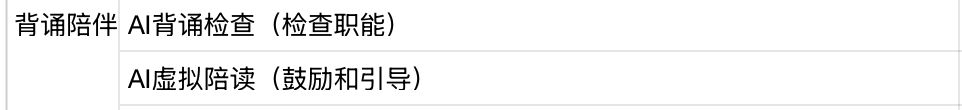

# 锐盟半导体
入职时间：2025.9.26

离职时间：

上班时间：周一到周五

## 公司介绍
公司是一家初创企业，依托于锐盟半导体（类似于子公司），主要做的是面向小学 1 - 3 年级辅导相关的具身智能产品，产品形态是一个台灯，内置了摄像头、麦克风、扬声器等硬件，可以通过语音和图像识别技术与学生进行互动，帮助学生完成作业和背诵课文等任务

## 实习产出
---
### 1. 主 agent 重构 —— 编排器 + Workflow
#### 业务场景与需求
当前后端的技术架构相对简单：

客户端发送请求 —— 解析音频/图片 —— 主 agent 创建主任务并识别意图 / 处理逻辑 / 调用子 agent 并修改状态 —— 子 agent 创建子任务 / 执行逻辑 / 返回结果 / 修改状态

主 agent 直接全权负责路由的决策，它会从 shortMemory 读取用户上下文，获得当前的状态，状态包括 idle / pre_agent_name / doing_agent_name，主 agent 不负责子 agent 执行完逻辑后的状态修改，需要子 agent 自行将状态修改回聊天 agent 的 idle

主 agent 调用 qwen3-max 模型，输出 JSON 格式如下：

```json
{
    "recognition": "识别到用户想要批改作业",
    "intention": "用户意图是获取作业批改结果",
    "decision": "切换到批改状态并调用批改 Agent",
    "execution": "调用homework_correct Agent",
    "Agent_calling_protocol": [
        "homework_correct",
        "learning_progress"
    ],
    "new_state": "correct_homework"
}
```

状态更新主要通过提取 `new_state` 字段，更新 shortMemory，再触发实际状态变化来完成，即 `idle -> pre -> doing -> idle` 的状态机

任务管理器主要通过异步方式调用子 agent 的接口来完成任务的创建和执行

由于主 agent 直接负责路由决策和状态管理，导致了主 agent 和整体架构存在以下问题：

* 可维护性差，主 agent 代码臃肿，逻辑复杂，难以维护和扩展
* 实际体验时延较高，简单的输入也需要主 agent 对不同场景做判断决策，响应等待时间长
* 状态与上下文管理混乱，主 agent 和子 agent 都需要修改状态，容易出现状态不一致的问题，且上下文信息分散在 shortMemory 和各个 agent 中，难以统一管理，状态的定义也未能满足复杂场景需求
* 主 agent 路由决策准确度难以保障和调优，由于主 agent 需要同时处理路由决策和业务逻辑，导致模型负担过重，难以专注于路由决策，且缺乏置信度和 guardrails 机制
* 业务场景逻辑不清晰，各个子 agent 的功能边界模糊、职责未工具化，难以对新需求进行快速迭代
* 难以灵活编排不同场景下的细分逻辑，即没有有向无环图编排，无法根据不同场景灵活调整子 agent 调用顺序和条件，无法并行调用多个子 agent
* 缺乏可观测性，prompt 管理原始化，基本都是硬编码拼接，也没有优化追踪

#### 技术方案
引入编排器（Orchestrator）和工作流（Workflow）概念，将主 agent 的路由决策和状态管理职责拆分出来，形成一个独立的编排层，负责根据用户输入和上下文信息，动态选择和调用不同的子 agent，并管理整体的状态和上下文

重构后完整架构图：


#### 实现细节


#### 评估复盘


---
### 2. 背诵 agent 完整开发
独立负责背诵 agent 从设计、开发、测试和上线的完整流程，完成了背诵检查、错误分析与记忆强化、复习计划和个性化报告等功能

#### 业务场景与需求
面向小学 1 - 3 年级学生的古诗文和英语课文背诵场景，为学生提供背诵相关的检查、纠错、复习，为家长提供背诵总结/周报/日报等功能


提醒开始背诵 —— 背诵检查 —— 背诵辅导（有错的地方做提醒） —— 如果正确率大于等于 85% 就不需要再次背诵，如果正确率小于 85% 当学生再次背诵，直到大于 85% —— 给出鼓励 —— 结束（提供家长背诵时间、背诵准确率）



记忆优化：

* 针对性纠错
  * 记忆存储：将学生错误分类成高频错误
    * 字音错
    * 漏内容
    * 记混顺序
    * 其他
  * 优化功能：
    * 若同类错误仅出现 1 次：简单提醒正确答案即可
    * 若同类错误重复出现（≥2 次）：补充错误原因和记忆方法
    * 补充 “趣味记忆法”，且内容要短、具象。比如 “字音错” 重复 2 次，除了正确读音，附加 “口诀记忆”（如 “苹果的‘苹’，和‘瓶子’的‘瓶’发音一样哦”
* 记忆曲线复习
  * 记忆存储：
    * 记录学生每段内容的首次达标时间（如 3 月 1 日背熟《春晓》）
    * 后续复习的正确率变化（如 3 月 3 日复习正确率 90%，3 月 7 日复习正确率 82%）
  * 功能逻辑：
    * 根据“艾宾浩斯记忆曲线”，自动计算下次复习时间（如首次达标后 1 天、3 天、7 天）
    * 到点提醒复习
    * 若某次复习正确率下降，缩短下次复习间隔
* 生成个性化背诵报告
  * 记忆存储：
    * 汇总学生日/周背诵数据（今日/本周背诵 5 次，平均正确率 88%）
    * 进步/薄弱点（今日/本周英语单词正确率从 75% 提升到 92%，古文背诵仍常错）
  * 功能输出：结合数据生成日报/周报，分析学习趋势，总结薄弱点

#### 技术方案
##### 接口设计

* POST
  * `/api/agents/recitation/run`
    * 同步执行背诵 agent 主流程，即比对、返回正确率/错误/记忆方法等逻辑
    * 输入：`input_data: text`（学生背诵的内容字符串）、`user_id`（用户唯一标识符）
    * 输出：`accuracy`、`feedback`、`need_retry` 等
  * `/api/agents/recitation/run-async`
    * 异步执行背诵 agent 主流程
  * `/api/agents/recitation/report/daily/{user_id, target_date}`
    * 生成并返回指定用户指定日期的背诵日报
  * `/api/agents/recitation/report/weekly/{user_id, target_date}`
    * 生成并返回指定用户指定的截止日期的背诵周报
* GET
  * `/api/agents/recitation/task/{task_id}`
    * 获取背诵主流程任务执行状态和结果
  * `/api/agents/recitation/history/{user_id}`
    * 获取背诵历史记录
  * `/api/agents/recitation/reviews/due/{user_id}`
    * 获取复习计划信息

##### 数据设计

`recitation_history` —— 背诵历史记录，记录每次背诵的正确/用户输入内容、正确率、是否需要重试、错误详情、模型回复等完整信息


`recitation_error_pattern` —— 背诵错误模式记录，记录学生在背诵过程中出现的错误类型、内容、频次和记忆方法，用于后续记忆优化和复习计划制定


`recitation_review_schedule` —— 背诵复习计划，基于艾宾浩斯曲线的复习管理，记录每段内容的首次达标时间、后续复习时间、复习次数、上次复习准确率和复习间隔时间等信息，用于生成个性化复习计划


`recitation_report` —— 背诵报告记录，存储生成的日报和周报内容，包括报告类型、报告日期、总背诵次数、平均正确率、背诵总结和薄弱点等信息

当天同用户已经生成的周报/日报不会重复生成，而是覆盖更新


##### 背诵流程
用户输入（触发事件） —— 编排器识别背诵意图 —— 进入背诵 agent 工作流 —— 返回结果

背诵 agent 工作流：


#### 实现细节
##### 合并检查比对和鼓励的 LLM 调用与记忆方法生成
最初设计时，背诵 agent 分为两个子任务：检查比对和鼓励反馈，分别调用 LLM 进行处理

这造成了下面的问题：

* 延迟高：两次网络往返增加了响应时间
* 成本高：两次调用都需要传递完整的上下文，token 消耗翻倍
* 用户体验差：学生等待时间过长，影响学习节奏

于是后续做了合并，一次调用同时完成检查和鼓励的逻辑，并一次性返回检查和鼓励的结果，将调用平均延迟从 4.2s 降低到了 2.1s，token 消耗从 ~1200 降低到了 ~700

只有在第二次重复错时才会生成针对这个错误的记忆方法，后续再次犯这个错误时也只会从表中读取记忆方法，而不会再调用 LLM 生成

##### 错误分类设计决策
两种方案：

* 方案 A：让 LLM 分类
  * 每次都调用 LLM 判断错误类型
  * 准确率高，但延迟高、成本高
* 方案 B：基于规则的算法
  * 对于可预测的错误类型，设计规则进行分类
  * 比对 `expected` 和 `actual` 两个变量的内容
    * 漏内容：actual 为空或明显短于 expected（50%）
    * 字音错：长度相同，只有个别字不同（2 个字）
    * 记混顺序：内容相同但顺序不同
    * 准确率稍低，但延迟低、成本低

由于背诵场景中错误类型相对固定且可预测，最终选择了两个方案结合

##### 错误智能去重方案迭代
同类型的错误可能以不同的形式出现，最开始的去重方案是简单的字符串匹配，只有完全一致才判定重复，测试发现会收到标点符号和空格的影响

第二版增加了标准化处理，去除标点和空格，但会受到同样一个错误因为出现在不同的上下文中而无法去重的问题

最终版选择了提取核心词对比 + 子串包含的方式，在标准化的基础上，对已有错误进行查找，允许子串匹配

最近测试发现可能是因为提示词设计矛盾，对于其输出的：

```json
{
  "agent_id": "recitation_99191857",
  "user_id": 1,
  "accuracy": 50,
  "need_retry": true,
  "feedback": "准确率50%,前两句很好,但遗漏了第3、4句,完整背一遍试试\n\n漏内容(第2次): 登高望远见山河，不更上怎见一层楼。\n漏内容(第2次): 登高望远见山河，不更上怎见一层楼。",
  "errors": [
    {
      "position": "第3句",
      "expected": "欲穷千里目，更上一层楼。",
      "actual": "",
      "type": "遗漏"
    },
    {
      "position": "第4句",
      "expected": "更上一层楼。",
      "actual": "",
      "type": "遗漏"
    }
  ],
  "usage": {
    "qwen_plus": {
      "input_tokens": 828,
      "output_tokens": 116,
      "cost": 0.0009
    }
  }
}
```

会对同一个错误重复计数，优化后解决了，具体是将提示词中的错误定位规则里关于 position 字段的定义从只能使用第几行改为了允许动态修改，具体到第几行第几个字，从而抛弃了原本的只有第几个字的错误

##### 基于艾宾浩斯曲线的复习系统
区分了首次背诵和复习背诵，只有首次背诵准确率达标后，才会创建复习计划，达标后后续的背诵都默认是复习，只要是复习，如果准确率不达标就会缩短下次复习计划时间，达标的话就延长

并不是一定要到了下次计划的复习时间才能再次背诵，如果首次背诵没有达标，会提示要再重新背一次

#### 评估复盘
当前对于模型的调用是单一模型的硬编码，并且仅支持中文的古诗背文背诵，对于错误类型的定义也没有全覆盖吧

---
### 3. 其他
#### Alembic 迁移工具重新启用与优化
##### 场景


##### 做了什么


##### 结果


重新启用 Alembic 迁移工具，解决现有脚本在不同环境不同机器部署时出现的问题，优化项目 Readme 启动项目步骤中数据库相关指引流程（待具体化细节）

优化监督 agent 提示词，提高监督 agent 的识别准确率，解决实际运行中出现的误判问题（待量化数据）

将聊天 agent 接入主 agent，使得聊天 agent 不再独立对外暴露接口，由主 agent 统一调度（小幅度重构）

优化客户端语音播放逻辑，用加全局锁的方式解决语音播放冲突和打断问题（相对跟后端关系不大，或者可以包装一下）

## 问题记录
要记录完整的问题和解决方案，要能讲清楚前因后果

* HTTP 自调用问题
* 主 agent 状态问题
* 数据库迁移工具 Alembic 使用问题


## 后端技术栈

* 编程语言：Python

* 框架：FastAPI

* 数据库：MySQL
  * ORM：SQLAlchemy
  * 迁移工具：Alembic

* 缓存：Redis

* 接口文档管理：Swagger

* 代码评审和项目管理：GitHub

## 我的工作

* **2025.9.26**：搭建后台环境，跑通后台项目业务流程

* **2025.9.28**：搭建跑通客户端项目，了解公司业务完整流程，输出业务流程反馈

* **2025.9.29-9.30**：研究主 agent 架构改进，体验业务全流程，从业务的角度思考改进方向，熟悉后台代码仓

* **2025.10.9-10.11**：请假

* **2025.10.13-10.15**：**修改监督 agent 提示词**，在实际 demo 台灯机上测试提示词效果，思考如何改进监督 agent，查看实际运行日志以判断每次不同的具体情况，熟悉后台项目中监督 agent 的相关代码

* **2025.10.16**：**解决监督 agent 监督识别不精确的问题**，思考后台项目重构方向

* **2025.10.17，10.21，10.23**：请假

* **2025.10.20，10.22**：**跟 mentor 和同事交流后台重构方案**，明确当前以业务为主的方向，先小规模重构，调研 FastAPI 框架以及 python 的优劣，思考是否要以 go 语言重构后台并加入 gRPC；**将聊天 agent 接入了主 agent**，二者不再独立，聊天 agent 不再直接对外暴露接口，一切调用均由主 agent 决定

* **2025.10.24**：修改客户端代码，**使客户端语音按时序播放，不再冲突、覆盖和打断**，主要实现方式是在已有队列基础上加异步锁，测试无误后提了 pr

* **2025.10.27-10.31，11.3**：**开发了一个全新的背诵 agent，主要功能是背诵检查和陪读**，完成了基本功能接口的开发之后本地测试无误，再在实机上结合客户端测试，梳理了背诵流程逻辑以及主 agent、聊天 agent 基本逻辑后和产品对齐体验流程，修复背诵和监督流程的冲突后提交了 pr

* **2025.11.4-11.5**：背诵 agent **代码 review 优化**，主要是将不同 agent 的调用方式修改为 API 调用

* **2025.11.6-11.7，11.10-11.14**：**背诵 agent 记忆和总结相关需求开发**，具体需求如下：

背诵agent加上记忆优化：
1. **针对性纠错**
记忆存储：将学生错误分类成高频错误：“字音错”“漏内容”“记混顺序”
优化功能：若同类错误仅出现 1 次：简单提醒正确答案即可；若同类错误重复出现（≥2 次）：补充错误原因和记忆方法（补充 “趣味记忆法”，且内容要短、具象。比如 “字音错” 重复 2 次，除了正确读音，附加 “口诀记忆”（如 “苹果的‘苹’，和‘瓶子’的‘瓶’发音一样哦”）
2. **记忆曲线复习**
记忆存储：记录学生每段内容的首次达标时间（如 3 月 1 日背熟《春晓》）、后续复习的正确率变化（如 3 月 3 日复习正确率 90%，3 月 7 日复习正确率 82%）
功能逻辑：根据“艾宾浩斯记忆曲线”，自动计算下次复习时间（如首次达标后 1 天、3 天、7 天），到点提醒复习；若某次复习正确率下降，缩短下次复习间隔
3. **生成个性化背诵报告**
记忆存储：汇总学生 日/ 周 背诵数据（今日/本周背诵 5 次，平均正确率 88%）、进步 / 薄弱点（今日/本周 英语单词正确率从 75% 提升到 92%，古文背诵仍常错）
功能输出：结束时生成报告。

* **2025.11.15**：请假

* **2025.11.17-11.18**：**记忆和总结相关需求产品验收**，实测无误后提交了 pr

* **2025.11.19**：将背诵 agent 的周报日报总结数据**集成到前端**中

* **2025.11.20-11.21**：背诵 agent **代码 review 优化**，并实机测试，产品验收无误后已上线

* **2025.11.24**：**重新讨论彻底重构主 agent 架构方案**，确定引入编排器和工作流，优化各个 agent 之间的调用关系

* **2025.11.25-11.28**：**开始进行主 agent 架构重构**，搭建编排器和工作流的基础框架，将背诵 agent **先接入**到现有的另一版主 agent 优化方案中

