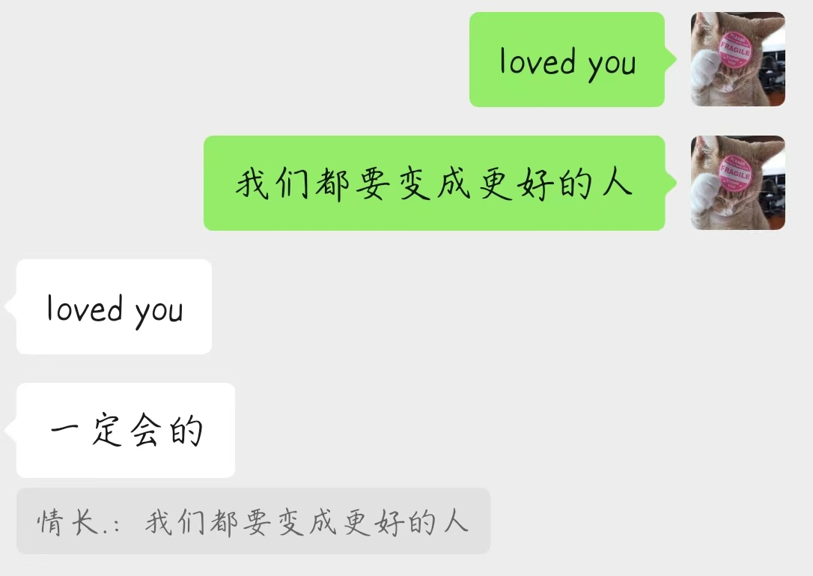

## 碎碎念
1

好久没有写点什么了

真的好久

都不会写了，不知道该怎么梳理自己繁杂的心绪

但为了不被情绪淹没，我还是要写一点，再写一点

2

说实话，我已经非常久没有过这样的情感问题了

暑假快要结束了，回头看看，我都做了什么呢

刚考完期末就不管三七二十一跟好朋友一起去了一趟沈阳，在东北感受独有的风土人情，还看了一场解解的演唱会，回来时以为自己能处理好所有事情

那个时候我觉得自己是纯粹的 p 人

回来之后开始学习，刷算法、看八股、写项目，规律地健身、娱乐，过上了重复的生活

持续了一段时间之后在七月底回了趟老家，在老家看完了亲密关系这本书，以为自己对于亲密关系的理解已经足够深刻了

回来之后又是一样的重复

规律或许没什么不好的，或许只是食堂的饭菜太过难吃，才让我每天都感到同样的厌烦

所以这个暑假才约了很多朋友出来玩了很多场桌游，跟不同的朋友尝试不同的游戏

前天还跟另一个好朋友去香港又看了一次解解的演唱会

只是我没想到桌游也确实会有腻了的一天

3

是啊，就是这样没条理的文字，你会发现任何事情都是一样的，你已经不再拥有 14 岁时的理解和专注能力，乏味地重复是你能学会一样东西并记住为数不多的方法

老人的爱是无私的，至少我感受到的是

刚回来的时候还会因为自己没办法多陪在他们身边而愧疚

明明去的时候不情不愿的，回来却忍不住想掉眼泪

我对他们的爱是常觉亏欠

很多时候我会感觉自己像是人格分裂了

有几天一直控制自己一点感情都不要有，有几天却感性细腻得可怕

所以才会讨厌自己，做不到爱上自己

就是这样一个矛盾而拧巴的人

4

其实还是很高兴自己今年又重新开始社交了的

认识了不少新朋友，也熟络了很多老朋友

跟你们一起玩的时候真的很开心

希望我们以后还要一起玩很多很多次

5

我相信自己肯定会变得更好的

我还有很多事要做

交给时间就好

以前不也是这样做的吗

在暑假开始的时候你不也没有想到这个暑假会是这样的吗

一段美丽的插曲

结束之后当然会回味，当然会有可惜，当然会不舍和遗憾

本就是两个世界两个性格两种习惯的两个人

曾经发生过的事，就不要重蹈覆辙

我们都会变成更好的人

有缘自会再见

有缘自会再爱

6

如果在你原本枯燥、重复但规律的生活中突然出现了这样一个人，ta 很喜欢你，你恰好也很喜欢对方，ta 能满足你对于爱情的一切想象，只要你愿意，你们可以体验浪漫关系中的一切美好，只是你们的关系只能持续十天，十天之后对方就要去世界上另一个很遥远的地方，即使后面 ta 回来了你们再见面，也只是从普通的好朋友做起

你会愿意接受吗

如果让我回到十天前重新选一次，我会

如果是新的人，我不会

