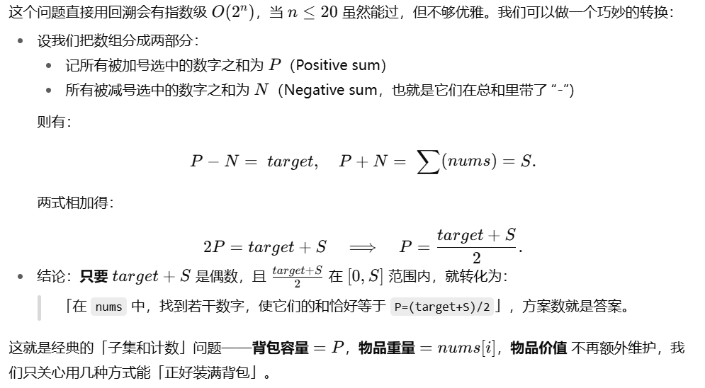
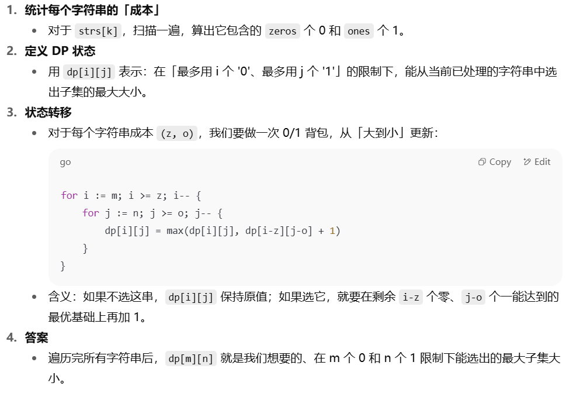
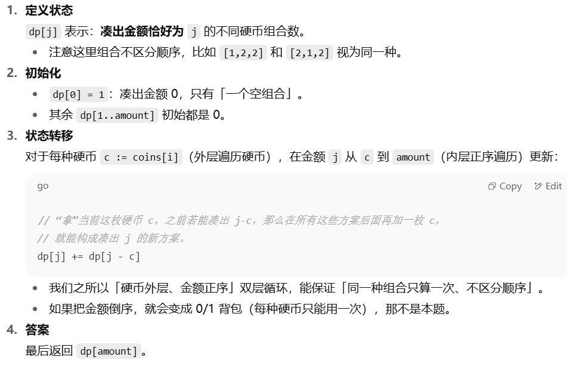
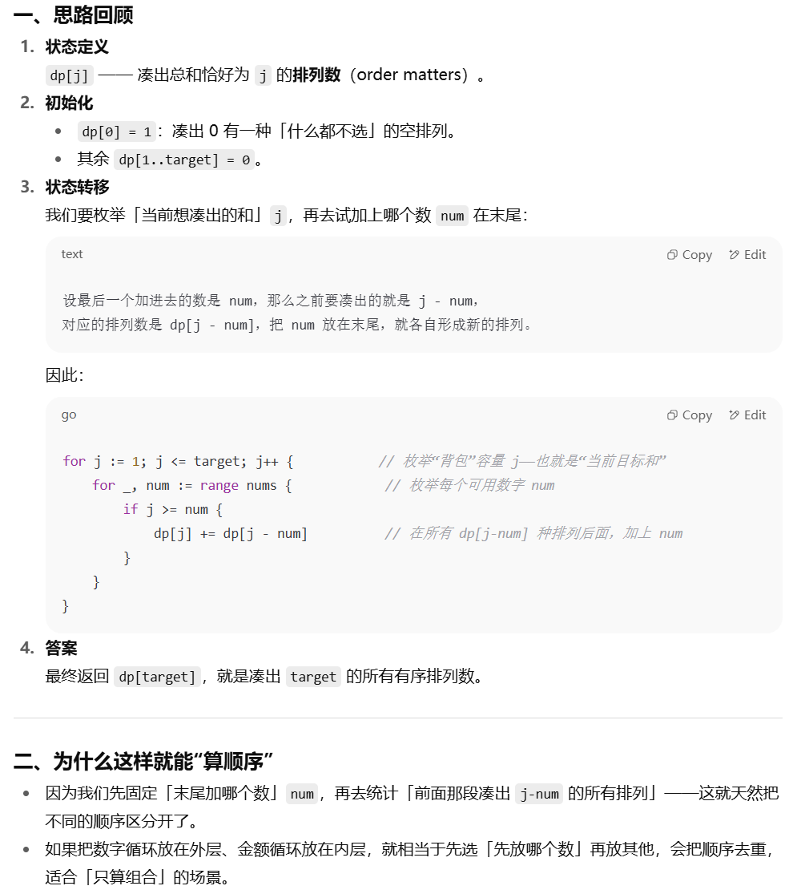
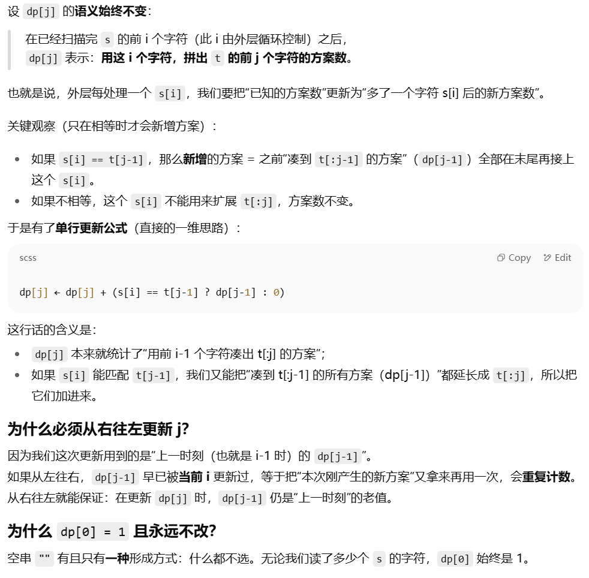
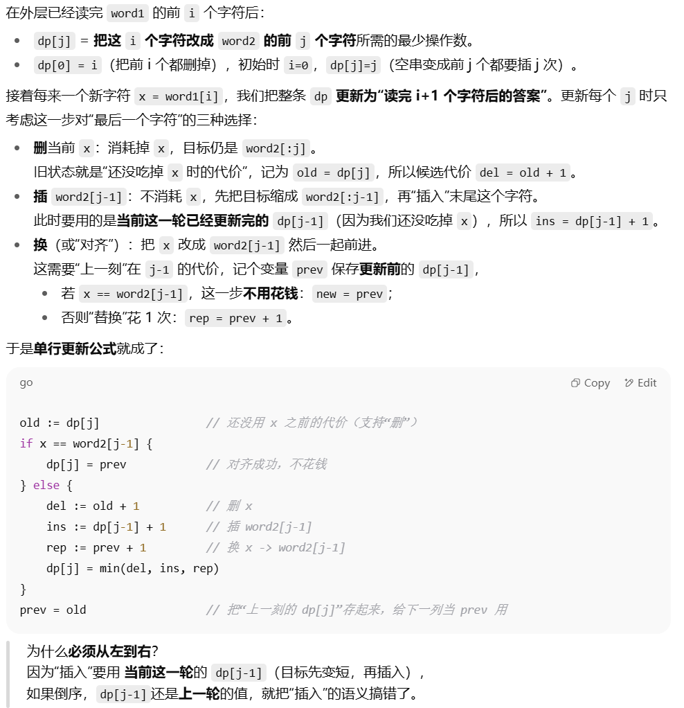

### 509. 斐波那契数
#### 题目：https://leetcode.cn/problems/fibonacci-number/description/

[我的解答](https://github.com/EthanQC/my-learning-record/blob/main/data-structure-and-algorithm/problems-record/dynamic-programming/509-fibonacci-number.md)

非常经典的动态规划的入门题，迭代就行，用两个变量，题目也把递推公式给出来了，动态规划的思路就是：最优子结构（递推式、多个规模更小的问题）-记忆化存储-状态转移

### 70. 爬楼梯
#### 题目：https://leetcode.cn/problems/climbing-stairs/description/

[我的解答](https://github.com/EthanQC/my-learning-record/blob/main/data-structure-and-algorithm/problems-record/dynamic-programming/70-climbing-stairs.md)

这道题就是斐波那契数列，最基本的想法就是找规律，见过就行，详细一点的思路推导就是如果要爬到第 `i` 阶，最后一步要么是从 `i−1` 阶跨 `1` 阶上来，要么是从 `i−2` 阶跨 `2` 阶上来

### 746. 使用最小花费爬楼梯
#### 题目：https://leetcode.cn/problems/min-cost-climbing-stairs/description/

[我的解答](https://github.com/EthanQC/my-learning-record/blob/main/data-structure-and-algorithm/problems-record/dynamic-programming/746-min-cost-climbing-stairs.md)

这道题也是一样的，还是斐波那契数列，但就是要加上一个花费，需要取最小，本质并不难

### 62. 不同路径
#### 题目：https://leetcode.cn/problems/unique-paths/description/

[我的解答](https://github.com/EthanQC/my-learning-record/blob/main/data-structure-and-algorithm/problems-record/dynamic-programming/62-unique-paths.md)

这道题是我们第一次接触二维 dp，嗯还是以学方法为主就好，是要用一个二维数组，不要忘记对第一行和第一列都进行初始化，然后直接从第二行第二列的元素开始

### 63. 不同路径 II
#### 题目：https://leetcode.cn/problems/unique-paths-ii/description/

[我的解答](https://github.com/EthanQC/my-learning-record/blob/main/data-structure-and-algorithm/problems-record/dynamic-programming/63-unique-paths-ii.md)

这道题跟上一题的思路是完全一样的，也是二维 dp，但要注意初始化的方式有略微的改变，以及如何分别计算二维数组行和列的长度也要熟悉

### 343. 整数拆分
#### 题目：https://leetcode.cn/problems/integer-break/description/

[我的解答](https://github.com/EthanQC/my-learning-record/blob/main/data-structure-and-algorithm/problems-record/dynamic-programming/343-integer-break.md)

定义 `dp[n]` 是把整数 `n` 拆成至少两个正整数后所能得到的最大乘积，当我们定义 `i` 从 `2` 开始遍历到 `n` 时，变量 `j` 就代表我们在 `1` 到 `i` 之间切分的一刀，第一块就是 `j` 本身，第二块就是我们拆分出来的子问题，我们可以让它不继续切分，也可以继续切分，继续切的话得到的最优值就刚好是提前算过的 `dp [i - j]`，然后我们再取最大值就可以解决这道题了

### 96. 不同的二叉搜索树
#### 题目：https://leetcode.cn/problems/unique-binary-search-trees/description/

[我的解答](https://github.com/EthanQC/my-learning-record/blob/main/data-structure-and-algorithm/problems-record/dynamic-programming/96-unique-binary-search-trees.md)

定义动态规划数组 `dp[i]` 是恰好能组成的不同二叉搜索树的种数，在 `1` 到 `i` 中选定某个节点 `j` 为根，`1 <= j <= i`，所以根左边有 `j - 1` 个节点，根右边有 `k - i` 个节点，又因为左右子树的形态是独立的（在选定 `i` 时就已经确保了左子树的所有值小于根，右子树的所有值大于根），所以就是他们俩乘起来 `dp[j - 1] * dp[i - j]`，再累加即可

### 416. 分割等和子集
#### 题目：https://leetcode.cn/problems/partition-equal-subset-sum/description/

[我的解答](https://github.com/EthanQC/my-learning-record/blob/main/data-structure-and-algorithm/problems-record/dynamic-programming/416-partition-equal-subset-sum.md)

是第一次接触背包问题，这是一个 **0/1 背包问题**，即元素不能重复用，所以在内层循环我们需要从大到小遍历，否则就会重复用到刚更新过的动态规划数组

`dp[j]` 表示是否能凑出和 `j`，如果之前能凑出 `j-num`，那么加上当前这个 `num` 就能凑出 `j`

先把数组和求出来然后除 `2` 得到目标值，再对目标值动态规划，如果目标值是奇数则直接返回 `false`

### 1049. 最后一块石头的重量 II
#### 题目：https://leetcode.cn/problems/last-stone-weight-ii/description/

[我的解答](https://github.com/EthanQC/my-learning-record/blob/main/data-structure-and-algorithm/problems-record/dynamic-programming/1049-last-stone-weight-ii.md)

这道题其实跟上一题差不多，也是分成两堆和最接近的子集，所以前面的操作都说一样的，只是最后在返回值的时候要找一下最接近 `cap` 的可达 `j`，然后返回的是两个子集的差值

### 494. 目标和
#### 题目：https://leetcode.cn/problems/target-sum/description/

[我的解答](https://github.com/EthanQC/my-learning-record/blob/main/data-structure-and-algorithm/problems-record/dynamic-programming/494-target-sum.md)

这道题也是差不多，都是子集和的 0/1 背包计数问题，处理方式也大差不差

### 474. 一和零
#### 题目：https://leetcode.cn/problems/ones-and-zeroes/description/

[我的解答](https://github.com/EthanQC/my-learning-record/blob/main/data-structure-and-algorithm/problems-record/dynamic-programming/474-ones-and-zeroes.md)

这道题挺难的，是二维 dp 的 0/1 背包问题，比较抽象，以学思路为主

### 518. 零钱兑换 II
#### 题目：https://leetcode.cn/problems/coin-change-ii/description/

[我的解答](https://github.com/EthanQC/my-learning-record/blob/main/data-structure-and-algorithm/problems-record/dynamic-programming/518-coin-change-ii.md)

本题是我们第一次接触完全背包（元素可以重复利用），并不算很难，甚至跟前面的动态规划不涉及背包时的问题的思路有点像，只是要正序遍历了，学会思路即可

### 377. 组合总和 Ⅳ
#### 题目：https://leetcode.cn/problems/combination-sum-iv/description/

[我的解答](https://github.com/EthanQC/my-learning-record/blob/main/data-structure-and-algorithm/problems-record/dynamic-programming/377-combination-sum-iv.md)

这道题跟上一题非常像，就是要算顺序了而已，相当于上一题是组合，这一题是排列，并不难

### 322. 零钱兑换
#### 题目：https://leetcode.cn/problems/coin-change/

[我的解答](https://github.com/EthanQC/my-learning-record/blob/main/data-structure-and-algorithm/problems-record/dynamic-programming/322-coin-change.md)

这道题跟前面两题还是有点区别的，遍历方式跟 518 是一样的，也是 `j` 在 `c` 到 `amount` 之间遍历，但初始化时要先将 `dp` 的所有值（除了 0）初始化为一个较大的值（一般为 `amount + 1`），这样方便我们后面取最小，如果凑出了 `dp[j - c]`，那再 `+1` 就是 `dp[j]`，要学会方法

### 279. 完全平方数
#### 题目：https://leetcode.cn/problems/perfect-squares/description/

[我的解答](https://github.com/EthanQC/my-learning-record/blob/main/data-structure-and-algorithm/problems-record/dynamic-programming/279-perfect-squares.md)

这道题也是完全背包，其实已经入门了，想到 `i` 来遍历，`j` 在 `i` 和 `n` 之间之后，就要进一步想到 `j * j` 是最后放进去的数，所以对应的就是 `dp[i - j * j]`，然后再加上这次的 `1` 就是要更新的 `dp` 值，动态规划相关问题的难点就在于找递推式，主要是要通过建模，大胆假设就肯定能推出来

### 139. 单词拆分
#### 题目：https://leetcode.cn/problems/word-break/description/

[我的解答](https://github.com/EthanQC/my-learning-record/blob/main/data-structure-and-algorithm/problems-record/dynamic-programming/139-word-break.md)

这道题还是完全背包问题，嗯感觉还是要选定究竟是要遍历谁，像这道题就是因为我们是要拼接 `s` 这个字符串，所以 `dp[i]` 表示的含义自然就是 `s` 中第 `i` 个字母时，刚好能被字典里的词拆分出来，也就是说 `i` 是遍历 `s` 的，所以 `i` 自然就在外层，然后内层直接遍历字典就好，用的思路还是如果前面 `i - lw` 刚好能拆分，那如果当前的也能拆分的话 `dp[i]` 就是 `true`

### 198. 打家劫舍
#### 题目：https://leetcode.cn/problems/house-robber/description/

[我的解答](https://github.com/EthanQC/my-learning-record/blob/main/data-structure-and-algorithm/problems-record/dynamic-programming/198-house-robber.md)

这道题就不是背包了，嗯正常动态规划的思路就可以解决，也有数组版和空间优化版（滚动）两种写法，需要注意的是数组版由于原本的数组下标是从 `0` 开始的，所以要写成 `i - 1` 而不是 `i`，思路的话其实就是**如果当前的要偷，那上一间就不能偷，所以是上上间加当前，如果当前不偷，那就是上一间**

### 213. 打家劫舍 II
#### 题目：https://leetcode.cn/problems/house-robber-ii/description/

[我的解答](https://github.com/EthanQC/my-learning-record/blob/main/data-structure-and-algorithm/problems-record/dynamic-programming/213-house-robber-ii.md)

这道题跟上一题完全一样，只要把上一题的函数重写一遍，然后在主函数里调用两次就行，一次传去掉第一个元素的，一次传去掉最后一个元素的，然后哪个大取哪个就行

### 337. 打家劫舍 III
#### 题目：https://leetcode.cn/problems/house-robber-iii/description/

[我的解答](https://github.com/EthanQC/my-learning-record/blob/main/data-structure-and-algorithm/problems-record/dynamic-programming/337-house-robber-iii.md)

这道题就跟前两个不太一样了，是树形 dp 了，要用后序遍历，不过也是如果当前拿的话那左右子节点就不拿，再加上当前的，然后如果当前不拿那就是左右子节点拿并且取最大，学会思路就行

### 121. 买卖股票的最佳时机
#### 题目：https://leetcode.cn/problems/best-time-to-buy-and-sell-stock/description/

[我的解答](https://github.com/EthanQC/my-learning-record/blob/main/data-structure-and-algorithm/problems-record/dynamic-programming/121-best-time-to-buy-and-sell-stock.md)

这题很简单，都不用 dp 数组，不过还是动态规划的思想，就是只用遍历一遍数组，然后每遍历一个元素实时更新就行，是很朴素的思路

### 122. 买卖股票的最佳时机 II
#### 题目：https://leetcode.cn/problems/best-time-to-buy-and-sell-stock-ii/description/

[我的解答](https://github.com/EthanQC/my-learning-record/blob/main/data-structure-and-algorithm/problems-record/dynamic-programming/122-best-time-to-buy-and-sell-stock-ii.md)

这道题之前我们用贪心算法写过一遍了，现在这遍是动态规划的方法，其实就是分成今天卖出/不卖、今天买入/不买这四种情况，嗯也用不到 dp 数组，主要是学会思路

### 123. 买卖股票的最佳时机 III
#### 题目：https://leetcode.cn/problems/best-time-to-buy-and-sell-stock-iii/description/

[我的解答](https://github.com/EthanQC/my-learning-record/blob/main/data-structure-and-algorithm/problems-record/dynamic-programming/123-best-time-to-buy-and-sell-stock-iii.md)

嗯这题很难，但也是模板题，学会方法就行，还是动态规划，但形式不同

### 188. 买卖股票的最佳时机 IV
#### 题目：https://leetcode.cn/problems/best-time-to-buy-and-sell-stock-iv/description/

[我的解答](https://github.com/EthanQC/my-learning-record/blob/main/data-structure-and-algorithm/problems-record/dynamic-programming/188-best-time-to-buy-and-sell-stock-iv.md)

这个就是最一般的情况了，模板学会记住就行

### 309. 买卖股票的最佳时机含冷冻期
#### 题目：https://leetcode.cn/problems/best-time-to-buy-and-sell-stock-with-cooldown/description/

[我的解答](https://github.com/EthanQC/my-learning-record/blob/main/data-structure-and-algorithm/problems-record/dynamic-programming/309-best-time-to-buy-and-sell-stock-with-cooldown.md)

这题主要是定义了三种状态，分别对应三个变量，学会方法就行，跟前面几题不太一样

### 714. 买卖股票的最佳时机含手续费
#### 题目：https://leetcode.cn/problems/best-time-to-buy-and-sell-stock-with-transaction-fee/description/

[我的解答](https://github.com/EthanQC/my-learning-record/blob/main/data-structure-and-algorithm/problems-record/dynamic-programming/714-best-time-to-buy-and-sell-stock-with-transaction-fee.md)

这道题跟 122 完全一样，就扣个手续费就行了，至此股票题结束，要学会模板并记住

### 300. 最长递增子序列
#### 题目：https://leetcode.cn/problems/longest-increasing-subsequence/description/

[我的解答](https://github.com/EthanQC/my-learning-record/blob/main/data-structure-and-algorithm/problems-record/dynamic-programming/300-longest-increasing-subsequence.md)

这道题有两种方法，第一种是常规的动态规划，只不过是从 0 开始的，所以写法会有点不一样，但挺好想到的，就还是用两个变量来遍历，然后数组代表结尾在哪个元素结束；另一种方法是贪心 + 二分查找，要用到一个包函数，学会思路即可，也很好理解

### 674. 最长连续递增序列
#### 题目：https://leetcode.cn/problems/longest-continuous-increasing-subsequence/description/

[我的解答](https://github.com/EthanQC/my-learning-record/blob/main/data-structure-and-algorithm/problems-record/dynamic-programming/674-longest-continuous-increasing-subsequence.md)

这道题非常简单，不要想复杂了，虽然是上一题加了一个连续的条件，但反而变简单了，只要一次线性扫描就行，甚至都不用动态规划了，主要是考察对代码的熟练度

### 718. 最长重复子数组
#### 题目：https://leetcode.cn/problems/maximum-length-of-repeated-subarray/description/

[我的解答](https://github.com/EthanQC/my-learning-record/blob/main/data-structure-and-algorithm/problems-record/dynamic-programming/718-maximum-length-of-repeated-subarray.md)

这道题理论上是用二维 dp 的，但可以滚动成一维的，所以这里只给了一维的写法，嗯关键就是内层变量要倒序遍历，并且断了要清零，最后的答案也是数组里的最大值，而不是最后一个值

### 1143. 最长公共子序列
#### 题目：https://leetcode.cn/problems/longest-common-subsequence/description/

[我的解答](https://github.com/EthanQC/my-learning-record/blob/main/data-structure-and-algorithm/problems-record/dynamic-programming/1143-longest-common-subsequence.md)

这题同样是滚动一维 dp，嗯跟上一题的区别就在于不要求连续，遍历顺序无论内外也变成了正序，最后答案是最后一个值，要做好区分，二维变一维的写法还是有点抽象的

### 1035. 不相交的线
#### 题目：https://leetcode.cn/problems/uncrossed-lines/description/

[我的解答](https://github.com/EthanQC/my-learning-record/blob/main/data-structure-and-algorithm/problems-record/dynamic-programming/1035-uncrossed-lines.md)

这题就是上一题的数组版，完全一模一样，要能识别出来

### 53. 最大子数组和
#### 题目：https://leetcode.cn/problems/maximum-subarray/description/

[我的解答](https://github.com/EthanQC/my-learning-record/blob/main/data-structure-and-algorithm/problems-record/dynamic-programming/53-maximum-subarray.md)

这道题的贪心其实就是动态规划优化空间之后得到的，之前在贪心那里写过了，学会即可，不再重复

### 392. 判断子序列
#### 题目：https://leetcode.cn/problems/is-subsequence/description/

[我的解答](https://github.com/EthanQC/my-learning-record/blob/main/data-structure-and-algorithm/problems-record/dynamic-programming/53-maximum-subarray.md)

双指针法秒了，非常非常简单，快慢指针遍历就行，一个指针只有相等才前进，学会思路熟练就好

### 115. 不同的子序列
#### 题目：https://leetcode.cn/problems/distinct-subsequences/description/

[我的解答](https://github.com/EthanQC/my-learning-record/blob/main/data-structure-and-algorithm/problems-record/dynamic-programming/115-distinct-subsequences.md)

这道题是经典的子序列一维动态规划问题，其实并没有那么难，学会思路就行

### 583. 两个字符串的删除操作
#### 题目：https://leetcode.cn/problems/delete-operation-for-two-strings/description/

[我的解答](https://github.com/EthanQC/my-learning-record/blob/main/data-structure-and-algorithm/problems-record/dynamic-programming/583-delete-operation-for-two-strings.md)

这道题的把两个串删到相同其实就是 1143. 最长公共子序列，完全一样，只要最后改下返回值就行了，返回要删的步数，也简单

### 72. 编辑距离
#### 题目：https://leetcode.cn/problems/edit-distance/description/

[我的解答](https://github.com/EthanQC/my-learning-record/blob/main/data-structure-and-algorithm/problems-record/dynamic-programming/72-edit-distance.md)

这道题相当于把前面几题综合起来了

### 647. 回文子串
#### 题目：https://leetcode.cn/problems/palindromic-substrings/description/

[我的解答](https://github.com/EthanQC/my-learning-record/blob/main/data-structure-and-algorithm/problems-record/dynamic-programming/647-palindromic-substrings.md)

嗯这道题还是动态规划，但遍历顺序跟常规的不太一样，它是从左下开始的，嗯所以这个遍历方式要记一下，递推式倒是不难

### 516. 最长回文子序列
#### 题目：https://leetcode.cn/problems/palindromic-substrings/description/

[我的解答](https://github.com/EthanQC/my-learning-record/blob/main/data-structure-and-algorithm/problems-record/dynamic-programming/647-palindromic-substrings.md)

这道题可以等价为最长公共子序列，只要记住**最长回文子序列(LPS) 的长度 = s 与反串 r=reverse(s) 的最长公共子序列(LCS) 的长度**这个结论就行了，所以方法跟最长公共子序列那题是完全一样的，只需要先构造一下原本字符串的反串就行
