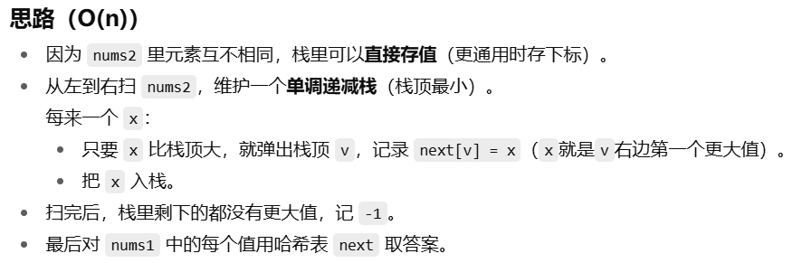
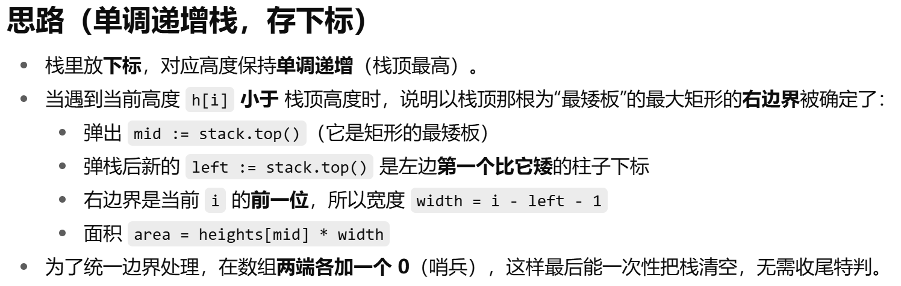
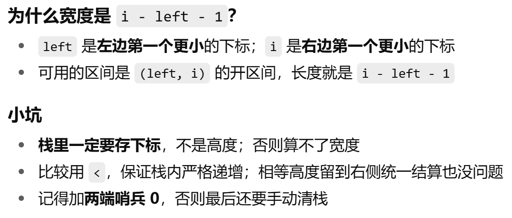

### 739. 每日温度
#### 题目：https://leetcode.cn/problems/daily-temperatures/description/

[我的解答](https://github.com/EthanQC/my-learning-record/blob/main/data-structure-and-algorithm/problems-record/monotonic-stack/739-daily-temperatures.md)

这道题就正式进入了单调栈，其实就是用栈来解决问题，只不过栈里面记录的一般是单调递增或递减的下标，而不是具体的值，这道题也算是单调栈入门级别的问题了，**如果要找右边第一个更大，那就是递减栈，如果要找右边第一个更小，那就是递增栈**，一般来说遍历顺序都是从左到右

### 496. 下一个更大元素 I
#### 题目：https://leetcode.cn/problems/next-greater-element-i/description/

[我的解答](https://github.com/EthanQC/my-learning-record/blob/main/data-structure-and-algorithm/problems-record/monotonic-stack/496-next-greater-element-i.md)

这题跟上一题差不多，都是找下一个最大的模板题，嗯只不过这题比较麻烦，也不算简单我感觉，嗯熟练度还是要提高才行

### 503. 下一个更大元素 II
#### 题目：https://leetcode.cn/problems/next-greater-element-ii/description/

[我的解答](https://github.com/EthanQC/my-learning-record/blob/main/data-structure-and-algorithm/problems-record/monotonic-stack/503-next-greater-element-ii.md)

其实只要把数组遍历两遍就可以解决这个循环数组的问题了，只是要注意只在第一遍的时候才压栈，然后答案数组要初始化为 -1 才行，这道题其实还是找右边最大的模板题

### 42. 接雨水
#### 题目：https://leetcode.cn/problems/trapping-rain-water/description/

[我的解答](https://github.com/EthanQC/my-learning-record/blob/main/data-structure-and-algorithm/problems-record/monotonic-stack/42-trapping-rain-water.md)

嗯这道题非常经典，方法也很多，主要是双指针法、单调栈和前后缀最大值这三种，嗯效率来说都差不多，但双指针法是最简单也是最方便的，所以这里目前只提供了双指针的解法，其实就是只要记住**每根柱子能接的水 = min(左侧最高，右侧最高) − 本柱高度**这个公式就可以了，然后用左右指针头尾分别遍历，哪边的值更小，就用哪边的来计算所接到的雨水

### 84. 柱状图中最大的矩形
#### 题目：https://leetcode.cn/problems/largest-rectangle-in-histogram/description/

[我的解答](https://github.com/EthanQC/my-learning-record/blob/main/data-structure-and-algorithm/problems-record/monotonic-stack/84-largest-rectangle-in-histogram.md)

