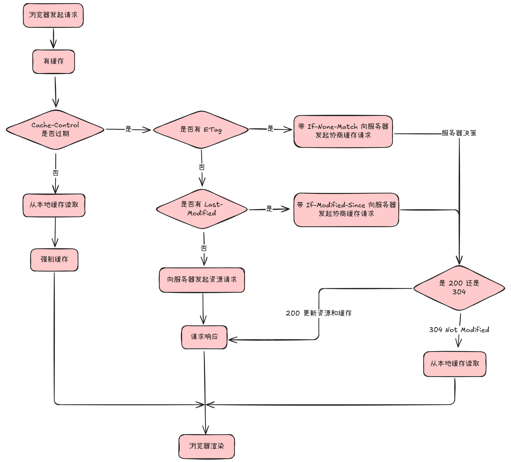

## HTTP
#### HTTP 是什么？

**HTTP**（HyperText Transfer Protocol） 是一种**应用层、请求-响应式（客户端发请求，服务端回相应）、面向资源**的协议，用于在客户端与服务端之间传输数据

它本身**无连接、无状态（每个请求独立）**（会话靠 Cookie/Token/Session 存在应用层），通过 URL/URI 标识资源，用方法（GET/POST/PUT/DELETE…）表达意图，用状态码表达结果，配合头部与缓存语义完成内容协商、压缩、鉴权、缓存等

协议在 HTTP 1.1 —— HTTP 2.0 —— HTTP 3.0（QUIC）演进中提升性能与可靠性，安全版是 HTTPS（HTTP over TLS）

#### HTTP 常见的状态码有哪些？

1xx：提示信息，是协议处理的一种中间状态，实际用到的比较少

2xx：服务器成功处理了请求

* **200 OK：常规成功**

* 204 No Content：成功但无响应体（删除/幂等更新）

* 206 Partial Content：应用于 HTTP 分块下载或断点续传，表示相应返回的数据并不是资源的全部，而是其中的一部分

**3xx**：重定向，资源位置发生变动，需要重新发送请求

* 301 Moved Permanently：永久重定向

* 302 Found：临时重定向，资源还在，但暂时需要用另一个 url 访问

* 304 Not Modified：资源未修改，缓存重定向，重定向已存在的本地缓存文件

**4xx**：客户端错误

* 400 Bad Request：请求格式错误

* 401 Unauthorized：未认证，鉴权相关

* 403 Forbidden：已认证但无权限/被阻断

* 404 Not Found：资源不存在或未找到

5xx：服务端/网关内部错误

* **500 Internal Server Error：跟 400 有点像，是一个笼统通用的错误码**

* 501 Not Implemented：方法未实现，请求的功能还未支持

* 502 Bad Gateway：网关或代理返回的错误码，表示服务器自身工作正常但在访问后端服务器时发生了错误

* **503 Service Unavailable：服务器当前很忙，暂时无法响应**

#### HTTP 常见字段有哪些？

**Host**：发送请求时指定目标域名和端口号

User-Agent：指定客户端信息

Accept：指定可接受的响应内容类型

**Cookie**：传递客户端存储的 Cookie 数据，如 Session ID

Authorization：传递身份验证信息

Content-Length：服务器返回的数据长度

Connection：客户端要求服务器使用 HTTP 长连接

**Content-Type**：服务器返回的数据格式，指明消息主体的数据类型

Content-Encoding：服务器返回的数据使用的压缩格式

Referer：指定请求来源页面

Range：请求资源的部分内容，即断点传续

#### HTTP 请求报文和响应报文是怎样的？

HTTP 请求报文：

* 请求行：包含请求方法（GET、POST 等）、URL、HTTP 版本
* 请求头：包含客户端信息、请求内容类型、语言、Cookie 等
* 请求体：仅在某些请求方法（如 POST）中包含，包含实际的数据内容

HTTP 响应报文：

* 状态行：包含 HTTP 版本、状态码（如 200、404 等）、状态描述
* 响应头：包含服务器信息、缓存策略、内容类型等
* 响应体：包含返回的实际数据（如 HTML 页面、JSON 等）

#### GET 和 POST 有什么区别？

安全指的是方法不会破坏服务器上的资源，幂等是指多次执行相同的操作结果都是相同的

**GET** 是请求资源，重复执行不会改变资源状态，所以是幂等且安全的

**POST** 是提交数据，每次都会更改资源，所以是非幂等且不安全的

GET 直接把参数加在 url 之后，有长度限制，可以缓存，而 POST 是把参数放在请求体里，没有长度限制，默认不缓存

#### HTTP 请求方式有哪些？

常用的主要有 GET（1.0）、POST（1.0）、PUT（1.1） 和 DELETE（1.1）

GET 用于请求服务器资源，是幂等的；POST 用于向服务器提交数据，非幂等；PUT 是上传资源到服务器，用于更新或创建，因此它是幂等的；DELETE 就是删除资源

其他方式有 HEAD、TRACE、OPTIONS、CONNECT 和 PATCH

#### 什么是强制缓存和协商缓存？它们的工作原理是什么？

**强制缓存**：

是在本地的，包括 **Expires**（绝对时间）和 **Cache-Control**（相对时间）两个字段

Expires 是设置一个时间，当超时时标识缓存过期，需要重新向服务器发起请求，在时间范围内则使用缓存，缺点是本地时间不准确时判断也会不准确

**Cache-Control** 是通过 HTTP 响应头的 Cache-Control 字段实现，通过设置 max-age 来表示与上次请求的时间间隔，在时间间隔内则直接使用缓存

如果 HTTP 响应头部同时有这两个字段的话，Cache-Control 的优先级是比 Expires 要高的

**协商缓存**：

是在服务器的，**在强制缓存失效时使用**，通过 HTTP 的 **ETag** 或 **Last-Modified** 字段与服务器进行验证，判断资源是否被修改，主要是根据和服务端的协商结果来判断是否使用本地缓存

如果修改则状态码 200 返回新资源，并更新本地缓存，如果未修改则状态码 304，告诉浏览器要使用本地缓存

Last-Modified 是资源最近一次的修改时间，客户端读取到该字段时会在下一次请求的请求头中写 If-Modified-Since 字段，包括服务器第一次修改给的时间

服务器接收到 If-Modified-Since 的值后，会与 Last-Modified 比较，如果相同则说明资源没有修改，使用本地缓存，如果不同则返回新资源，更新本地缓存

这种方法的缺点是对比的是修改时间，并且记录的是秒级别的，如果文件名被修改了然后再改回来，文件是不变的，但时间变了，就会导致缓存失效，另外如果文件是被毫秒级修改的还会导致缓存不更新

**ETag** 则是根据文件指纹（文件 Hash 值比对），是由服务器根据文件内容计算得到的标识符，跟资源一起返回给客户端，客户端会在请求头字段的 **If-None-Match** 携带 ETag 值，服务器会进行比对，如果相同就使用本地缓存，不同就更新资源和 ETag 值

如果这两个字段同时都有的话，Etag 的优先级是更高的，但**协商缓存中的两个字段都需要配合强制缓存中的 Cache-Control 字段来使用**，只有未命中强制缓存时才能发起带有协商缓存字段的请求

#### HTTP 1.0 和 HTTP 1.1 的区别是什么？

**持久连接**：

1.0 是短连接，每次请求都会重新建立 TCP 连接；1.1 引入了长连接，建立了一次 TCP 连接之后，只要通信双方没有一方主动断开连接，连接就不会断开，但如果长连接超过一定时间没有数据交互时服务端也会主动断开连接

**管道化**：

1.0 只能等前一个请求响应之后才能发送后续的请求；1.1 支持管道化，第一个请求发出后不用等响应即可继续发送后续的请求，但服务端只能按顺序返回响应

管道化解决了发出请求时队头阻塞的问题，但如果第一个响应的处理时间长，就会出现响应时队头阻塞的问题

**请求头和响应头**：

1.0 的请求头和响应头比较简洁；1.1 引入了一些新的字段，改进了对请求和响应的描述，比如 host 和 chche-control 等字段

**错误处理、请求方法与身份认证**：

1.0 的响应状态码和请求方法都比较少，仅支持基本的身份认证；1.1 增加了更多的响应状态码和更多的请求方法，如 PUT 和 DELETE，还引入了更多的身份认证机制，如 Authorization 和 WWW-Authenticate 头部

#### HTTP 2.0 与 HTTP 1.1 相比有哪些主要改进？

**二进制协议分帧**：

1.1 使用文本格式传输数据；2.0 使用二进制格式传输数据，统称为头信息帧和数据帧，加快了数据传输效率

**多路复用**：

1.1 使用串行方式发送请求和响应；2.0 支持多路复用，引入了 Stream 的概念，多个 Stream 复用在同一条 TCP 连接上，允许在单个 TCP 连接上的不同 Stream 并行交错发送多个请求和响应，不同的 HTTP 请求用独一无二的 Stream ID 区分，接收端用该 ID 有序组装，从而解决了 1.1 中的响应队头阻塞问题

**头部压缩**：

1.1 支持 Body 压缩，Header 不支持压缩；2.0 引入了 HPACK 算法，可以对请求和响应的头部信息进行压缩，在客户端和服务器同时维护一张头信息表，所有字段都会存入这个表，生成一个索引号，后续只发送索引号而不是同样的字段，从而减少了冗余头部信息的传输

**服务器推送**：

1.1 需要客户端自己发送请求来获取相关资源；2.0 允许服务器主动推送资源给客户端，不需要客户端明确请求，减少了页面加载时间，并且客户端和服务器双方都可以建立 Stream

#### HTTP 3.0 有了解过吗？它与之前的版本有哪些主要不同？

3.0 最大的特点是使用了 **UDP** 和 **QUIC** 协议，而不是像前几个版本那样使用 TCP

它解决了 2.0 没有解决的也就是 TCP 的队头阻塞问题，一个包的丢失会导致整个连接的多个请求都必须等待重传，另外 TCP + TLS 的连接握手过程也很慢，首次访问的延迟比较高

QUIC 连接上的多个 Stream 之间是相互独立的，当某个流发生丢包时只会阻塞那一个流，其他流不会受到影响，因此不存在队头阻塞问题，另外它的连接建立也是更快的，还实现了连接迁移，即使 IP 地址变化了，通过连接 ID 和上下文信息仍能很方便地复用原连接

#### HTTP 的 Keep-Alive 是什么？它在网络通信中有什么作用？

HTTP 的 Keep-Alive 是一种被称为 HTTP 长连接的应用层机制，它允许客户端和服务器在单个 TCP 连接上复用多个 HTTP 请求和响应，从而避免频繁建立和关闭连接的开销

#### 什么是 HTTP 管道化？它在网络通信中有什么作用？

HTTP 的管道化是指客户端在接收到前一个请求的响应之前，就可以发送后续的多个请求，它主要用于提高网络通信效率，可以减少延迟、提高吞吐量并节省资源

#### 什么是 HTTP 2.0 的服务器推送？它在网络通信中有什么作用？

服务器推送允许服务器主动向客户端推送资源，而不是仅在客户端请求时才发送，它可以在客户端发送请求之前就预先发送某些资源，从而减少延迟，提升页面的加载速度

## RPC
#### 可以说一下 gRPC 是一个什么样的协议吗？为什么会产生这样一个协议出来？

#### 那 gRPC 相对于 RESTful 那种的接口设计有什么优势吗？

#### 你刚刚提到了 RESTful 状态的问题，那你在用 gRPC 和其他的组件其他的服务做协调的时候，其中有可能会遇到有什么样的错误？或者你们在用 gRPC 来做组件的联调的时候会跟 RESTful 有什么不同吗，有没有相关的感受？

## WebSocket
#### 什么是 WebSocket？它在网络通信中有什么作用？

## 其他
#### DNS 查询过程是怎样的？它是如何实现域名解析的？

DNS 查询分为迭代查询和递归查询

**迭代查询**：

查看本地是否缓存域名的 IP 地址 —— 查询本地 DNS 服务器 —— 查询根 DNS 服务器 —— 根 DNS 服务器告知本地 DNS 服务器该查询哪个顶级 DNS 服务器 —— 本地 DNS 服务器向顶级 DNS 服务器发送查询请求 —— 顶级 DNS 服务器告知本地 DNS 该查询哪个权限 DNS 服务器 —— 本地 DNS 查询根 DNS 服务器 —— 获取域名 IP 地址并更新缓存

**递归查询**：

跟迭代查询是类似的，不同之处在于迭代查询是由本地 DNS 服务器依次询问根、顶级和权限 DNS 服务器，而递归查询是由根去查询顶级，顶级再查权限，获得结果再依次返回

#### Cookie 和 Session 是什么？它们在网络通信中扮演什么角色？有什么区别？

Cookie 和 Session 都是用来管理用户状态和身份的工具

**Cookie**：

存储在用户浏览器中的小型文本文件，用于在用户和服务器之间传递数据，通常服务器会将一个或多个 Cookie 发送到浏览器，浏览器会将这些 Cookie 存在本地

服务器在接收到来自客户端的请求后，会分析存放在请求头中的 Cookie 得到客户端特有的信息，从而动态生成相应的内容

**Session**：

用于维护用户登录状态和用户临时数据，在客户端访问服务器时，服务器会把客户端信息以 Session 记录在服务器上，并为每个用户分配一个唯一的 Session ID，这个 ID 通常存储在 Cookie 中

**区别**：

Cookie 存储在浏览器中，存储容量相对较小，也很容易被读取和篡改，可以设置过期时间，在每次 HTTP 请求中都会被自动发送到服务器

Session 存储在服务器上，存储容量一般取决于服务器的配置和资源，不太容易被读取和篡改，它依赖会话的持续时间或用户活动，ID 通常通过 Cookie 或 url 参数传递

## HTTPS（待整理）
#### HTTP 与 HTTPS 有哪些区别？

#### HTTPS 解决了 HTTP 的哪些问题？

#### HTTPS 是如何建立连接的？其间交互了什么？

#### HTTPS 的应用数据是如何保证完整性的？

#### HTTPS 一定安全可靠吗？

#### HTTPS RSA 的握手过程是什么？

#### HTTPS ECDHE 的握手过程是什么？

#### HTTPS 如何优化？

#### 既然有 HTTP 协议，为什么还要有 RPC 和 WebSocket 协议？

#### HTTPS 为什么安全？

A：HTTPS 通过 TLS 实现加密、完整性校验和身份认证，支持前向安全，它在握手阶段以服务器证书公钥完成非对称密钥交换，协商会话密钥，随后的业务报文用对称算法加密并附带 MAC 校验，浏览器会对证书链和域名做验证

#### 一个数字证书上面一般都会有什么内容？

A：证书通常含版本、序列号、签名算法、颁发者 Issuer、主体域名/组织、有效期、公钥信息、指纹摘要及扩展、颁发者数字签名等，客户端会验证签名并校验证书链与有效期

#### 介绍一下 HTTPS

A：HTTPS 是在 HTTP 的基础上加入了 TLS 或者说 SSL 加密的通信协议，默认走 TCP 443 端口，它的核心在于握手阶段，客户端发 ClientHello，服务器选定加密套件并返回证书，客户端验证证书合法后，用非对称加密协商出对称密钥，最后双方互发 Finished 消息确认；握手完成后，所有数据都通过对称加密和消息认证码进行保护，并用 ECDHD 提供前向安全，保证机密性、完整性和服务器身份认证；相比 HTTP 的明文传输，虽然 HTTPS 增加了握手开销，但一次握手后就能复用会话，还支持 http 2 的多路复用

#### 为什么要同时使用公钥和私钥，这两个密钥有什么用

A：公钥和私钥一对是非对称加密的基础，用对方的公钥加密能确保只有拥有对应私钥的那一端才能解密查看，用自己的私钥对数据签名，让对方通过我的公钥来验证，保证消息确实来自我并且没有被篡改，在 HTTPS 中，服务器把公钥打包在 CA 签发的证书里，客户端验证证书无误后，用该公钥校验服务器私钥对握手数据的签名，再用公钥加密，只有服务器私钥能解开，这样既验证了服务器身份，也保证了后续通信的机密性和完整性