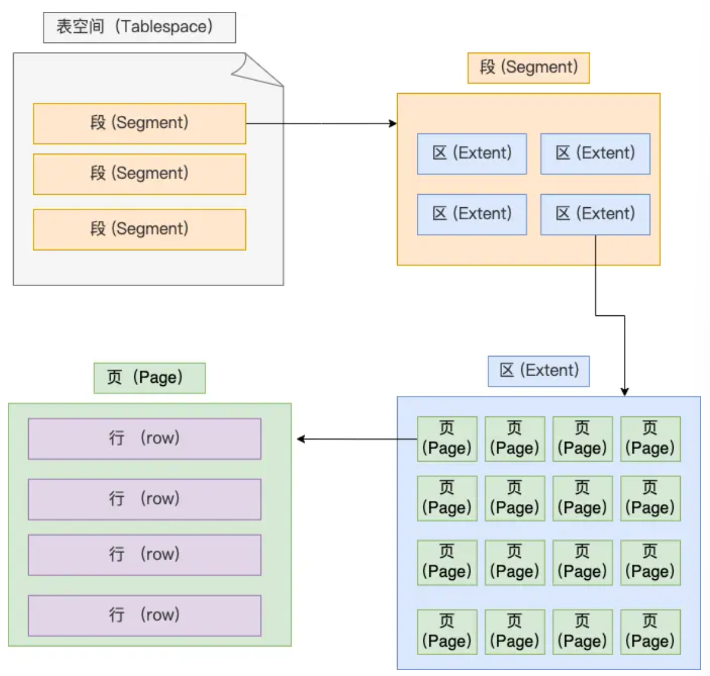

## MySQL 基础
#### 执行一条 select 语句，期间发生了什么？一条 SQL 查询语句是如何执行的？

MySQL 的架构分为 **Server 层**和**存储引擎层**两部分，**Server 层负责建立连接、分析和执行 SQL，存储引擎层负责数据的存储和提取**

MySQL 是基于 TCP 进行传输的，要先连接 MySQL 服务才能执行 SQL 语句，可以用 `show processlist;` 命令来查看当前 MySQL 服务被多少个客户端连接了，以及连接的状态，空闲连接是有最大空闲时长的（wait_timeout），最大连接数也有限制（max_connections），可以用 `kill connection + id;` 来断开连接，用 `show variables like 'wait_timeout';` 和 `show variables like 'max_connections';` 来查看当前的配置

MySQL 的连接跟 HTTP 一样也有短连接和长连接两种模式，短连接是每次请求都建立和断开连接，长连接是建立连接后可以复用，减少了频繁建立连接的开销，但长连接会占用内存，我们可以定期断开长连接，或者客户端主动重置连接，来释放内存

建立连接之后就可以向 MySQL 服务发送 SQL 语句了，下面才是真正的执行过程：

1. MySQL 8.0 之前：先解析 SQL 语句的第一个字段看一下是什么类型的语句，如果是查询语句就会先去**查询缓存**（以键值对类型保存在内存中）里查找缓存数据，如果命中就会直接返回值，如果没有才会继续往下执行
   * 由于对于更新比较频繁的表，查询缓存的命中率太低（只要有一个表有更新，这个表的所有查询缓存就会被清空），所以 MySQL 8.0 就移除了查询缓存
2. **解析 SQL**：
   1. MySQL 会先用解析器对 SQL 语句进行**词法分析**和**语法分析**
   2. 词法分析会识别关键字，如 select 和 from
   3. 语法分析会根据词法分析的结果和语法规则判断输入的 SQL 语句是否满足 SQL 语法，如果有问题就会报错，如果没问题就会构建 SQL 语法树，方便后续模块获取 SQL 类型、表名、字段名和 where 条件等信息
3. **执行 SQL**：（select —— 查询语句）
   1. 先进入**预处理**阶段，预处理器会检查 SQL 查询语句中的表或字段是否存在，并将 select * 中的 * 扩展为表上的所有列
   2. 然后是**优化**阶段，优化器会负责将 SQL 查询语句的执行方案确定下来，比如要使用哪个索引，可以在 SQL 前面加一个 explain 来查看执行计划
   3. 最后是**执行**阶段，执行器会跟存储引擎交互，真正执行语句

#### 主键、索引和外键的区别是什么？

**主键**是一列，它的值可以唯一标识表中的每一行数据，每个表只能有一个主键，并且主键的值**不能重复也不能为空**，通常用于保证数据的唯一性和在表中查找特定的行

**索引**没有重复值，但可以有一个空值，主要是用于快速查询到数据

**外键**是一个表中的一个字段，它的值是另一个表的主键，用于建立两个表之间的关系

#### 优化器如何决定使用某个索引？ 

本质这是一个基于成本的决策，它会根据统计信息估算一下，在当前查询语句下，使用某个索引的**选择性**如何、**需要扫描多少索引页和数据页**、**是否需要回表**、能不能顺带解决排序/分组/limit 等，然后把这些成本和全表扫描、其他索引方案做对比，选择成本最低的方案执行

选择性高、组合顺序匹配 where/order by/group by/limit 的**覆盖索引**在**大表**上更有可能被优化器优先考虑，而选择性差、被函数包裹、表本身比较小的情况下，即使有索引也可能被忽略

#### 如何分析一条慢 SQL 的执行瓶颈？

分析一条慢 SQL，我会先通过**慢日志**确认它到底慢在什么维度，看常用的 **Query_time、Lock_time、Rows_examined、Rows_sent** 等指标，来大致判断是扫描行数很大（索引/执行计划问题）、锁等待严重，还是排序/分组耗时

然后用 **EXPLAIN/EXPLAIN ANALYZE** 看执行计划和真实耗时，是全表扫描、错误索引、回表太多，还是临时表、额外排序或 join 过多

最后再结合表的统计信息和索引设计，从**减少扫描行、减少随机 I/O、减少排序/临时表、减少锁等待**这四个方向去针对性优化 SQL 或索引结构，而不是只盯着一个字段加不加索引

#### 数据库的慢查询要怎么优化？

先通过**慢查询日志**定位到慢查询语句，然后用 **EXPLAIN** 分析执行计划，从而针对不同问题采取不同的优化措施

扫描行数太多（Rows_examined 高）：

A：先查一下日志看看是哪些语句是慢查询，然后可以用 EXPLAIN 来分析一下执行计划，看看是否有索引没有命中、全表扫描还是排序开销大等问题，如果是索引没有命中就可以考虑加索引，如果是全表扫描就可以考虑优化 SQL 语句，或者是加一些缓存来减少数据库的压力；另外还可以考虑分库分表来提高性能；索引优化的话可以考虑使用覆盖索引来减少回表的次数，或者是用联合索引来减少索引的数量，也可以删除重复和无用的索引来让优化器更快选出最优索引；如果是排序开销大就可以考虑加一个临时表来存储中间结果，或者是用一些缓存来减少数据库的压力；另外也可以分多几个库，比如主库负责写入，从库负责读取，也可以分区分表来提高性能，或者重新设计表结构，非实时场景可以先写入消息队列然后再异步处理

* SQL 调优你了解吗，比如说你调试的一些 SQL 语句怎么验证它是否命中了一些索引，以及它的性能是否是最优，该通过什么样的方式去验证

* MySQL 跟性能有关的参数你知道一些什么呢？比如说你自己在安装 MySQL 的时候会去做哪些配置，比如说它的默认配置你会去关注哪些参数，你会去改哪些吗？

* 使用 MySQL 时有遇到过什么性能方面的问题吗？

#### MySQL 一行记录是怎么存储的？

MySQL 目前默认使用的是 InnoDB 存储引擎，它的数据是保存在磁盘的 /var/lib/mysql/ 目录下，每个数据库对应一个文件夹，每个表对应一对 .frm 和 .ibd 文件，**.frm 文件保存表的结构信息，.ibd 文件保存表的数据和索引信息**

表空间是由**段、区、页、行**（segment、extent、page、row）组成的，数据库表中的的记录都是按行进行存放的，每行记录根据不同的行格式有不同的存储结构

记录是按照**行**来存储的，但 InnoDB 是按**页**为单位来**读写**的，每个页默认的大小是 16 KB，页是 InnoDB 存储引擎磁盘管理的最小单元

在表中数据量大时，为某个索引分配空间时就不会以页为单位来分配了，而是以**区**为单位来分配，每个区包含 64 个**连续**的页，大小是 1 MB，这样对于 16 KB 的页来说就能使**相邻页的物理位置页相邻**，能使用顺序 I/O 从而提高读写性能

多个区组成段，表空间就是由多个段组成的，不同类型的数据会存放在不同的段中，比如说**数据段**，存放 B+ 树叶子节点的区，**索引段**，存放 B+ 树非叶子节点的区，**回滚段**，存放回滚数据的区

InnoDB 提供 4 种行格式，分别是 **Compact**、Redundant、**Dynamic** 和 **Compressed**，其中 Redundant 由于太古老已经没有什么人用了，它并不是一种紧凑的行格式，而剩下的三种都是**紧凑**的行格式，能让一个数据页中存放更多的行记录

一条完整的行记录分为**记录的额外信息**和**记录的真实数据**两个部分

* 记录的额外信息
  * 变长字段长度列表：
    * 存放变长字段的长度信息，会按照列的顺序**逆序**存放，使位置靠前的真实数据和数据对应的字段长度信息可以同时在一个 CPU Cache Line 中，**提高 CPU Cache 的命中率**
    * 每个变长字段占用 1 或 2 个字节，具体取决于表中变长字段的总数是否超过 255 个，如果超过了就需要 2 个字节（字符集是 ASCII 的话，每个字符占 1 个字节）
    * **NULL 是不会存放在行格式中记录的真实数据中的**，所以变长字段长度列表中也不会存放 NULL 值的变长字段的长度信息，当数据表没有变长字段时，变长字段长度列表就不会存在了
  * NULL 值列表：
    * 存放哪些字段是 NULL 的信息，每个字段占用 1 位，1 表示 NULL，0 表示非 NULL，也是按照列的顺序**逆序**存放
    * 当数据表的字段都定义成 NOT NULL 时，NULL 值列表就不会存在了
  * 记录头信息
    * **delete_mask**：标识该记录是否被删除，执行 delete 删除记录时**并不会真正删除记录**，只是把这个记录的 delete_mask 标记为 1
    * **next_record**：下一条记录的位置，记录与记录之间是通过**链表**组织的，指向的是下一条记录的记录头信息和真实数据之间的位置，这样向左读就是记录头信息，向右读就是真实数据，比较方便
    * **record_type**：表示当前记录的类型，0 表示普通记录，1 表示 B+ 树非叶子节点记录，2 表示最小记录，3 表示最大记录
* 记录的真实数据（三个隐藏字段）
  * row_id
    * 如果建表时没有指定主键或唯一约束，InnoDB 会自动生成一个隐藏的 row_id，它并不是必须的，会占用 6 个字节
  * trx_id
    * 事务 id，表示这个数据是由哪个事务生成的，它是必需的，会占用 6 个字节
  * roll_pointer
    * 记录上一个版本的指针，它是必需的，会占用 7 个字节

#### MySQL 的 NULL 值是怎么存放的？

MySQL 的 Compact 行格式中会用 **NULL 值列表**来记录值为 NULL 的列，**NULL 值并不会存储在行格式中的真实数据部分**

NULL 值列表会占用 **1 字节空间**，如果表中的字段数超过 8 个的话，每增加 8 个字段就会多占用 1 字节空间，当表中所有字段都定义成 **NOT NULL** 时，NULL 值列表就不会存在了，从而节省 1 字节的空间

#### MySQL 怎么知道 varchar(n) 实际占用数据的大小？

MySQL 的 Compact 行格式中会用 **变长字段长度列表** 来记录变长字段的实际长度

#### varchar(n) 中 n 最大取值为多少？

MySQL 规定除了 **TEXT、BLOBs** 这种大对象类型之外，其他所有的列（不包括隐藏列和记录头信息）占用的总字节长度不能超过 **65535** 个字节，即一行的总长度最大为 为 65535 字节

如果字符集是 ASCII 的话，由于**变长字段长度列表和 NULL 值列表都会占用字节**，所以我们需要保证的是**所有字段的长度 + 变长字段长度列表 + NULL 值列表 ≤ 65535 字节**

如果是**单字段**的情况，因为变长字段长度列表允许存储的最大字节数大于 255 字节，所以需要 **2** 个字节，NULL 值列表需要 1 个字节，所以最大就是 65535 - 2 - 1 = **65532** 字节

#### 行溢出后，MySQL 是怎么处理的？

MySQL 中磁盘和内层交互的基本单位是**页**，InnoDB 存储引擎的默认页大小是 16 KB，一行记录如果超过了 16 KB（即**一个页存不了一条记录**），就会发生**行溢出**，多的数据就会存到另外的**溢出页**中

如果是 **Compact** 行格式，发生行溢出时，在记录的真实数据处**只会保存该列的一部分数据，剩下的数据会存到另外的溢出页中**，并且在记录的真实数据处会用 20 字节保存一个指向溢出页的**指针**，从而找到剩余数据所在页

而如果是 **Compressed 或 Dynamic** 行格式，它们和 Compact 很像，但它们采用的是**完全的行溢出方式**，一旦发生行溢出，记录的真实数据处是**不会保存任何数据的，所有数据都会存到另外的溢出页中**，它们只会在记录的真实数据处用 20 字节保存一个指向溢出页的指针

#### MySQL 的存储引擎有哪些？

MySQL 当前默认的存储引擎是 **InnoDB**，支持**事务、行级锁和 MVCC**，有**聚簇索引和崩溃恢复**功能，适合大多数场景

早期版本的默认存储引擎是 **MyISAM**，支持**表级锁和全文索引**，但**不支持事务、外键约束和行级锁**，适合**读多写少**的场景

另外还有 **MEMORY** 存储引擎，数据存放在内存中，速度非常快，但数据不持久化，适合**临时表和缓存表**等场景，还有一些特殊用途的引擎，例如 **NDB** 用于 **MySQL Cluster** 的分布式场景，**ARCHIVE** 用于日志归档，**CSV** 用于 CSV 文件存储，**FEDERATED** 用于访问远端 MySQL 表，**BLACKHOLE** 只写入不存储，用于复制链路或测试等

#### 同样是一百万的数据量，读的话，InnoDB 和 MyISAM 哪个更快

A：如果只是纯粹的单次读的话，MyISAM 会稍微快一点，因为它没有事务和 MVCC 的元数据开销，但如果是高并发的读写混合场景下，InnoDB 的 Buffer Pool 同时缓存数据和索引，在预热后会更快，因为它支持行级锁和多版本并发控制（MVCC），可以更好地处理并发事务，避免了 MyISAM 的表级锁带来的性能瓶颈；另外 InnoDB 还支持更复杂的查询和事务处理，所以在大多数情况下，InnoDB 是更好的选择

#### 给你一个用户信息表，选择使用哪个存储引擎来存储，为什么

A：嗯用户信息表是属于读多写少的场景，所以我会优先选择默认的 InnoDB 引擎，它既能提供完整的事务和 MVCC，保证用户数据在并发修改时能原子且一致地提交，又支持外键约束和崩溃自动恢复，符合核心业务对数据可靠性的要求，只有在完全只读或者对高可用有特殊要求的极端场景下我才会考虑 MyISAM 或者其他引擎

#### SQL 中的 JOIN 操作是什么？常见的 JOIN 有哪几种？

**Q：多级评论的表（最多二级），你会设计哪几个关键字段**

A：我会让表里有 comment_id (主键)、post_id (归属资源)、user_id (评论人)、parent_id (父评论，NULL 表示一级)、root_id (根评论，用于快速聚合一级＋二级)、reply_to_user_id (被@用户)、level (层级)、content (内容) 以及 created_at、updated_at 打点时间。
这样，当我要查询一个帖子下所有一级评论，就 WHERE post_id=? AND level=1；要加载某条一级评论的二级回复，就 WHERE root_id=? AND level=2。reply_to_user_id 让前端能正确显示“回复 @某人”。索引方面，我会针对 (post_id, level, created_at) 做分页，以及 (parent_id, root_id) 做回复聚合，保证高并发场景下也能快速返数据

**Q：写 sql，查询二级评论最多的一级评论，取前十条**

A：

    -- 查询前 10 个二级评论最多的一级评论 ID 及其回复数
    SELECT
    root_id AS comment_id,
    COUNT(*) AS reply_count
    FROM comment
    WHERE level = 2
    GROUP BY root_id
    ORDER BY reply_count DESC
    LIMIT 10;

思路：先把所有二级评论（level=2）按 root_id 聚合，计算每个 root 的回复数，再按数量倒序取前 10

* MySQL 的缓存池是什么？

* 有了解过 SQL 注入等安全问题吗？

#### 什么是数据库的分片和分区？有什么区别？

