## 日志
#### undo log、redo log 和 binlog 分别是什么？

**undo log（回滚日志）**是 InnoDB 存储引擎层生成的日志，实现了事务中的**原子性**，主要用于**事务回滚和 MVCC**

**redo log（重做日志）**也是 InnoDB 存储引擎层生成的日志，实现了事务中的**持久性**，主要用于**掉电**等故障恢复

**binlog（归档日志）**是 server 层生成的日志，主要用于**数据备份和主从复制**

#### 为什么需要 undo log？

我们在执行增删改的语句时，mysql 会**隐式自动开启事务**来执行，执行完毕就自动提交，如果这个事务在执行过程中，MySQL 发生了**崩溃**，就需要使用 **undo log** 来**回滚**到事务之前的数据，事务的**原子性**就是这样实现的

**undo log 是一种用于撤销回退的日志**，在事务没提交之前，MySQL 会记录更新前的数据到 undo log 中，比如在插入一条记录时，会把这条记录的主键值记下来，回滚时只要把这个主键值对应的记录删掉就好了，删除和更新也是同理，都是**做原先的相反操作**，但 delete 其实不会立即删除，而是将要被删除的对象打上 delete flag，标记为删除，最终由 purge 线程完成删除，update 就要看更新的列是否是主键列，不是的话就在 undo log 中直接反响记录是如何 update 的，是的话就先删除该行，再插入一条目标行，**不同的操作需要记录的内容是不同的，对应所产生的 undo log 的格式也是不同的**

undo log 的另外一个作用是**配合 ReadView 实现 MVCC（多版本并发控制）**，一条记录的每一次更新操作产生的 undo log 的格式都有一个 **roll_pointer 指针和一个 trx_id 事务 id**，roll_pointer 可以**将这些不同版本的 undo log 串成一个链表**，这个链表就被称为**版本链**，trx_id 可以**标识该记录是被哪个事务修改的**

对于**读已提交**隔离级别来说，它是**每个 select 都会生成一个新的 ReadView**，也就是说事务期间多次读取同一条数据，前后两次读到的数据可能会出现不一致，对于**可重复读**隔离级别来说，它只会**在事务开始时生成一个 ReadView**，然后整个事务期间都用这个 ReadView，事务期间多次读取同一条数据，前后两次读到的数据是一致的

这两个隔离级别都是通过 **MVCC** 实现的，也就是**快照读**，它们会根据事务的 ReadView 里的字段和记录中的 trx_id 和 roll_pointer 这两个隐藏字段来**判断该记录的版本是否对当前事务可见**，如果不可见，就通过 roll_pointer 指针顺着 undo log 版本链找到对应的 undo log，然后根据 undo log 里的内容来还原出该记录对当前事务可见的版本

所以，undo log 就是**实现事务回滚**，保障事务的原子性，和**配合 ReadView 实现 MVCC**，这两个主要的功能，undo log 和数据页的刷盘策略是一样的，都要**通过 redo log 来保证持久化**，buffer pool 中有 undo 页，对 undo 页的修改也会记录到 redo log，redo log 会每秒刷盘，提交事务时也会刷盘，从而保证持久化

#### 为什么需要 redo log？

Buffer Pool 是基于内存的，为了防止断电导致数据丢失的问题，当有一条记录需要更新时，InnoDB 会**先更新内存**，然后将本次对这个页的修改**以 redo log 的形式记录下来**，后面再由后台线程将脏页刷新到磁盘里，这就是 **WAL**（Write Ahead Logging）技术，指的是 **MySQL 的写操作并不是立刻写到磁盘上，而是先写日志，再在合适的时间写到磁盘上**

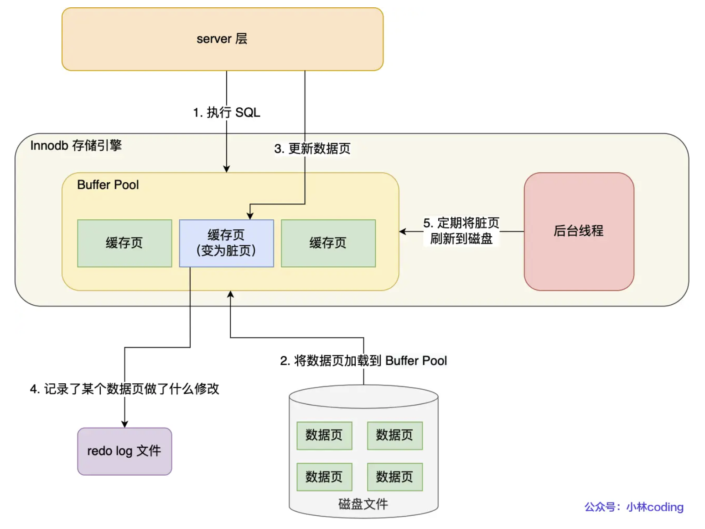

redo log 会记录某个数据页做了什么修改，每当执行一个事务就会产生这样的一条或多条物理日志，在**事务提交**时，只要**先将 redo log 持久化到磁盘即可**，可以不需要等到将缓存在 Buffer Pool 里的脏页数据持久化到磁盘，这样即使系统崩溃，虽然脏页数据没有持久化，但重启之后可以根据 redo log 的内容将所有数据恢复到最新状态，这个能力称为 crash-safe，崩溃恢复

undo log 被更新了之后也会产生对应的 redo log，redo log 记录的是此次事务修改**后**的数据状态，记录的是更新**之后**的值，主要用于**事务崩溃恢复**，保证事务的**持久性**，而 undo log 记录的是此次事务修改**前**的数据状态，记录的是更新**之前**的值，主要用于**事务回滚**，保证事务的**原子性**，如果是在事务提交之前崩溃（事务执行错误），就会通过 undo log 来回滚事务

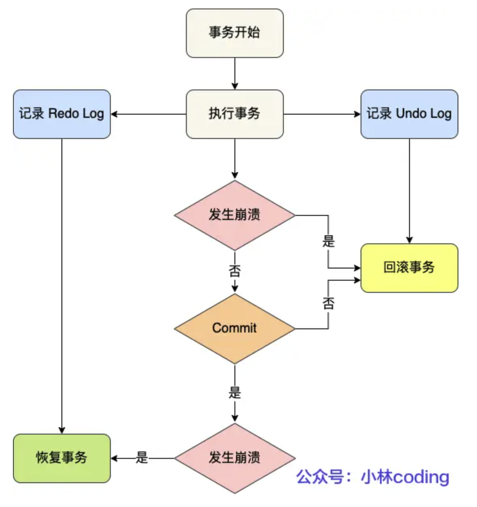

而写入 redo log 的方式是**追加操作**，在磁盘中就是**顺序写**，但直接把数据写入磁盘则需要**先找到写入位置，再进行写入**，是**随机写**，顺序写的效率要远高于随机写，所以 redo log 写入磁盘的开销更小，这也是我们需要它的另一个原因

总结：redo log 实现了事务的**持久性**，让 MySQL 具备崩溃恢复能力，同时**将写操作从随机写变成了顺序写**，大大提升了写入性能

redo log 本身也不是直接写入磁盘的，它也有自己的缓存，叫 **redo log buffer**，redo log 先写入 redo log buffer，然后由后台线程定期将 redo log buffer 刷新到磁盘上的 redo log 文件中，缓存大小默认是 16 MB，可以通过参数 `innodb_log_buffer_size` 来配置，增大它的大小可以让 MySQL 处理大事务时不需要写入磁盘

#### redo log 什么时候刷盘？

主要是下面几种情况：

* **MySQL 正常关闭时**
* redo log buffer 中记录的写入量**大于** redo log buffer 内存空间的**一半**时
* InnoDB 的**后台线程每隔一秒**会将 redo log buffer 刷新到磁盘上一次
* 每次**事务提交**时，都会将缓存里的 redo log 刷新到磁盘上

**`innodb_flush_log_at_trx_commit`** 参数**控制每次事务提交时 redo log 的刷盘策略**，默认值是 **1**，表示**每次**事务提交时都会将缓存里的 redo log **直接持久化到磁盘上**，这样可以保证 MySQL 异常重启后数据不会丢失，为 **0** 时表示**每次**事务提交时都把 redo log **留在缓存中**，该模式下事务提交不会主动触发写入磁盘的操作，为 **2** 时表示**每次**事务提交时都只是把缓存中的 redo log **写到 redo log 文件**，并没有写入磁盘，也就是**写入了操作系统的文件缓存**，就是**页缓存**

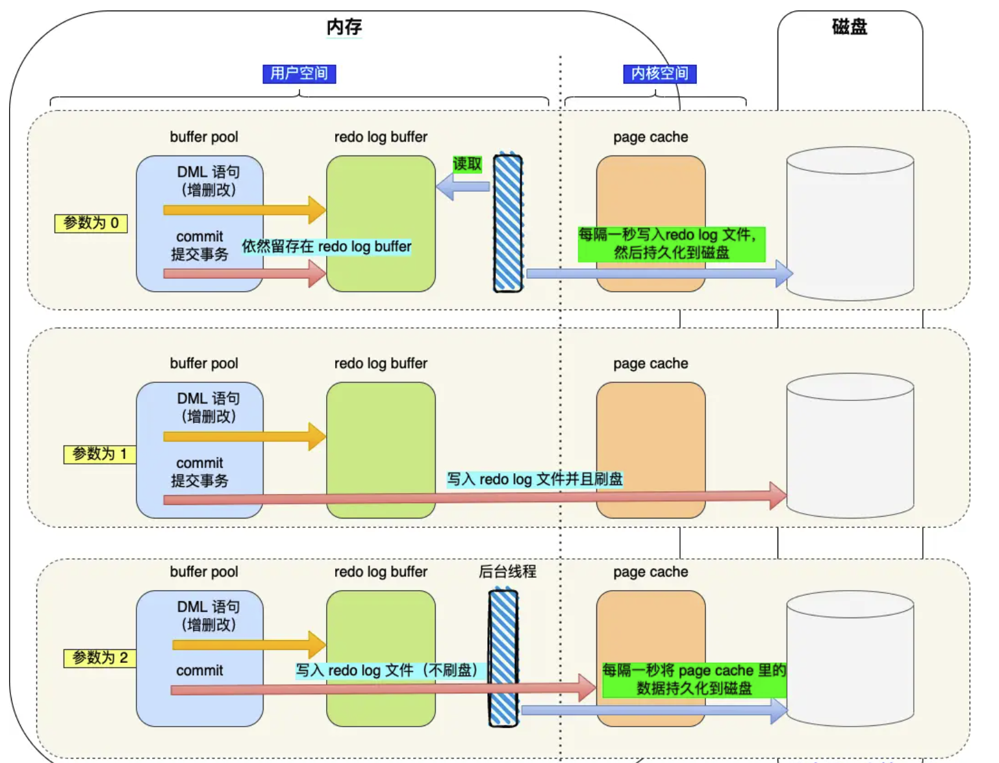

也就是说，InnoDB 的后台线程每隔一秒，在参数为 0 的情况下，会调用 `write()` 函数把 redo log 缓存里的 redo log 写到操作系统的页缓存，然后调用 `fsync()` 持久化到磁盘，也就是说在这种策略下，**MySQL 进程到崩溃会导致上一秒所有事务数据的丢失**

如果参数为 2，后台线程也是每隔一秒，但它会直接调用 `fsync()` 来做持久化，也就是 **MySQL 进程崩溃不会导致数据丢失，只有在操作系统崩溃或者系统断电的情况下上一秒的所有事务数据才可能丢失**

所以，**参数为 1 时数据最安全，但性能最差，参数为 0 时性能最好，但数据最不安全**，参数为 2 时性能和数据安全性介于两者之间，在一些对数据安全性要求比较高的场景中，应该把参数值设为 1

#### 如果 redo log 文件写满了，该怎么办？

InnoDB 存储引擎在默认情况下有一个**重做日志文件组**，里面包含两个分别叫做 `ib_logfile0` 和 `ib_logfile1` 的重做日志文件，这两个文件是**循环使用**的，当一个文件写满之后，就切换到另一个文件继续写入，另一个文件也写满了之后，就会切换回第一个文件，这两个文件的大小是固定且一致的，随着系统运行，Buffer Pool 里的脏页被刷新到磁盘之后，这些脏页对应的 redo log 就不再需要了，就可以擦除这些旧记录

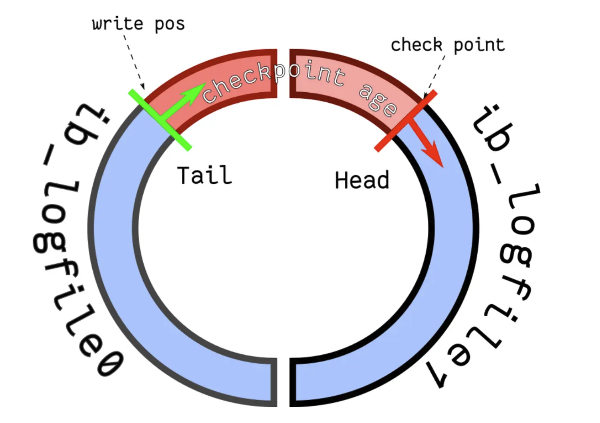

循环写的方式相当于这样一个**环形**，**write pos** 和 **checkpoint** 分别表示**当前写到的位置**和**当前要擦除的位置**，它们都是顺时针方向移动，红色部分用来记录新的更新操作，蓝色部分表示待落盘的脏页数据

如果 write pos 追上了 checkpoint，就说明 redo log 文件**满了**，这时 MySQL 不能再执行新的更新操作，也就是会被阻**塞**，这也是为什么对于并发量大的系统，适当设置 redo log 的文件大小是重要的，满了之后就会**先停下来将 Buffer Pool 里的脏页刷新到磁盘中**，然后标记 redo log 里哪些对应的记录可以被擦除，再擦除，擦除之后 checkpoint 继续往后移动，MySQL 才会恢复正常运行

#### 为什么需要 binlog？

binlog 是 **server 层**生成的日志，也是在**事务提交时**将执行过程中产生的所有 binlog 统一写入 binlog 文件中，**binlog 只记录所有数据库表结构变更和表数据修改的日志，不会记录查询类的操作**

最开始 MySQL 使用的不是 InnoDB 引擎，而是 MyISAM，MyISAM 是没有崩溃恢复能力的，binlog 只能用于**归档**，后来 InnoDB 由另一个公司以插件形式引入了 MySQL，再通过 redo log 实现了崩溃恢复

binlog 有**三种**格式类型，分别是 **STATEMENT（默认格式）、ROW 和 MIXED**，**STATEMENT** 会**将每一条修改数据的 SQL 都记录到 binlog 中**，用于**主从复制**中从库执行相同的 SQL 来达到和主库一致的状态，但如果使用了**动态函数**，比如 `now()`、`uuid()` 等，可能会导致**主从数据不一致**的问题，**ROW** 格式则是**将每一行数据的修改前后的值都记录下来**，从而避免了这个问题，但会导致 binlog 文件变**大**，**MIXED** 则是两者**结合**，默认使用 STATEMENT 格式，只有在使用了动态函数时才使用 ROW 格式

binlog 是**追加写**，写满一个文件之后就会创建一个新的继续写，不会覆盖以前的日志，保存的是**全量的日志**，它主要被用于**备份恢复**和**主从复制**场景下，如果整个数据库的数据都被删除了，是不能通过 redo log 文件恢复的，只能使用 binlog 文件恢复，因为 redo log 文件是循环写，只记录没有被刷入磁盘的数据的物理日志，已经被刷入磁盘的数据就会被删除

#### 主从复制是怎么实现的？

MySQL 的主从复制是依赖于 **binlog** 的，复制的过程就是**将 binlog 的数据从主库传输到从库上**，这个过程一般是**异步**的，也就是主库上执行事务操作的线程不会等待复制 binlog 的线程同步完成

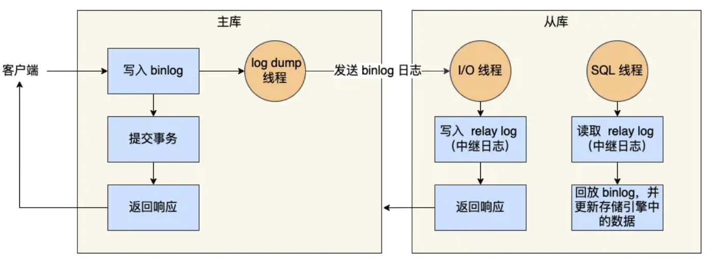

主要是三个阶段：

首先，主库在收到客户端提交事务的请求之后，会**先写入 binlog，再提交事务**，更新存储引擎中的数据，事务提交完成后就返回响应给客户端

然后，从库会创建一个**专门的 I/O 线程**来连接主库的 **log dump 线程**，接收主库的 binlog 日志，再把 binlog 写入到 **relay log（中继日志）**中，再返回响应给主库

最后，从库会创建一个**用于回放 binlog 的线程**，来读取 relay log 中的 binlog 日志，然后回放 binlog 更新存储引擎中的数据，从而达到和主库数据一致的状态

完成了主从复制之后，我们就可以在写数据时只写主库，读数据时只读从库，从而实现**读写分离**，即使写请求会锁表或者锁记录，也不会影响到读请求的处理，从而提升整体的并发能力和性能

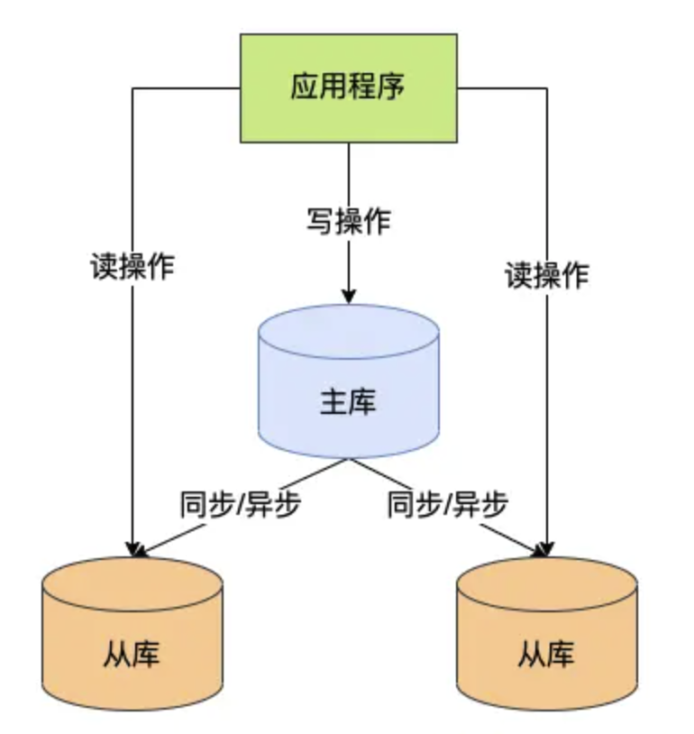

但**从库并不是越多越好的**，因为随着从库数量增加，主库要创建同样多的 log dump 线程来处理复制请求，会占用更多的主库资源，影响主库的性能，同时还受限于主库的网络带宽，所以在实际使用中，一个主库一般跟两到三个从库（一主二从一备）比较合适

MySQL 的主从复制模型主要有三种：

**同步复制**，主库提交事务的线程要等待**所有**从库的复制成功响应之后才会返回响应给客户端，这种模式下性能和可用性都会比较差

**异步复制（默认模型）**，主库提交事务的线程**并不会等待** binlog 同步到各个从库，而是直接返回响应给客户端，这种模式下性能和可用性都比较好，但会存在数据丢失的风险，例如主库宕机的情况下

**半同步复制**，介于同步和异步之间，主库提交事务的线程只需要等待**至少一个**从库的复制成功响应之后才会返回响应给客户端，这种模式下性能和可用性都比较好，同时也降低了数据丢失的风险，兼顾了异步和同步的优点

#### binlog 什么时候刷盘？

binlog 也有自己的缓存，叫 **binlog cache**（server 层的 cache），事务在执行过程中，会将 binlog 先写入 binlog cache，事务提交时再把缓存写到 binlog 文件中，参数 **`binlog_cache_size`** 用于配置单个线程内 binlog cache 的大小，如果超过了，就要暂存到磁盘

一个事务的 binlog 是**不能被拆开**的，无论这个事务有多大，也要保证一次性写入，这是因为一个线程上同时只能有一个事务在执行，每开始一个事务时，就会默认提交上一个事务，这样如果一个事务的 binlog 被拆开了，**在备库执行时就会被当作多个事务分开执行**，就破坏了事务的**原子性**

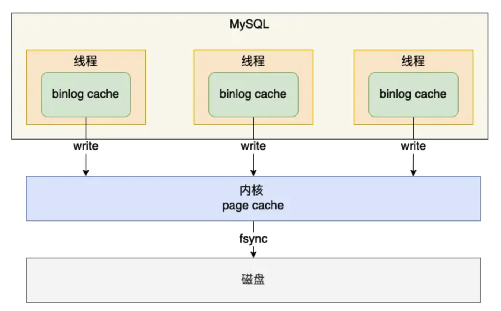

在事务提交时，执行器把 binlog cache 里的**完整**事务写入到 binlog 文件中，并清空 binlog cache，虽然每个线程都有自己的 binlog cache，但最终都是写到**同一个** binlog 文件中，写入到 binlog 文件时并没有把数据持久化到磁盘，这时数据还在**操作系统的页缓存**中，MySQL 提供 **`sync_binlog`** 参数来控制 binlog 什么时候刷盘

`sync_binlog` 为 **0** 时，表示每次提交事务都**只写到 binlog 文件**中，不调用 `fsync()`，由操作系统来决定什么时候刷盘，这样性能最好，但数据安全性最低，这也是默认值，一旦主机发生异常重启，还没持久化到磁盘的数据就会丢失

`sync_binlog` 为 **1** 时，表示每次提交事务将数据写到 binlog 文件后**都会调用 `fsync()`** 将 binlog 文件持久化到磁盘，这样数据最安全，但性能最差，即使主机发生异常重启，最多也只会丢失一个事务的 binlog

`sync_binlog` 为 **N**（N>1）时，表示每**隔 N 次**提交事务才调用一次 `fsync()` 将 binlog 文件持久化到磁盘，这样性能和数据安全性介于两者之间，如果能允许少量事务的 binlog 日志丢失，为了提高写入的性能，一般会将 `sync_binlog` 设置为 100 到 1000 中的某个值

#### 为什么 redo log 和 binlog 在事务提交之后，需要两阶段提交？它的具体过程是什么？

主要是为了**保证主从一致**，redo log 和 binlog 持久化到磁盘是两个独立的逻辑，可能会出现半成功的状态

如果是**在 redo log 刷盘之后，binlog 刷盘之前**，MySQL 宕机了，重启之后虽然可以通过 redo log 将 Buffer Pool 中的数据恢复到最新状态，但 binlog 没有持久化到磁盘，导致**从库无法获取到最新的 binlog 日志**，从库里的数据还是旧值，从而出现主从数据不一致的问题

如果是**在 binlog 刷盘之后，redo log 刷盘之前**，MySQL 宕机了，由于 redo log 还没写，崩溃恢复后这个事务是无效的，所以主库里记录还是旧值，**但 binlog 已经持久化到磁盘**，从库会获取到这个 binlog 日志，并执行更新操作，将数据更新为新值，导致也会出现主从数据不一致的问题

所以，为了避免这两种半成功的状态，MySQL 采用了**两阶段提交**的方式，它其实是一个**分布式事务一致性协议**，用来保证多个逻辑操作**要么全部成功，要么全部失败**，从而保证主从数据一致，两阶段提交把单个事务的提交拆分成了**准备**和**提交**这两个阶段，每个阶段都由**协调者**和**参与者**共同完成

在 MySQL 的 InnoDB 存储引擎开启 binlog 的情况下，MySQL 使用了**内部 XA 事务**来实现两阶段提交，InnoDB 存储引擎作为参与者，server 层（binlog）作为协调者

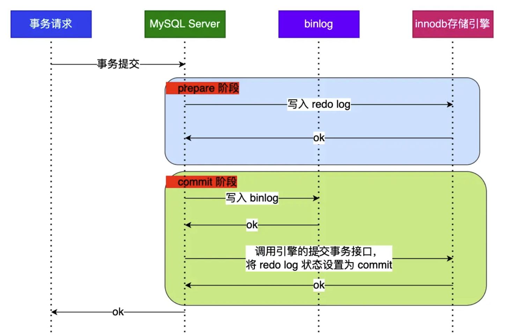

我们把 **redo log 的写入**拆成了 **prepare** 和 **commit** 两个阶段，**中间再穿插写入 binlog**，首先将 **XID**（内部 XA 事务 id） 写入 redo log，将 redo log 对应的事务状态设置为 prepare，然后将 redo log 持久化到磁盘（`innodb_flush_log_at_trx_commit` = 1）

接着**将 XID 写入到 binlog**，将 binlog 持久化到磁盘（`sync_binlog` = 1），再调用存储引擎的**提交事务接口**，将 redo log 状态设置为 commit，此时该状态并不需要持久化到磁盘，只需要调用 `write()` 函数写到操作系统的页缓存中即可，因为只要 binlog 写磁盘成功，即使 redo log 的状态还是 prepare，也一样会被认为事务已经提交成功

如果是 redo log 已经写入磁盘，binlog 还没有写入磁盘，或者是 redo log 和 binlog 都已经写入磁盘，但还没有写入 commit 状态，这两种情况下 redo log 都会处于 prepare 状态，在 MySQL 宕机重启后，会按顺序扫描 redo log 文件，发现有 prepare 状态的事务，就会**拿着 redo log 中的 XID 去 binlog 文件中查找对应的 binlog 日志**，如果找到了，就说明 redo log 和 binlog 都已经写入磁盘了，就会提交事务，如果没找到，就说明 binlog 没有写入磁盘，就会回滚事务

所以两阶段提交是**以 binlog 写成功作为事务提交成功的标志**，对于处于 prepare 状态的 redo log，通过查找**是否有与 redo log 相同 XID 的 binlog** 来决定是提交还是回滚事务，从而避免了主从数据不一致的问题

另外，由于 **redo log 在事务未提交时也可能被持久化到磁盘**，如果这时 MySQL 崩溃重启了，就会进行回滚操作，因为这时 binlog 是还没有持久化到磁盘的，所以不会出现主从数据不一致的问题，**binlog 必须在事务提交之后才会被持久化到磁盘**

#### 两阶段提交会有什么性能影响吗？

主要是**磁盘 I/O 次数高**和**锁竞争激烈**两个问题，当 **`sync_binlog` 和 `innodb_flush_log_at_trx_commit` 都设置为 1 时**，每次提交事务都需要把 redo log 和 binlog 持久化到磁盘，也就是**在每个事务提交过程中**都会**至少调用两次刷盘**，而 MySQL 早期是通过 `prepare_commit_mutex` 这个锁来保证事务提交的顺序的，一个事务只有在获取到锁时才能进入 prepare 状态，一直到 commit 状态才会释放锁，其他事务只能在等待锁的过程中排队等待，这在并发量高的场景下会导致严重的锁竞争，从而影响整体的性能

于是 MySQL 引入了**组提交机制**，当有多个事务提交时，会**将多个 binlog 刷盘操作合并成一个**，从而减少磁盘 I/O 的次数，这个机制下，prepare 阶段不变，只针对 commit 阶段，将其拆分成了 **flush、sync、commit** 三个阶段，多个事务会**按进入的顺序**将 binlog 从缓存写入到操作系统**页缓存**（还没有刷盘，只是调用 `write()`），然后在 **sync** 阶段将多个事务的 binlog **合并**成一次 fsync 的刷盘，最后在 commit 阶段各个事务**按顺序**做事务提交操作

flush、sync 和 commit 这三个阶段，每个阶段都有一个**队列**，每个队列都有**锁**来**保证事务写入的顺序**，**第一个进入队列的事务**会成为 **leader**，其他事务会成为 **follower**，leader **全权负责**所在队列的所有事务，完成后通知 follower 操作结束，这样**锁的粒度就减小了**，让多个阶段可以**并发执行**，从而提升了整体的性能

**redo log** 则不再在 prepare 阶段让各事务各自执行刷盘，而是**推迟到组提交的 flush 阶段**，下面是所有阶段的全过程，针对的还是 `sync_binlog` 和 `innodb_flush_log_at_trx_commit` 都设置为 1 的情况：

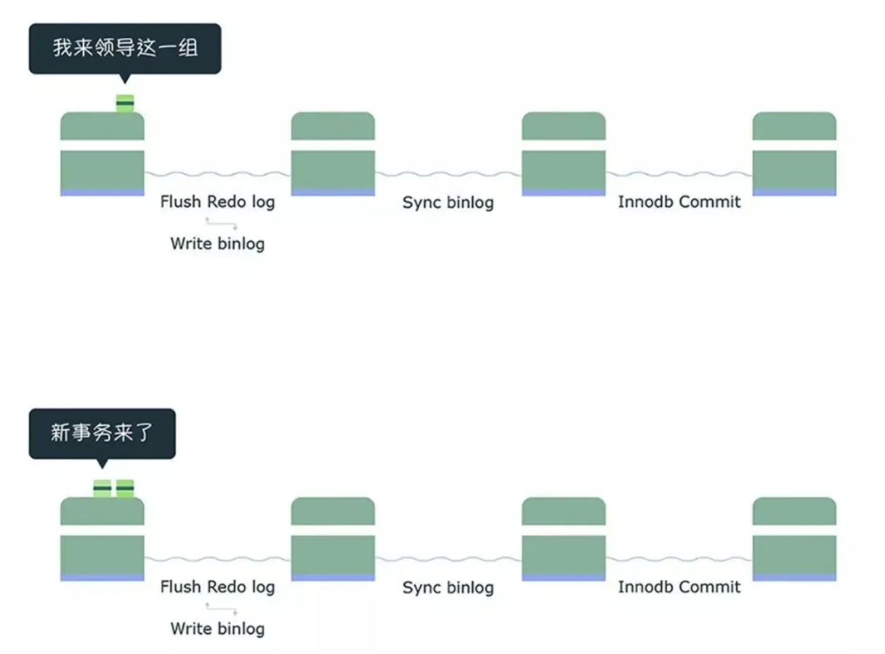

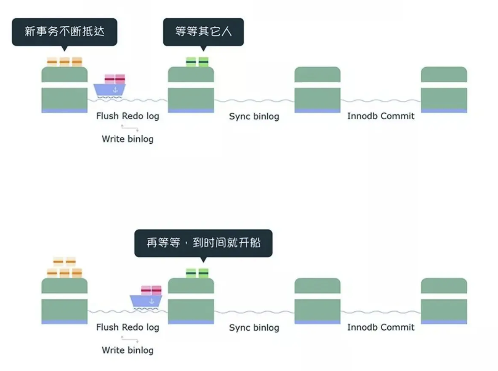

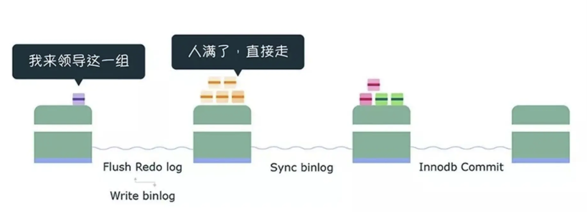
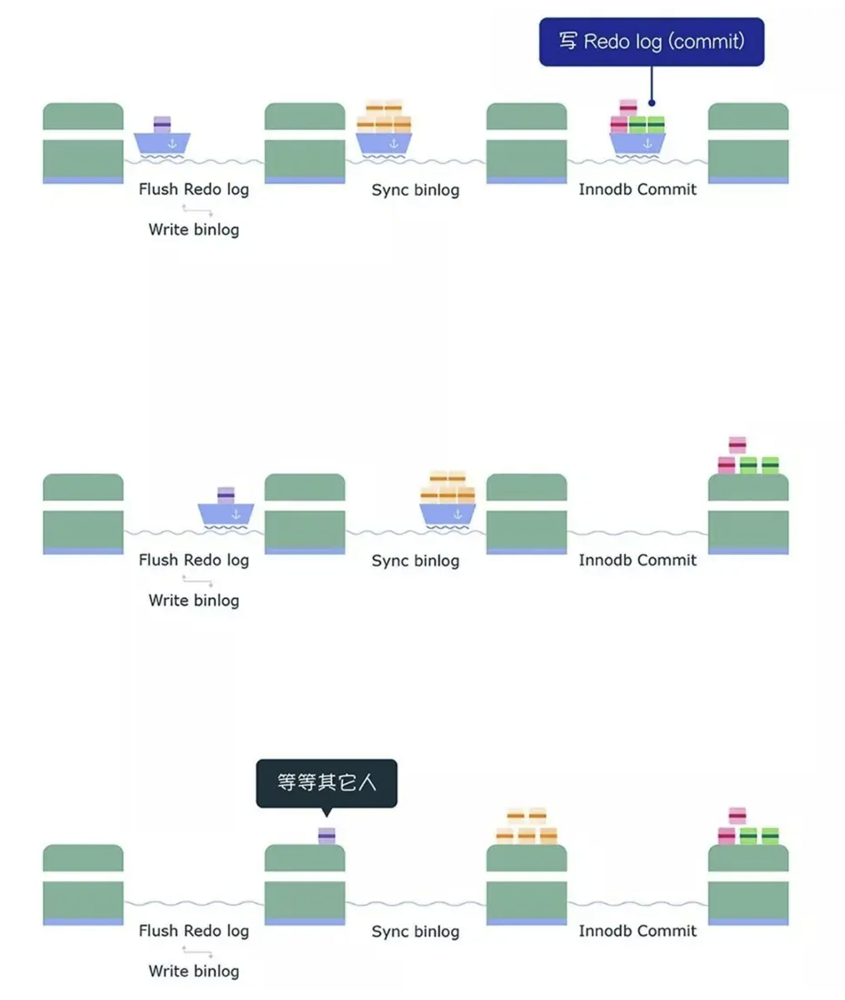

**flush 阶段**的作用是**支撑 redo log 的组提交**，如果在这一步完成后数据库崩溃，由于 binlog 中没有该组事务的记录，MySQL 会在重启后**回滚**这一组事务

**sync 阶段**的作用是**支撑 binlog 的组提交**，如果在这一步完成后数据库崩溃，由于 binlog 中已经有该组事务的记录，MySQL 会在重启后**继续提交**这一组事务，在这个阶段的**等待时间**是由 **`binlog_group_commit_sync_delay`** 参数控制的，**`binlog_group_commit_sync_no_delay_count`** 参数则控制等待时间内**事务的最大数量**，如果数量提前达到了，就不会等待，而是直接将 binlog 刷盘，所以如果想提升 binlog 组提交的效果，可以调大这两个参数的值

**commit 阶段**的作用是**承接 sync 阶段的事务**，完成最后的引擎提交，让 sync 可以尽早处理下一组事务，最大化组提交的效率

#### MySQL 磁盘 I/O 很高，有什么优化手段吗？

事务在提交时需要将 binlog 和 redo log 持久化到磁盘，我们可以通过控制以下几个参数来**延迟它们刷盘的时机**，从而降低磁盘 I/O 的频率

**`binlog_group_commit_sync_delay` 和 `binlog_group_commit_sync_no_delay_count`**，它们可以**延迟 binlog 刷盘的时机**，从而减少 binlog 的刷盘次数，由于这个方法是基于额外的故意等待来实现的，语句的响应时间可能会增加，但即使 MySQL 进程中间挂了，也不会有丢失数据的风险，因为 binlog 已经被写入到操作系统的页缓存中了，只要操作系统没有挂掉，数据就不会丢失

**`sync_binlog`**，可以设置为**大于 1 的值**（比较常见的范围是 100 到 1000），表示每次提交事务后都会调用 `write()` 将 binlog 写到操作系统的页缓存中，但**累计 N 个事务后**才会调用 **`fsync()`** 将 binlog 刷盘，相当于**延迟了 binlog 刷盘的时机**，但这样做会导致在主机断电后，最多丢失 N 个事务的 binlog 日志

**`innodb_flush_log_at_trx_commit`**，设置为 **2**，表示每次事务提交时只会将 redo log 写到 redo log 文件中，并没有写入磁盘，而是写入了**操作系统的页缓存**中，也就是**延迟了 redo log 刷盘的时机**，然后交由操作系统控制持久化到磁盘的时机，这样做的风险也是主机断电时会丢失数据

#### update 语句的执行过程是什么？

当优化器分析出成本最小的执行计划后，执行器就会按照执行计划来进行更新操作，以 `update user set name = 'new_name' where id = 1` 为例，假设 id 列上有索引，执行过程如下：

执行器先调用存储引擎的接口，**通过主键索引树搜索**获取 id = 1 的记录所在的**数据页**，如果这个数据页本身就在 **Buffer Pool** 里，就直接返回给执行器更新，否则就**从磁盘中读取**该数据页到 Buffer Pool 里，再返回给执行器更新

执行器在得到**聚簇索引记录**后，回看一下**更新前后的记录是否相同**，如果相同就不需要更新，直接返回，否则就把更新前后的记录都当作参数传递给 InnoDB 层，让 InnoDB 来执行真正的更新操作

接下来就会**开启事务**，InnoDB 会先生成 **undo log**，将更新前的记录写入 undo log 中，undo log 会写入 Buffer Pool 里的 **undo 页**中，在内存修改该 undo 页后，同时会产生**对应的 redo log**，redo log 也会写入 redo log buffer 中

然后 InnoDB 层才**开始更新记录**，会**先更新内存**并标记该数据页为**脏页**，然后**将记录写到 redo log 里**，这时就算更新完成了，脏页不会被立即刷新到磁盘上，而是由后台线程在合适的时间将脏页刷新到磁盘上

更新语句执行完之后，执行器会将生成的 **binlog** 写入 binlog cache 中，等到事务提交时再写入 binlog 文件中，事务提交后，redo log 和 binlog 会被持久化到磁盘上，但会被分为**两个阶段**来提交，分别是 **prepare 阶段和 commit 阶段**

prepare 阶段会将 redo log 对应的**事务状态**设置为 prepare，然后进入到 **flush** 阶段（由于**组提交**），将 redo log 按组刷盘，接着进入 **sync** 阶段，将 binlog 按组刷盘，最后进入 **commit** 阶段，调用存储引擎的提交事务接口，完成事务的提交操作，将 redo log **状态**设置为 commit，再把这个状态刷入到磁盘 redo log 文件中
