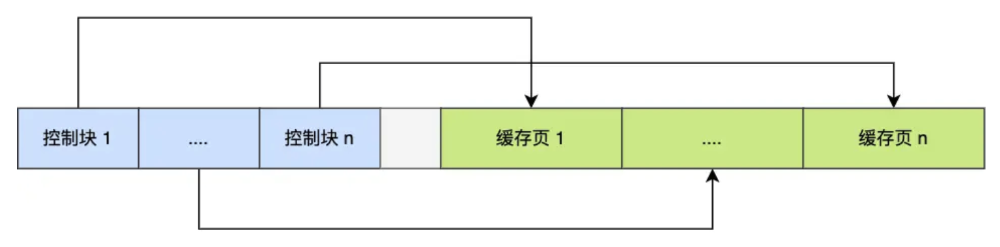
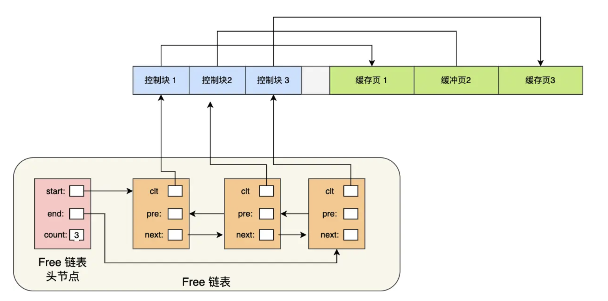
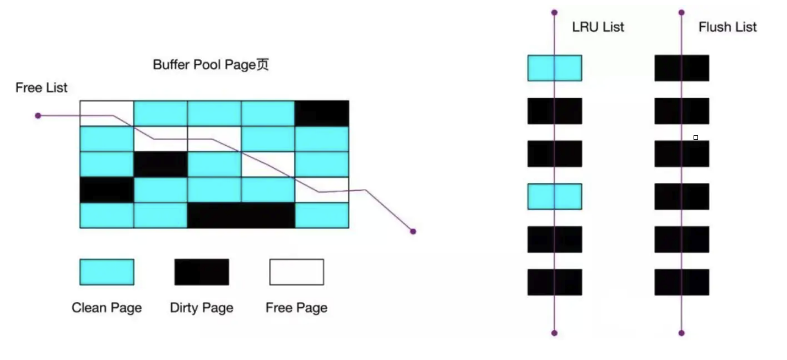
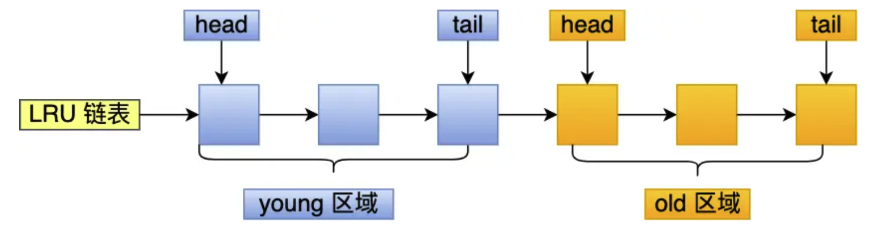
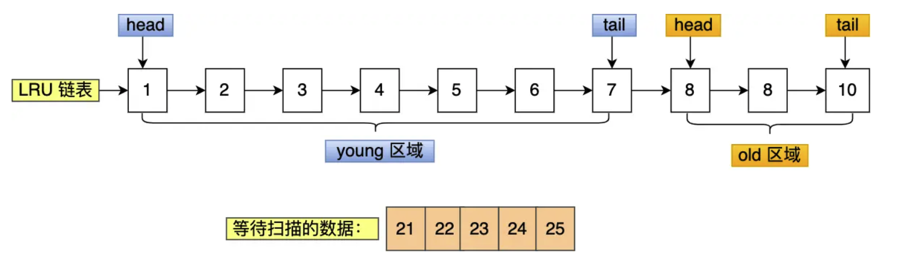
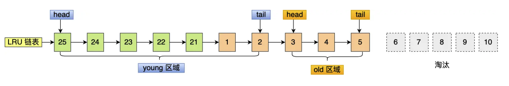

## 缓存
#### 为什么需要 Buffer Pool？

MySQL 的数据是存储在**磁盘**上的，中更新一条记录时要先从磁盘读取，然后**在内存中修改**，修改完再缓存到 InnoDB 存储引擎设计的**缓存池**中，这样下次有查询语句命中了这条记录就可以直接读取缓存中的记录，而不需要再去磁盘上读取

有了 Buffer Pool 之后，**读取数据时**，如果数据存在 Buffer Pool 中，就**直接读取**，否则再去磁盘里读取，在**修改数据时**，如果数据存在于 Buffer Pool 中，就直接修改 Buffer Pool 中数据所在的页，然后将这页设置为**脏页**（该页的内存数据和磁盘上的已经不一致），否则就**先从磁盘读取到 Buffer Pool 中**，然后再修改，为了减少磁盘 I/O，**脏页不会被立即写入磁盘中**，而是后续由后台线程选择合适的时机将脏页写入到磁盘

我们可以通过调整 **`innodb_buffer_pool_size`** 参数来**设置 Buffer Pool 的大小**，通常建议设置为**物理内存的 60%~80%**，默认配置下 Buffer Pool 只有 **128 MB**

#### Buffer Pool 会缓存什么？

缓存池跟磁盘一样，也是**以页作为单位进行划分**的，一个页的默认大小是 **16 KB**，在 MySQL 启动时，InnoDB 会为 Buffer Pool 申请一块**连续**的内存空间，然后将这块内存划分成多个页，Buffer Pool 中的页就叫做**缓存页**，此时这些缓存页都是空闲的，之后随着程序的运行，才会有磁盘上的页被缓存到 Buffer Pool 中

所以，MySQL 刚启动时，会观察到**使用的虚拟内存空间很大**，而使用到的**物理**内存空间却**很小**，就是因为只有这些虚拟内存**被访问后**，操作系统才会触发**页中断**，才会申请物理内存，**将虚拟内存映射到物理内存上**

Buffer Pool 主要会缓存**数据页、索引页、undo 页、插入缓存页、自适应哈希索引和锁信息**等，undo 页记录的就是 undo log，在查询一条记录时，InnoDB 会**将整个页的数据都加载到 Buffer Pool 中**，而不是只加载这条记录的数据，然后再通过页里的**页目录**定位到某条具体的记录

为了更好地管理这些在 Buffer Pool 中的缓存页，InnoDB 为每个缓存页都创建了一个**控制块**，它包括**缓存页的表空间、页号、缓存页地址、链表节点**等信息，所以它也会占用内存空间，它被放在 Buffer Pool 的最前面

在控制块和缓存页之间的灰色部分就是**碎片空间**，也就是在分配了足够多的控制块和缓存页后剩余的不足以再分配一个完整控制块和缓存页的内存空间

在查询一条记录时，InnoDB 会**把整个页的数据都加载到 Buffer Pool 中**，因为通过索引只能定位到磁盘中的**页**而不是页中的一条记录，是通过**页目录**再去定位到某条具体的记录

#### Buffer Pool 是如何被管理的？

Buffer Pool 是一片**连续**的内存空间，为了能快速找到空闲的缓存页和脏页，MySQL 使用了**双向链表**，将空闲缓存页的**控制块**作为链表的节点，这个链表就是 **Free 链表**

除了右边的控制块之外，还有一个**头节点**，后续每次需要从磁盘中加载一个页到 Buffer Pool 时，就会从 Free 链表中取出一个空闲的缓存页，把该缓存页对应的控制块信息填上，然后把该控制块从 Free 链表中**移除**

脏页也是一样的，只是脏页的链表叫 **Flush 链表**，跟 Free 链表类似，也是为了知道哪些页是脏页设计的

为了提高缓存命中率，Buffer Pool 使用 **LRU 算法**来管理缓存页，也就是**最近最少使用**算法，InnoDB 会维护一个 LRU 链表，链表头部是**最近最常使用**的缓存页，链表尾部是**最近最少使用**的缓存页，当需要淘汰缓存页时，就会从链表尾部开始淘汰

**Free Page** 表示此页未被使用，位于 Free 链表，**Clean Page** 表示此页已被使用但未被修改，位于 LRU 链表，**Dirty Page** 表示此页已被使用且被修改，当脏页上的数据被写入磁盘后，内存数据和磁盘数据一致，该页就变成了干净页，脏页**同时存在**于 LRU 链表和 Flush 链表中

由于**预读失效**和 **Buffer Pool 污染**这两个问题，MySQL 对简单的 LRU 算法做了一些改进

MySQL 是有预读机制的，因为程序有**空间局部性**，**靠近当前被访问数据的数据很可能在不久的将来也会被访问到**，所以 MySQL 在加载数据页时，会**提前把相邻的数据页一并加载进来**，目的是为了减少磁盘 I/O，但这些被提前加载进来的数据页也是**有可能完全没有被访问**的，也就是**预读失效**，这会导致如果使用了简单 LRU 算法，就会把预读页也放到 LRU 链表的头部，导致真正被频繁访问的数据页被淘汰掉，从而降低缓存命中率

由于大部分情况下，局部性原理都是成立的，我们不能因为害怕预读失效就把预读机制去掉，最好的情况是**让预读的页停留在 Buffer Pool 里的时间尽可能短**，让真正被访问的页移动到 LRU 链表的头部，从而保证真正被读取的热点数据留在 Buffer Pool 里的时间能尽可能**长**，于是 MySQL 将 LRU 划分成了 **old** 和 **young** 两个区域：

old 区域占整个链表长度的比例可以通过 **`innodb_old_blocks_pct`** 参数来设置，默认值是 37，表示整个 LRU 链表中 young 和 old 区域的比例是 63 : 37，划分成这两个区域之后，**预读页就只需要加入到 old 区域的头部**，当页真正被访问时，才将其插入 young 区域的头部，如果预读页一直没有被访问，就会从 old 区域移除

但这种优化并没有解决 **Buffer Pool 污染**的问题，它指的是，**当某个 SQL 语句扫描了大量数据时**（例如全表扫描），在 Buffer Pool 空间比较有限的情况下，这些被扫描的数据页可能会把 Buffer Pool 里**原本的所有热点数据页给挤出去**，导致缓存命中率下降，产生大量的磁盘 I/O，让 MySQL 的性能急剧下降

并且 Buffer Pool 污染并不是只有查询出大量数据时才会发生，即使查询出来的结果集很小，但查询语句发生了索引失效导致**全表扫描**时，例如 `select * from user where name like '%xxx%'` 这个查询语句，也会导致 Buffer Pool 污染

查询的过程会**先把从磁盘读到的页加入到 old 区域的头部**，当从页里读取行记录时，也就是这个页被访问了，就要把它**放到 young 区域的头部**，然后拿在这个行记录的 name 字段和字符串进行**模糊匹配**，如果符合条件就加入到结果集中，**如此往复直到扫描完表里的所有记录**，此时即使结果集很小，但扫描过程中读到的页都被加入到了 Buffer Pool 里，导致热点数据页被挤出去，产生大量的磁盘 I/O

为了解决 Buffer Pool 污染的问题，MySQL 为进入到 young 区域增加了一个**停留在 old 区域的时间判断**，其默认值是 1000 ms（也就是 1 秒），可以通过 **`innodb_old_blocks_time`** 参数来设置，在对某个处在 old 区域的缓存页进行第一次访问时，就在它对应的控制块记录这个访问时间，如果后续对该页的访问时间在该阈值**内**，就**不会**将其移动到 young 区域的头部，而是继续留在 old 区域中，只有当该页在 old 区域停留的时间**大于**该阈值时，才会将其移动到 young 区域的头部

也就是说，只有**同时满足被访问并且在 old 区域停留的时间超过 1 秒**，这两个条件时，才会将该页移动到 young 区域的头部，另外 MySQL 还对 young 区域做了一个优化，为了防止 young 区域中的节点被频繁移动到头部，young 区域**前 1/4** 的节点被访问时是**不会被移动到链表头部**的，只有后面的 3/4 被访问了才会

#### 脏页什么时候会被刷入到磁盘？

主要是下面几种情况会触发脏页的刷新：

* 当 **redo log 日志满了**时，会主动触发脏页刷新到磁盘
* **Buffer Pool 空间不足**时，需要将一部分数据页淘汰掉，如果这些页是脏页，就需要先将它们刷新到磁盘
* MySQL 认为**空闲**时，后台线程会定期将适量的脏页刷入到磁盘
* MySQL **正常关闭之前**，会把所有的脏页刷入到磁盘

如果每次修改数据都刷入磁盘，性能就会很差，所以一般都会**在一定时机批量刷盘**，而 MySQL 的 **WAL 策略**（Write-Ahead-Log），也就是先写日志，再写入磁盘的策略，能通过 redo log 来让 MySQL 有**崩溃恢复**的能力

在开启了**慢 SQL 监控**后，如果发现偶尔会出现一些用时稍长的 SQL，这可能是因为**脏页在刷新到磁盘时给数据库带来的性能开销**，导致的数据库操作**抖动**，如果间断出现这种现象，就需要**调大 Buffer Pool 空间或 redo log 的大小**
