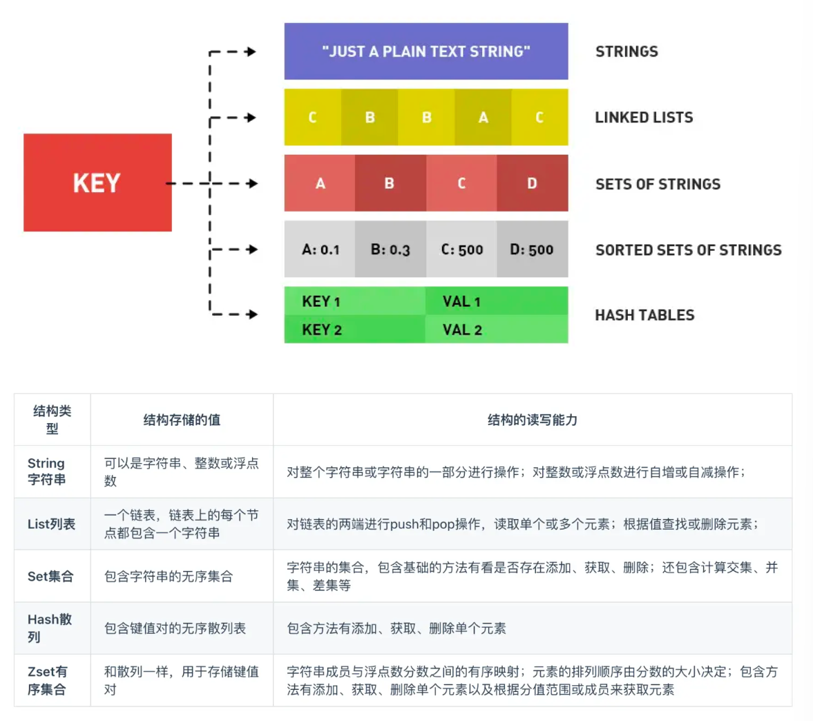
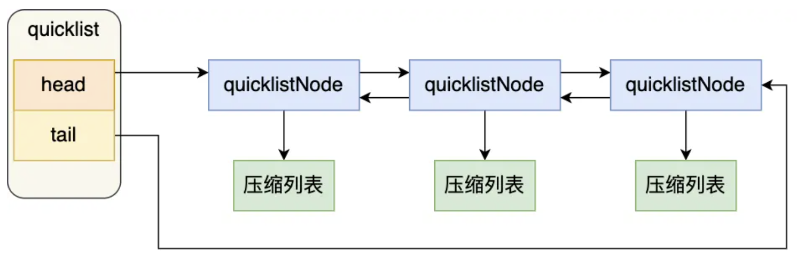
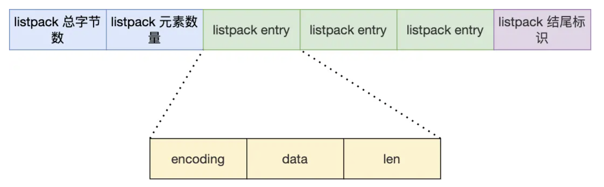
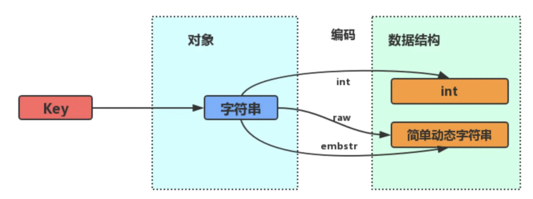
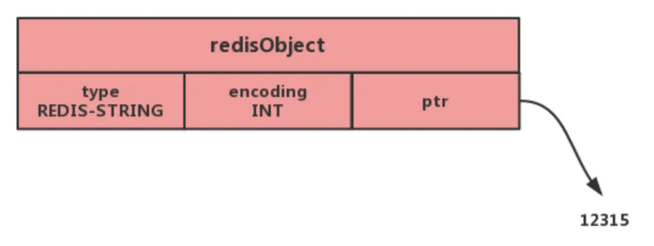
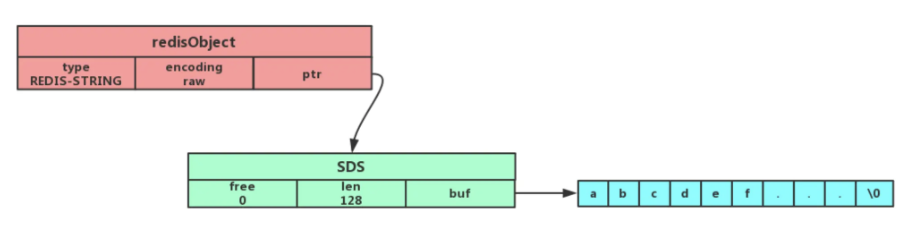
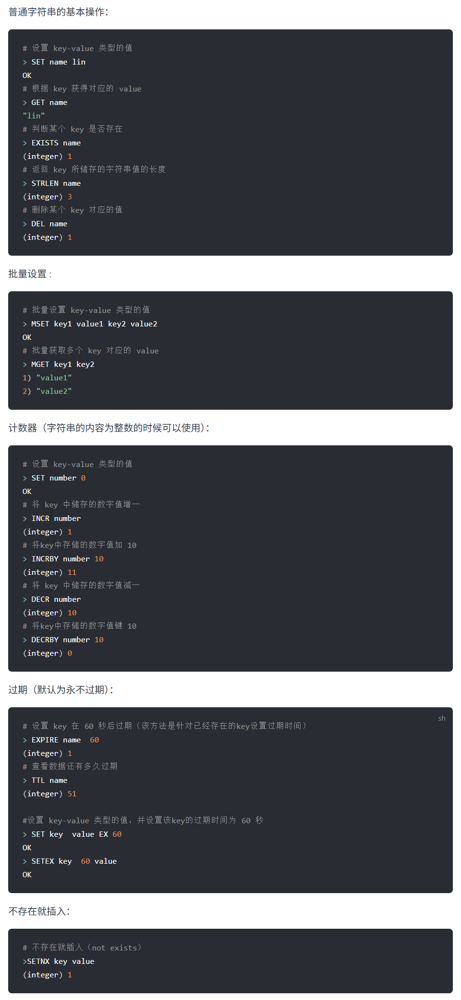
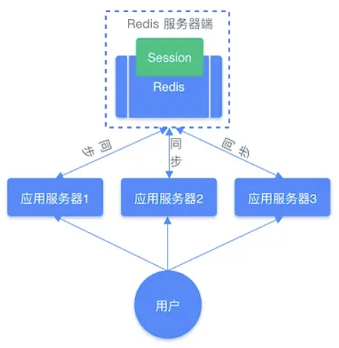

## 数据结构
#### Redis 有哪些数据类型，使用场景分别是什么？

常见的有 **string、hash、list、set、zset** 五种数据类型



后续随着版本更新，新增了 **BitMap、HyperLogLog、GEO、Stream** 等数据类型

**使用场景**如下：

* String
  * 缓存对象
  * 常规计数
  * 分布式锁
  * 共享 session 信息
* List
  * 消息队列
    * 生产者需要自行实现全局唯一 id
    * 不能以消费组形式消费数据
* Hash
  * 缓存对象
  * 购物车
* Set
  * 聚合计算（并集、交集、差集）场景
    * 点赞
    * 共同关注
    * 抽奖
* ZSet
  * 排序场景
    * 排行榜
    * 电话
    * 姓名排序
* BitMap
  * 二值状态统计的场景
    * 签到
    * 判断用户登录状态
    * 连续签到用户总数
* HyperLog
  * 海量数据基数统计的场景
    * 百万计网页 UV 计数
* GEO
  * 存储地理位置信息的场景
    * 网约车
* Stream
  * 消息队列
    * 会自动生成全局唯一消息 id
    * 支持以消费组形式消费数据

关于**底层的数据结构实现**，**List 使用的是 quicklist**，**Hash 和 ZSet 使用的是 listpack**，**Set 使用的是哈希表或整数集合**（如果集合中的元素都是整数并且元素个数小于 512，默认值就是 512，由 **`set-maxintset-entries`** 配置，就会使用整数集合，否则就使用哈希表）

#### Redis 的键值对数据库是怎么实现的？


#### quicklist 和 listpack 分别是什么，有什么作用？

在 Redis 3.2 版本之前，List 底层的实现方式会根据数据量自动切换，当元素少并且小的时候会使用 ziplist 压缩列表，它的内存是连续的，可以节省内存空间，但修改数据时，特别是中间插入，会导致昂贵的内存重新分配和连锁更新问题，当数据量很大时则会使用双向链表，修改效率比较高，但每个节点都需要额外的指针，内存开销极大，甚至可能超过数据本身，并且节点在内存中并不连续，任意产生内存碎片

quicklist 的出现就是为了融合两者的优点，保留双向链表头尾插入删除的高效的同时，利用 ziplist 的内存紧凑特性来节省内存空间，我们可以把它想象成一列火车，火车的整体是一个双向链表，每节车厢是一个节点，车厢内部是一个 ziplist，存放具体的数据元素



quicklist 会通过控制每个链表节点中压缩列表的大小或元素个数来解决连锁更新的问题，它的结构体会包含头节点、尾节点、节点数量和总元素数量等属性，quicklist 节点结构体会包含前后节点指针、指向 ziplist 的指针、压缩列表数据和元素个数等属性

quicklist 会限制每个节点里的 ziplist 能存储数据的大小，可以通过 **`list-max-ziplist-size`** 配置项来设置，负数表示限制字节大小，正数表示限制每个节点中元素的个数，另外 quicklist 还会做节点压缩，因为 List 的典型使用场景通常是队头队尾操作，中间数据访问频率相对较低，`list-compress-depth` 配置项可以设置压缩的深度，默认值是 0，表示不压缩，设置为 1 表示头尾各保留一个节点不压缩，其他节点都压缩，设置为 2 表示头尾各保留两个节点不压缩，其他节点都压缩，以此类推

在插入时，quicklist 会先检查插入位置的 ziplist 是否还有空间，有的话就直接在对应的 ziplist 里插入数据，如果没有空间了，就会新建一个 ziplist 节点，然后将其插入到 quicklist 的合适位置

虽然 quicklist 解决了链表内存过大的问题，但它内部使用的 ziplist 还有一个连锁更新的性能缺陷，由于它把多个元素存储在一块连续的内存中，为了能双向遍历，ziplist 每个节点都会记录前一个节点的长度 `prevlen`，如果前一个节点的长度小于 254 字节，那么 `prevlen` 就只需要占用 1 个字节，如果前一个节点的长度大于等于 254 字节，那么 `prevlen` 就需要占用 5 个字节

如果一个 ziplist 里有一排连续的节点的长度都在这个边界值附近，当我们把第一个节点的数据改大了一些，超过了阈值，导致长度增加了 4 字节，第二个节点发现前一个节点变大了就也会扩展自己的 `prevlen`，以此类推，导致后续所有节点都需要重新分配内存并移动数据，这就是连锁更新的性能缺陷，在数据量大时它会导致 redis 服务器卡顿

于是 Redis 引入了 listpack，它保留了 ziplist 使用一整块连续的内存空间来紧凑地保存数据、支持双向遍历的优点，但移除了 `prevlen` 字段，切断了节点之间的依赖关系，彻底避免了连锁更新的问题



它把存储前一个节点的长度改成了存储自身的长度在节点尾部，再通过一种特殊的变长编码方式可以从后往前解析出数值，从而实现双向遍历，listpack 还引入了新的编码方式来进一步节省内存空间，在 Redis 7.0 版本之后彻底代替了 ziplist 成为紧凑型数据的唯一标准，List、Hash、ZSet 和 Stream 都有使用 listpack 来存储紧凑型数据

#### 详细介绍一下 String 这种数据结构在 Redis 中的实现方式是什么样的？

String 是最基本的键值对结构，它的值除了字符串以外也可以是整数或浮点数，值最多可以容纳的数据长度是 512 MB

**底层的数据结构**使用的主要是 `int` 和 **`SDS`**（Simple Dynamic String，简单动态字符串），它和 C 字符串不太一样

SDS 不仅可以保存文本数据，还可以保存**二进制数据**，它使用 `len` 属性的值而不是空字符串来判断字符串是否结束，并且它所有的 API 都会以处理二进制的方式来处理其存放在 **`buf[]` 数组**里的数据，所以它除了能存放文本数据以外，还可以保存**图片、音频、视频和压缩文件**这样的二进制数据

SDS 获取字符串长度的时间复杂度是 `O(1)`，因为它用 `len` 属性记录了字符串长度，并且 Redis 的 SDS API 是**安全的**，**拼接字符串不会造成缓冲区溢出**，因为它在拼接之前会检查 SDS 空间是否满足要求，如果空间不够就会**自动扩容**

字符串对象的内部编码有 int、raw 和 embstr 三种



如果一个字符串对象保存的是整数，并且这个整数可以用 long 类型来表示，字符串对象就会将其保存在字符串对象结构的 ptr 属性里，将 void* 转换成 long，并且将字符串对象的编码方式设置为 int



如果保存的是字符串，并且长度小于等于一定阈值，就会使用 SDS，将编码设置为 embstr，这是一种专门用于保存短字符串的优化编码方式


如果保存的是字符串，并且长度大于一定阈值，就会使用 SDS，将编码设置为 raw



embstr 和 raw 的编码阈值边界在不同的 Redis 版本里是不一样的，它们都会使用 SDS 来保存字符串，但 embstr 会通过依次内存分配函数来分配一块连续的内存空间来保存字符串对象结构和 SDS 字符串数据，而 raw 则是分开两次调用来分别分配两块内存空间存储对象结构和 SDS 字符串数据

这样做可以降低 embstr 的内存分配次数和释放内存次数，也可以更好地利用 CPU 缓存提升性能，因为被保存在一块连续的内存中，但如果字符串的长度增加需要重新分配内存，整个对象结构和 SDS 就要被重新分配空间，所以 embstr 编码的字符串对象实际上是只读的，当我们对其执行任何修改命令时，Redis 会将其重新编码为 raw 编码，然后再执行修改命令

字符串的常用指令如下：



主要的应用场景有缓存对象、常规计数、分布式锁、共享 session 信息等，String 可以直接缓存整个对象的 JSON，例如 `SET user:1 '{"name":"Alice","age":30}'`，也可以将 key 分离，例如 `MSET user:1:name "Alice" user:1:age 30`，然后使用 `MGET` 获取不同属性的值

因为 Redis 是单线程处理命令，执行命令的过程是原子的，所以 String 适合计数场景，比如计算访问次数、点赞、转发、库存数量等，例如：

```
INCR page:view:count
INCR post:123:like:count
DECR product:456:stock
GET product:456:stock
```

也可以用作分布式锁，通过 SET 命令的 NX 参数实现 key 不存在时才插入的功能，再加上过期时间，例如 `SET lock_key unique_value NX PX 30000`，表示设置一个锁，锁的 key 是 `lock_key`，锁的值是 `unique_value`，只有当 `lock_key` 不存在时才会设置成功，并且锁的过期时间是 30 秒，解锁的过程就是把这个键值对删除，但要注意只能删除加锁的客户端标识的键值对，解锁时要用 Lua 脚本来保证原子性，例如：

```lua
if redis.call("get",KEYS[1]) == ARGV[1] then
    return redis.call("del",KEYS[1])
else
    return 0
end
```

最后的共享 Session 信息是指，在分布式系统中，多个应用服务器需要共享用户的 Session 信息，而不是让用户每次都重复登陆，我们可以用 Redis 来对其进行统一的存储和管理，这样无论请求发送到哪台服务器，都会通过同一个 Redis 获取相关的 Session 信息



#### 详细介绍一下 List 这种数据结构在 Redis 中的实现方式是什么样的？

List 列表是简单的字符串列表，按照插入顺序排序，可以在头部或尾部添加元素，

底层的数据结构使用的是 **quicklist**，它是由多个 ziplist 组成的双向链表