## 数据结构
#### Redis 有哪些数据类型，使用场景分别是什么？

常见的有 **string、hash、list、set、zset** 五种数据类型


后续随着版本更新，新增了 **BitMap、HyperLogLog、GEO、Stream** 等数据类型

**使用场景**如下：

* String
  * 缓存对象
  * 常规计数
  * 分布式锁
  * 共享 session 信息
* List
  * 消息队列
    * 生产者需要自行实现全局唯一 id
    * 不能以消费组形式消费数据
* Hash
  * 缓存对象
  * 购物车
* Set
  * 聚合计算（并集、交集、差集）场景
    * 点赞
    * 共同关注
    * 抽奖
* ZSet
  * 排序场景
    * 排行榜
    * 电话
    * 姓名排序
* BitMap
  * 二值状态统计的场景
    * 签到
    * 判断用户登录状态
    * 连续签到用户总数
* HyperLog
  * 海量数据基数统计的场景
    * 百万计网页 UV 计数
* GEO
  * 存储地理位置信息的场景
    * 网约车
* Stream
  * 消息队列
    * 会自动生成全局唯一消息 id
    * 支持以消费组形式消费数据

关于**底层的数据结构实现**，**List 使用的是 quicklist**，**Hash 和 ZSet 使用的是 listpack**，**Set 使用的是哈希表或整数集合**（如果集合中的元素都是整数并且元素个数小于 512，默认值就是 512，由 **`set-maxintset-entries`** 配置，就会使用整数集合，否则就使用哈希表）

#### Redis 的键值对数据库是怎么实现的？

Redis 键值对中的**键是字符串对象**，**值**可以是五种常见的数据类型中的**任意一种**，Redis 使用**哈希桶**来保存所有键值对，让我们可以用 O(1) 的时间复杂度来进行键的查找、插入和删除操作

哈希桶存放的是**指向键值对的指针**，键值对的数据结构中保存的也不是数据本身，而是分别**指向实际的键对象和值对象的指针**

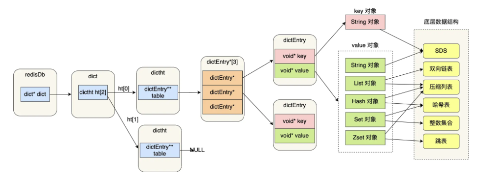

**键值对的数据结构保存的节点**我们称为 **`dictEntry`**，它包含了键对象指针 `void* key` 和值对象指针 `void* value`，它们指向的都是 Redis 对象，由 **redisObject** 结构体表示，里面包含 `type`，标识对象类型，`encoding`，标识对象的编码方式，`ptr`，指向底层数据结构的指针

#### SDS 是什么？

**SDS** （**Simple Dynamic String**，简单动态字符串）是 Redis 自定义实现的一种字符串数据结构，它解决了 C 语言字符串的缺陷

C 语言的字符串其实就是一个字符数组，最后一个字符由 **`\0` 来标识字符串结束**，这会导致如果字符串有 `\0` 字符本身时，字符串就会被**截断**，**不能保存图片、音频和视频这样的二进制数据**，并且获取字符串长度的时间复杂度也是 `O(n)`，需要**遍历整个字符串来计算长度**，另外 C 语言标准库中对字符串的操作函数也是**不安全**的，例如 `strcat` 这个函数，它可以将两个字符串拼接在一起，但由于 **C 语言字符串不会记录自身的缓冲区大小**，这个函数就会假定执行时已经为拼接后的字符串分配了足够的内存空间，如果实际空间不够，就会导致**缓冲区溢出**，造成程序崩溃，而且这个函数本身时间复杂度也很高

于是 Redis 封装了结构如下的 SDS：

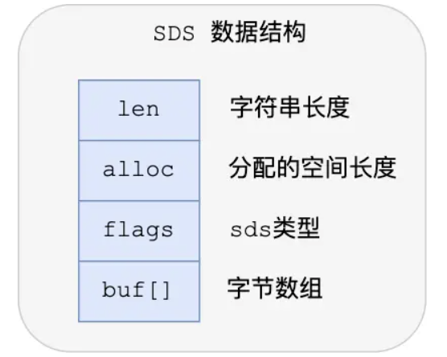

其记录了**字符串长度**和分配给字符数组的**空间长度**，在修改字符串时就可以计算出剩余的空间大小，在判断出缓冲区大小不够时会**自动扩容**，如果所需的 SDS 长度小于 1 MB，就翻倍扩容，否则就线性扩容 1 MB，从而避免缓冲区溢出的问题，除了分配修改所必要的数据，还会分配**额外的未使用空间**，来**减少内存分配次数**，避免了手动修改 SDS 空间大小

SDS 获取字符串长度的时间复杂度是 `O(1)`，字节数组是用来保存实际数据的，并且因为 SDS 不需要以 `\0` 来标识字符串结束，所以它可以**保存二进制数据**，Redis 所有的字符串操作 API 也都是以**处理二进制数据的方式**来处理 SDS 的数据

flags 标识的则是使用的 SDS 类型，区别在于变量使用的数据类型不同，能够**灵活保存不同大小的字符串**，使用专门的编译优化来节省内存空间，它会让编译器**取消结构体在编译过程中的优化对齐**，按照实际占用字节数进行对齐，从而有效节省内存空间

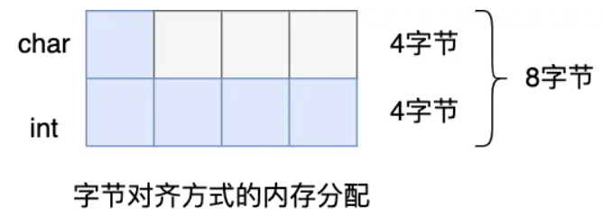
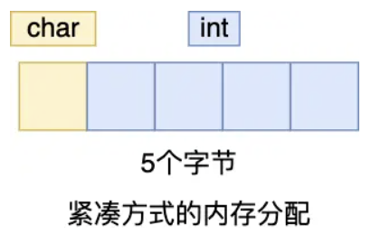

#### Redis 里是怎么实现链表的？

Redis 中的 List 对象的底层实现之一就是链表，使用的是**双向链表**，在 listNode 结构体的基础上又封装了一层 list 结构，操作起来比较方便


Redis 的链表是**无环**链表，每个节点都可以很方便地获取其前置和后置节点，还保存了表头和表尾节点、节点数量，通过 `void*` 指针来保存节点值，可以保存任意类型的数据，但每个节点之间的内存是**不连续**的，也就是没办法很好地利用 CPU 缓存，另外内存开销也比较大，所以在数据量比较少的情况下 Redis 的 List 对象会使用 **ziplist** 压缩列表来保存数据，ziplist 在后续版本被 listpack 取代

#### ziplist 压缩列表是什么？

压缩列表是 Redis 中占用一块**连续**内存空间的**紧凑型**数据结构，是由连续内存块组成的**顺序型**数据结构，会记录其占用的内存字节数、尾节点偏移量和节点数量等属性

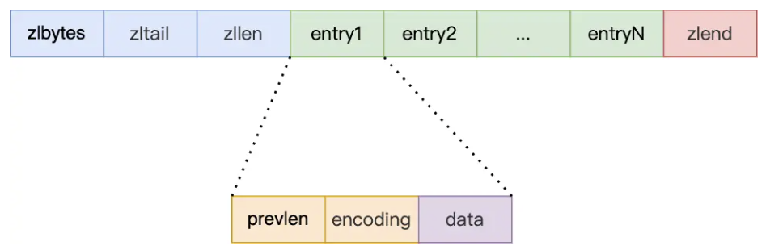

在查找除了第一个元素和最后一个元素以外的时间复杂度都是 `O(n)`，因为需要从头节点或尾节点开始遍历，直到找到目标节点为止，其内部节点记录了**前一个节点的长度**、节点数据的编码方式和节点数据本身，会根据数据大小和类型进行不同的空间大小分配

ziplist 还有一个很严重的问题就是**连锁更新**，在新增或修改某个元素时，如果空间不足，ziplist 占用的内存空间就需要重新分配，这可能导致后续元素的 prevlen 的占用空间发生变化，导致每个元素的空间都要重新分配

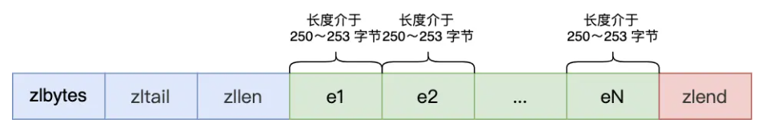

如果前一个节点的长度小于 254 字节，那么 prevlen 就只需要占用 1 个字节，如果大于等于，就需要占用 5 个字节

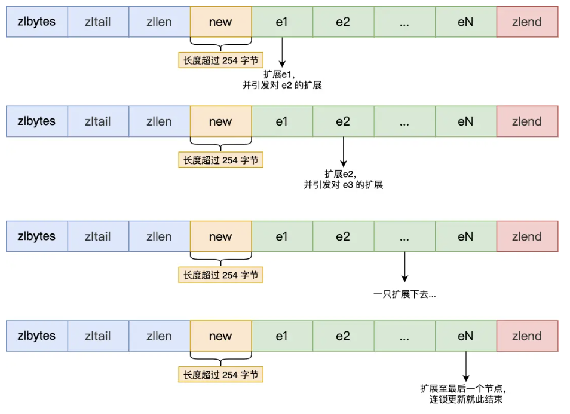

内存的重新多次分配会直接影响到压缩列表的**访问性能**，所以虽然这种紧凑的内存布局可以节省内存开销，但如果保存的元素数量增加或变大了，就会带来连锁更新这样的问题，因此它**只用于保存节点数量不多的场景**，在 Redis 7.0 版本之后被 listpack 彻底取代

#### Redis 里是怎么实现哈希表的？

哈希表在 Redis 中是一个**数组**，数组里的元素是**哈希桶**，每个元素都是一个**指向哈希表节点的指针**，哈希表节点使用 dictEntry 结构体表示，包含了键对象指针 `void* key`、值对象指针 `void* value` 和指向下一个节点的指针 `dictEntry* next`，用于解决**哈希冲突**，其中值部分可以是一个**指向实际值的指针**，也可以是一个**整数值或浮点数值**，这样可以节省内存空间

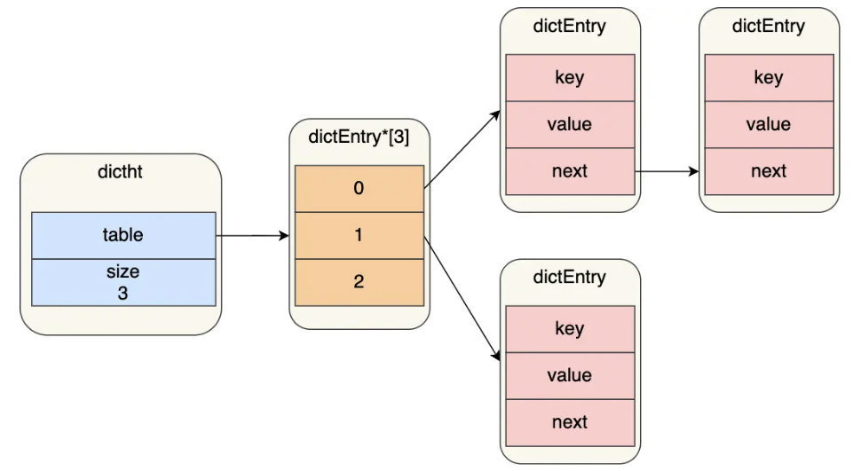

当一个键值对的键经过哈希函数计算后得到哈希值，再取模计算，就能得到值对应的是第几个哈希桶，如果这时有两个及以上的键被分配到了**同一个**哈希桶上时，就会发生**哈希冲突**

Redis 使用**链式哈希**的方法来解决这个问题，每个哈希表节点都有一个 next 指针用于指向下一个节点，当发生哈希冲突时，就会将新的键值对插入到对应哈希桶的多个节点组成的单向链表中

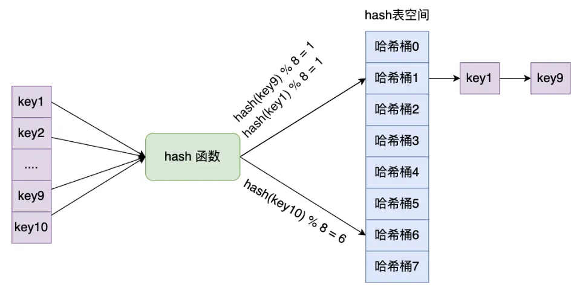

在实际使用哈希表时，Redis 还会**额外定义一个哈希表**，方便进行 **rehash**

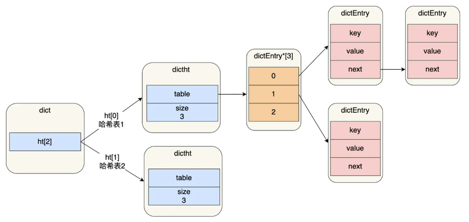

在正常服务阶段，插入的数据都会写入到哈希表 1，哈希表 2 并**不会被分配空间**，直到触发 rehash，会先给哈希表 2 分配哈希表 1 两倍的空间，然后逐步将哈希表 1 里的数据迁移到哈希表 2 中，迁移完成后就将哈希表 1 释放掉，并将哈希表 2 赋值给哈希表 1


为了避免在迁移时数据拷贝对 Redis 性能的影响，Redis 采用了**渐进式 rehash** 的方式，在每次对哈希表进行读写操作时，除了执行对应的操作以外，Redis 都会顺便**迁移相对应索引的数据**到另一张哈希表上，这样就能将 rehash 的开销**分摊到多次读写操作中**，避免一次性迁移带来的性能问题，在迁移过程中，哈希表 1 不会进行任何写入操作，查找则会先在哈希表 1 找，如果没有找到再去哈希表 2 找

rehash 的触发条件跟**负载因子**有关，负载因子 = 哈希表已保存节点数量 / 哈希表大小，当负载因子大于等于 1 时，并且 Redis 没有在执行 bgsave 或 bgrewriteaof 命令，也就是 RDB 快照或 AOF 重写这种**持久化操作**时，就会触发 rehash，或者当负载因子大于等于 5，无论有没有在执行持久化操作，都会强制触发 rehash

#### Redis 里是怎么实现整数集合的？

整数集合是 **Set** 对象的底层实现之一，它本质上是一块**连续的**内存空间，包括 encoding、length 和保存元素的数组，encoding 标识保存的整数类型，可以是 16 位、32 位或 64 位整数，length 标识保存的整数个数，数组部分则是实际保存的整数值

整数集合有一个**升级规则**，当插入的整数值超出当前 encoding 能表示的范围时，就会将整个整数集合升级为**更大范围**的 encoding，例如从 16 位升级到 32 位，或者从 32 位升级到 64 位，它并不会重新分配一个新类型的数组，而是**直接在原有的内存空间上进行扩展**，然后将原有的整数值转换为新的 encoding 类型保存到扩展后的内存空间中

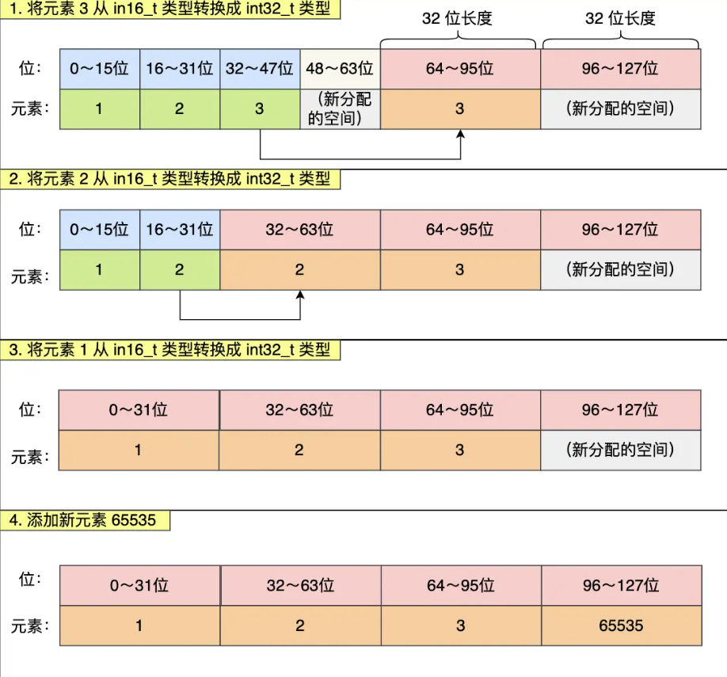

这样做的好处是可以节省内存资源，但它是不支持降级操作的

#### Redis 里是怎么实现跳表的？

跳表是 ZSet 对象的底层实现之一，它是由**多层有序链表**组成的，最底层是一条完整的有序链表，保存了所有节点，上层的链表则是对下层链表的抽样索引，可以加快查找速度，跳表的节点使用 zskiplistNode 结构体表示，包含了节点的值、**权重值**、**后向指针和 level 数组**，level 数组中保存的是每层的**前向指针和跨度**

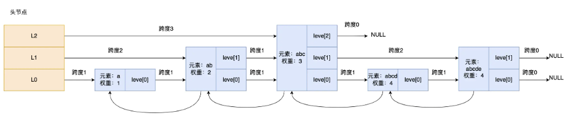

level 数组中的每个元素表示跳表的**一层**，包含 forward 前向指针和 span 跨度，**forward 指针指向当前层的下一个节点**，**span 跨度**表示**从当前节点到下一个节点之间跨越了多少个底层节点**，在查找某个节点时，通过将沿途访问过所有层的节点的跨度**累加**起来，就能计算出该节点在底层链表中的**排位**，跳表结构体里除了包含头尾节点和长度，还包含了当前跳表的最大层数

在查询一个节点时，跳表会**从头节点的最高层开始逐层遍历**，比较当前节点的下一个节点的权重值和目标节点的权重值，如果下一个节点的权重值**小于**目标节点的权重值，就继续沿着当前层向前遍历，直到找到一个节点的下一个节点的权重值**大于等于**目标节点的权重值或当前节点的 SDS 类型数据**大于**要查找的数据时，就会下降到下一层，继续重复这个过程，直到到达底层链表

跳表相邻两层节点最理想的数量是 **2:1**，查询的平均时间复杂度是 `O(log n)`，但 Redis 在创建节点时会生成范围为 0~1 的**随机数**，如果随机数**小于** 0.25，就会增加一层，然后继续生成下一个随机数，直到随机数大于等于 0.25 或达到最大层数为止，但一般来说在创建跳表头节点时，会直接创建最大层高，在 7.0 版本之后，最大层数是 32 层

ZSet 的实现之所以**用跳表而不是平衡树**，比如 AVL 树或者红黑树，是因为**从内存占用的角度，跳表会比平衡树更加灵活**，每个节点平均包含的指针数量更少，内存开销更小，并且**在做范围查找时，跳表的操作会更简单高效**，在平衡树上找到指定范围的节点后，还需要通过中序遍历来获取范围内的所有节点，如果不对平衡树进行改造，那这里的中序遍历并不容易实现，而跳表只需要找到范围的起点，然后顺着底层链表向后遍历就可以了，另外从**算法实现难度**上比较，**跳表的实现也要比平衡树简单很多**，跳表只需要修改相邻节点的指针，而平衡树在插入或删除节点时，可能会涉及到多次旋转操作和子树的调整

#### quicklist 和 listpack 分别是什么，有什么作用？

在 Redis 3.2 版本之前，List 底层的实现方式会根据数据量自动切换，当**元素少并且小**的时候会使用 ziplist 压缩列表，它的内存是**连续**的，可以节省内存空间，但修改数据时，特别是**中间插入**，会导致昂贵的内存重新分配和连锁更新问题，当**数据量很大时**则会使用**双向链表**，修改效率比较高，但每个节点都需要额外的指针，**内存开销极大**，甚至可能超过数据本身，并且节点在内存中并**不连续**，任意产生内存碎片

**quicklist** 的出现就是为了融合两者的优点，**保留双向链表头尾插入删除的高效**的同时，利用 ziplist 的**内存紧凑特性**来节省内存空间，我们可以把它想象成一列火车，火车的整体是一个双向链表，每节车厢是一个节点，车厢内部是一个 ziplist，存放具体的数据元素


quicklist 会通过**控制每个链表节点中压缩列表的大小或元素个数**来解决连锁更新的问题，它的结构体会包含头节点、尾节点、节点数量和总元素数量等属性，quicklist 节点结构体会包含前后节点指针、**指向 ziplist 的指针**、压缩列表数据和元素个数等属性

quicklist 会**限制**每个节点里的 ziplist 能**存储数据的大小**，可以通过 **`list-max-ziplist-size`** 配置项来设置，负数表示限制字节大小，正数表示限制每个节点中元素的个数，另外 quicklist 还会做**节点压缩**，因为 List 的典型使用场景通常是**队头队尾操作**，中间数据访问频率**相对较低**，**`list-compress-depth`** 配置项可以设置压缩的深度，默认值是 0，表示不压缩，设置为 1 表示头尾各保留一个节点不压缩，其他节点都压缩，设置为 2 表示头尾各保留两个节点不压缩，其他节点都压缩，以此类推

在插入时，quicklist 会先**检查**插入位置的 ziplist 是否还有空间，有的话就直接在对应的 ziplist 里插入数据，如果没有空间了，就会新建一个 ziplist 节点，然后将其插入到 quicklist 的合适位置

虽然 quicklist 解决了链表内存过大的问题，但它内部使用的 ziplist 还有一个**连锁更新**的性能缺陷，由于它把多个元素存储在一块连续的内存中，为了能双向遍历，ziplist **每个节点都会记录前一个节点的长度** `prevlen`，如果前一个节点的长度小于 254 字节，那么 `prevlen` 就只需要占用 1 个字节，如果前一个节点的长度大于等于 254 字节，那么 `prevlen` 就需要占用 5 个字节

如果一个 ziplist 里有一排连续的节点的长度**都在这个边界值附近**，当我们把第一个节点的数据改大了一些，超过了阈值，导致长度增加了 4 字节，第二个节点发现前一个节点变大了就也会扩展自己的 `prevlen`，以此类推，导致**后续所有节点都需要重新分配内存并移动数据**，这就是连锁更新的性能缺陷，在数据量大时它会导致 redis 服务器卡顿

于是 Redis 引入了 **listpack**，它保留了 ziplist 使用一整块**连续**的内存空间来**紧凑**地保存数据、支持**双向遍历**的优点，但移除了 `prevlen` 字段，**切断了节点之间的依赖关系**，彻底避免了连锁更新的问题


它把存储前一个节点的长度改成了**存储自身的长度在节点尾部**，再通过一种**特殊的变长编码方式**可以**从后往前**解析出数值，从而实现**双向遍历**，listpack 还引入了**新的编码方式**来进一步节省内存空间，在 Redis 7.0 版本之后彻底代替了 ziplist 成为紧凑型数据的唯一标准，List、Hash、ZSet 和 Stream 都有使用 listpack 来存储紧凑型数据

#### String 在 Redis 中底层的实现方式是什么样的？

String 是最基本的键值对结构，它的值除了字符串以外也可以是整数或浮点数，值最多可以容纳的数据长度是 512 MB

**底层的数据结构**使用的主要是 `int` 和 **`SDS`**（Simple Dynamic String，简单动态字符串），它和 C 字符串不太一样

SDS 不仅可以保存文本数据，还可以保存**二进制数据**，它使用 `len` 属性的值而不是空字符串来判断字符串是否结束，并且它所有的 API 都会以处理二进制的方式来处理其存放在 **`buf[]` 数组**里的数据，所以它除了能存放文本数据以外，还可以保存**图片、音频、视频和压缩文件**这样的二进制数据

SDS 获取字符串长度的时间复杂度是 `O(1)`，因为它用 `len` 属性记录了字符串长度，并且 Redis 的 SDS API 是**安全的**，**拼接字符串不会造成缓冲区溢出**，因为它在拼接之前会检查 SDS 空间是否满足要求，如果空间不够就会**自动扩容**

字符串对象的内部编码有 **int、raw 和 embstr** 三种


如果一个字符串对象保存的是**整数**，并且这个整数可以用 long 类型来表示，字符串对象就会将其保存在字符串对象结构的 ptr 属性里，将 `void*` 转换成 long，并且将字符串对象的编码方式设置为 **int**


如果保存的是**字符串**，并且长度**小于等于**一定阈值，就会使用 **SDS**，将编码设置为 **embstr**，这是一种专门用于保存**短字符串**的优化编码方式


如果保存的是**字符串**，并且长度**大于**一定阈值，就会使用 SDS，将编码设置为 **raw**


embstr 和 raw 的编码阈值边界在不同的 Redis 版本里是不一样的，它们都会使用 SDS 来保存字符串，但 **embstr** 会通过**一次内存分配函数**来分配**一块**连续的内存空间来保存字符串对象结构和 SDS 字符串数据，而 **raw** 则是**分开两次**调用来分别分配**两块**内存空间存储对象结构和 SDS 字符串数据

这样做可以**降低 embstr 的内存分配次数和释放内存次数**，也可以更好地**利用 CPU 缓存提升性能**，因为被保存在一块连续的内存中，但如果字符串的长度增加需要重新分配内存，整个对象结构和 SDS 就要被重新分配空间，所以 **embstr** 编码的字符串对象实际上是**只读**的，当我们对其执行任何修改命令时，Redis 会将其**重新编码为 raw 编码**，然后再执行修改命令

字符串的**常用指令**如下：


主要的应用场景有**缓存对象、常规计数、分布式锁、共享 session 信息**等，String 可以直接缓存整个对象的 **JSON**，例如 `SET user:1 '{"name":"Alice","age":30}'`，也可以将 **key 分离**，例如 `MSET user:1:name "Alice" user:1:age 30`，然后使用 `MGET` 获取不同属性的值

因为 Redis 是**单线程处理命令**，执行命令的过程是**原子**的，所以 String 适合**计数场景**，比如计算访问次数、点赞、转发、库存数量等，例如：

```
INCR page:view:count
INCR post:123:like:count
DECR product:456:stock
GET product:456:stock
```

也可以用作**分布式锁**，通过 SET 命令的 `NX` 参数实现 **key 不存在时才插入**的功能，再加上**过期时间**，例如 `SET lock_key unique_value NX PX 30000`，表示设置一个锁，锁的 key 是 `lock_key`，锁的值是 `unique_value`，只有当 `lock_key` 不存在时才会设置成功，并且锁的过期时间是 30 秒，解锁的过程就是把这个键值对删除，但要注意**只能删除加锁的客户端标识的键值对**，解锁时要用 **Lua 脚本**来保证**原子性**，例如：

```lua
if redis.call("get",KEYS[1]) == ARGV[1] then
    return redis.call("del",KEYS[1])
else
    return 0
end
```

最后的**共享 Session 信息**是指，在分布式系统中，**多个应用服务器需要共享用户的 Session 信息**，而不是让用户每次都重复登陆，我们可以用 Redis 来对其进行统一的存储和管理，这样无论请求发送到哪台服务器，都会通过同一个 Redis 获取相关的 Session 信息


#### List 在 Redis 中底层的实现方式是什么样的？

List 列表是**简单的字符串列表**，按照插入顺序排序，可以在头部或尾部添加元素，它的底层实现是 **quicklist**，**常用命令**如下：

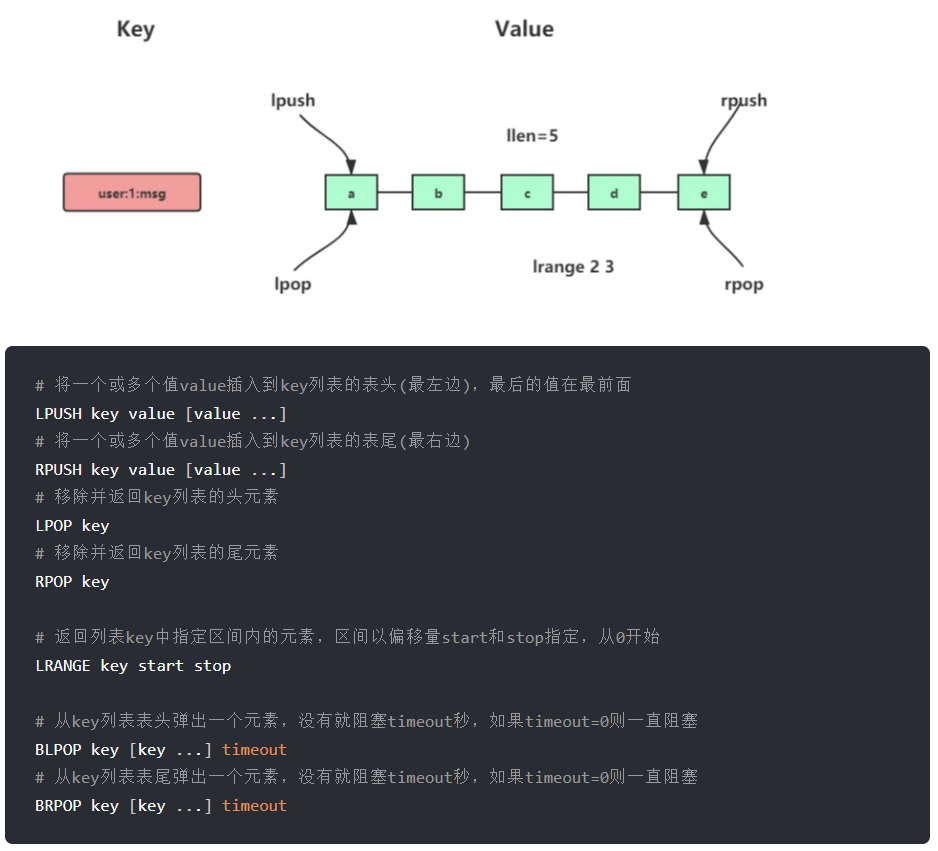

List 主要的应用场景是**消息队列**，消息队列在存取消息时必须满足**保证顺序、处理重复的消息和保证消息可靠性**这三个需求，List 本身就是按照**先进先出**的顺序来存储数据的，可以通过 `LPUSH` 命令在队列头部插入消息，通过 `RPOP` 命令在队列尾部取出消息，保证了消息的顺序性

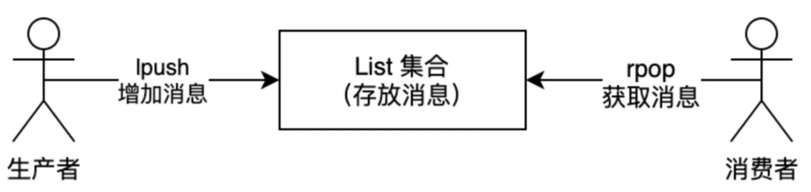

但生产者在往 List 中写入数据时，并**不会主动通知**消费者有新消息写入，而是需要消费者一直调用 `RPOP` 命令来**轮询**获取消息，这样会带来不必要的性能损失，于是 Redis 提供了 `BRPOP` 命令来实现**阻塞式的消息获取**，消费者在调用这些命令时，如果队列中没有消息，就会阻塞等待，直到有新消息写入队列才会返回

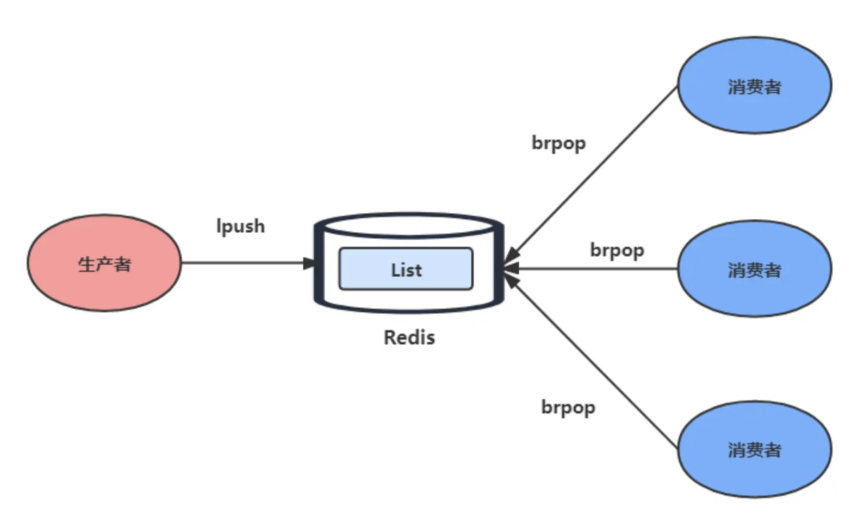

List 也**不会为每个消息生成 ID 号**，所以我们需要**自行为每个消息生成一个全局唯一 ID** 来让消费者**比对判断**当前收到的消息是否已经处理过，另外当消费者从 List 里读取一条消息之后，List 就**不会再保存**这条消息了，如果消费者在处理消息时出现宕机等异常情况，导致消息没有被成功处理，那**这条消息就会丢失**，无法保证消息的可靠性，于是 Redis 提供了 `RPOPLPUSH` 命令来解决这个问题，它可以**将消息从源队列尾部弹出并推入到另一个临时队列的头部**，这样即使消费者在处理消息时出现异常，消息也不会丢失，还保存在临时队列中，等消费者恢复之后，可以从临时队列中继续处理未完成的消息

但 List 不支持**多个消费者消费同一条消息**，也不支持**消费组**的实现，所以后续 Redis 引入了 **Stream** 数据类型来更好地支持消息队列场景

#### Hash 在 Redis 中底层的实现方式是什么样的？

hash 是一个**键值对集合**，底层是由 **listpack 或哈希表**实现的，如果元素**个数少并且小**的时候会使用 listpack 来保存数据，否则就会使用哈希表

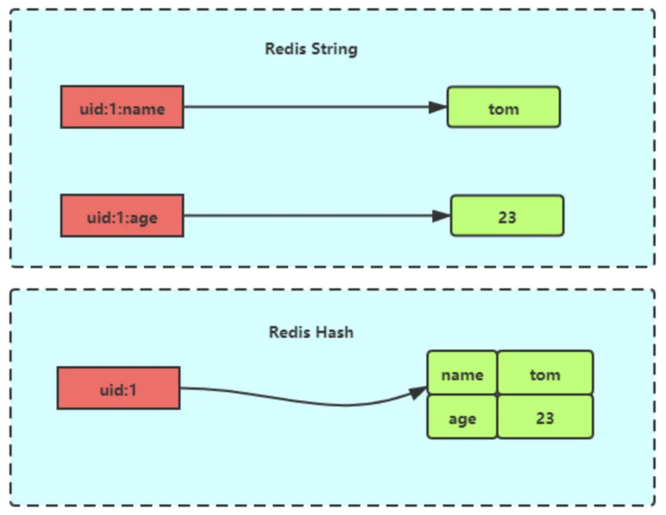

**常用命令**如下：

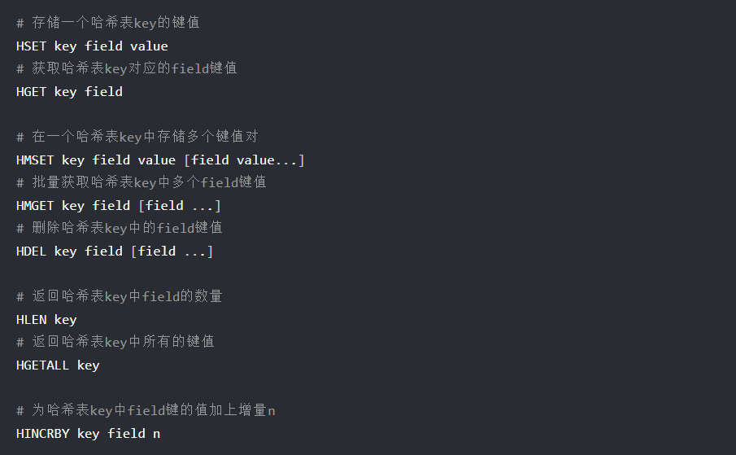

hash 类型的 **`(key, field, value)`** 结构与**对象结构体的对象 id、属性和值**比较相似，其可以用来**存储缓存对象**，下图表示的存储可以通过 `HMSET uid:1 name Tom age 15` 和 `HMSET uid:2 name Jerry age 13` 这两个命令来保存两个用户对象的信息


在存储对象时，一般对象都是用 **String + Json** 来存储，但对象中某些**频繁变化的属性**就可以考虑抽出来用 **Hash** 类型来存储

hash 也可以应用在**购物车场景**，主要涉及以下命令：

* 添加商品：`HSET cart:user_id product_id quantity`
* 添加数量：`HINCRBY cart:user_id product_id increment`
* 减少数量：`HINCRBY cart:user_id product_id -decrement`
* 删除商品：`HDEL cart:user_id product_id`
* 获取商品总数：`HLEN cart:user_id`
* 获取所有商品：`HGETALL cart:user_id`

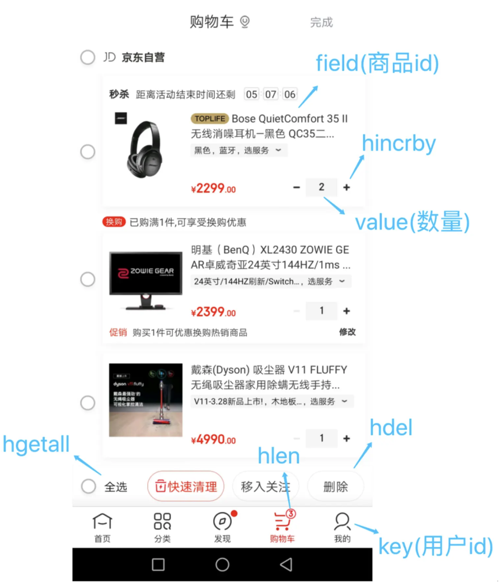

当然，Redis 存储的只是商品 ID，在回显商品具体信息时还需要用商品 ID 去**查询一次数据库**获取完整的商品信息

#### Set 在 Redis 中底层的实现方式是什么样的？

