## 基础
#### 什么是 Redis？

Redis，Remote Dictionary Service，是一个开源的**键值对数据库服务器**，或者说是一个数据结构服务器，它不通过迭代或者排序方式处理数据，而是直接**按照数据结构的方式组织**

主要来说，它是一个**内存数据库**，被用作例如 **MySQL 前的缓存**，来提高应用程序的性能，它利用**内存的高速访问**来减轻核心应用程序数据库的负载，它的 QPS 跟 MySQL 相比也非常高，可以更好地应对**高并发场景**

**不经常更改但经常被请求**的数据，或者**任务关键性较低但经常更改**的数据，都可以存到 Redis 中

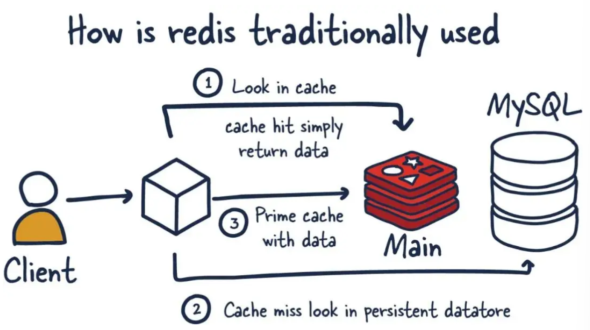

Redis 对数据的操作都是**原子性**的，它由单线程负责执行命令，**不存在并发竞争的问题**，还支持**事务、持久化、Lua 脚本、多种集群方案（主从复制、哨兵、切片集群）、发布/订阅模式、内存淘汰和过期删除机制**等功能

#### Redis 和 Memcached 有什么区别？

Redis 和 Memcached 都是基于**内存**的数据库，一般都用来当作缓存使用，它们都有过期策略，性能也都非常高

但 Redis **支持的数据类型更加丰富**，还支持**数据的持久化、原生集群和事务**等其他功能，Memcached 是没有持久化功能的，也没有原生的集群模式，更不支持其他功能

#### Redis 是单线程的吗？

Redis 单线程指的是，**接收客户端请求 - 解析请求 - 进行数据读写等操作 - 发送数据给客户端**，这个过程是由一个主线程来完成的，**Redis 程序并不是单线程的**，它在启动时会启动多个**后台线程（BIO）**


**关闭文件、AOF 刷盘和释放内存**这三个任务都有各自的任务队列，然后由后台线程去**异步**处理这些任务，从而避免阻塞主线程，提高 Redis 的性能

#### Redis 的单线程模型是什么样的？

Redis 在 6.0 版本之前采用的是单线程模型，所有的客户端请求都是由一个主线程来处理的，通过**I/O 多路复用技术**来同时监听多个客户端连接，当有客户端请求到达时，主线程会依次处理这些请求

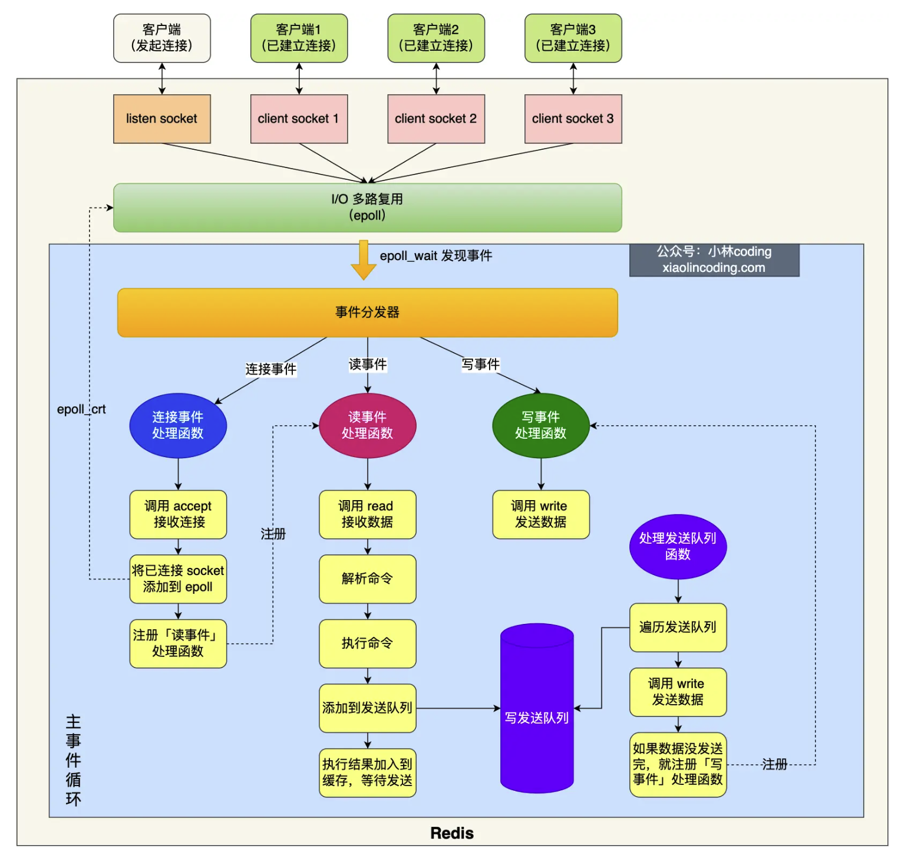

Redis 在初始化时，会先调用 **`epoll_create()`** 和 **`socket()`** 来创建一个 epoll 对象和一个服务端 socket，然后调用 **`bind()`** 和 **`listen()`** 来绑定端口并监听客户端连接请求，再调用 **`epoll_ctl()`** 把服务端监听的 socket 添加到 epoll 对象中，同时注册**连接事件处理函数**

初始化之后，主线程就会进入到一个**事件循环函数**，先调用**处理发送队列函数**，来看发送队列里是否有任务，如果有发送任务，就通过 **`write()`** 函数将**客户端发送缓存区**里的数据发送出去，如果这一轮数据没有发送完，就会注册**写事件处理函数**，等待 **`epool_wait()`** 检测到 socket 可写时，再次调用**处理发送队列函数**来继续发送数据

然后会调用 **`epoll_wait()`** 来等待事件的到来，如果是**连接事件**，就会调用**连接事件处理函数**，它会调用 **`accept()`** 来获取已连接的 socket，然后调用 **`epoll_ctl()`** 把已连接的 socket 添加到 epoll 对象中，同时注册**读事件处理函数**

如果是**读事件**，就会调用**读事件处理函数**，它会调用 **`read()`** 函数来读取客户端发送过来的数据，然后进行命令解析和处理，最后把客户端对象添加到发送队列，将执行结果写到**发送缓存区**等待发送

如果是**写事件**，就会调用**写事件处理函数**，它会调用 **`write()`** 函数来发送客户端发送缓存区里的数据，如果这一轮数据没有发送完，就会继续注册**写事件处理函数**，等待 **`epoll_wait()`** 检测到 socket 可写时，再次调用**写事件处理函数**来继续发送数据

#### 为什么 Redis 采用的是单线程还能这么快？6.0 之前为什么要使用单线程？

单线程的 Redis 吞吐量可以达到 **10w QPS** 以上，主要的原因是 Redis 的大部分操作都在**内存中**完成，并且采用了**高效的数据结构**，**CPU 并不是制约 Redis 性能的瓶颈，机器的内存和网络带宽才是**

Redis 采用的单线程模型**避免了多线程之间的竞争**，节省了**多线程切换**带来的时间和性能上的开销，也避免了**死锁**问题，**I/O 多路复用机制**可以处理大量的客户端 socket 请求，一个线程可以处理多个 IO 流，也就是 **select/epoll** 机制，它**允许内核中存在多个监听 socket 和已连接 socket**，内核会一直监听这些 socket 上的连接请求或数据请求，一旦有请求到达，就会通知 Redis 线程处理，从而实现了**一个 redis 线程处理多个 IO 流的效果**

如果想要使用多核 CPU，可以在一台服务器上启动**多个 Redis 节点或采用分片集群**的方式，并且使用单线程的**可维护性也更高**，多线程模型虽然在某些方面表现优异，但它引入了程序执行顺序的不确定性，带来了并发读写的一系列问题，增加了系统复杂度，同时可能存在线程切换、加锁解锁和死锁造成性能损耗

#### Redis 6.0 之后为什么引入了多线程？

随着网络硬件的性能提升，Redis 的性能瓶颈有时会出现在**网络 I/O 的处理**上，所以在 6.0 之后 Redis 也采用了**多个 I/O 线程来处理网络请求**，但对于**命令的执行，Redis 仍然使用单线程来处理**

在默认情况下，Redis 支持的 I/O 多线程特性**只针对发送响应数据**，并不会以多线程的方式处理读请求，要开启多线程处理客户端读请求的话就需要把 **Redis.conf** 配置文件中的 **`io-threads-do-reads`** 选项设置为 **`yes`**，还可以通过 **`io-threads`** 选项来设置 I/O 线程的数量，如果是 4 核的 CPU 建议线程数设置为 2 或 3，8 核则建议设置为 6，线程数一定要小于机器核数，线程数并不是越大越好的

所以在 6.0 版本之后，Redis 启动时在默认情况下，除了主线程以外，会**额外创建 6 个线程**，加起来一共是：

* **Redis-server**
  * **主线程**，主要负责执行命令
* **BIO 线程**，主要负责**异步**处理**后台任务**
  * bin_close_file
    * 关闭文件
  * bin_aof_fsync
    * AOF 刷盘
  * bio_lazy_free
    * 释放内存
* **I/O 线程**，主要负责处理**网络请求**
  * io_thd_1
  * io_thd_2
  * io_thd_3
  * io-threads 默认是 4，所以会启动 4 - 1 = 3 个 I/O 多线程来分担 Redis 网络 I/O 的压力

#### AOF 日志是如何实现的？

Redis 一共有三种数据持久化的方式，分别是 AOF 日志、RDB 快照和混合持久化

**AOF 日志**是指，Redis 在执行完一条写操作命令后，会把该命令以**追加**的方式记录到 AOF 文件中，当 Redis 重启时，会读取 AOF 文件中的命令并逐一执行，从而恢复数据

这样先执行命令再记录的做法可以**避免额外的语法检查开销**，也**不会阻塞当前写操作命令的执行**，但有可能导致数据的丢失和阻塞其他操作，因为 AOF 日志也是在主线程中执行的，会阻塞后续的操作

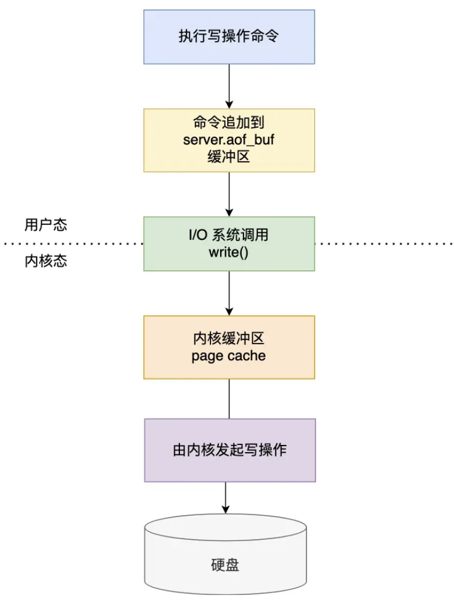

Redis 在执行完写操作命令后，会先将命令追加到 **`server.aof_buf` 缓冲区**，然后通过 `write()` 系统调用将缓冲区的数据写入到 AOF 文件中，此时数据还没有真正落盘，只是在**页缓存**中，要等待内核将数据写入磁盘，Redis 提供了**三种写回磁盘的策略**，可以在 **Redis.conf** 配置文件中通过 **`appendfsync`** 选项来设置，分别是 **Always**，表示每次写操作命令执行完后都会同步将 AOF 日志数据写回磁盘，**Everysec** 表示每隔一秒就将缓冲区里的内容写回磁盘，**No** 则表示不由 Redis 控制，而是让操作系统决定何时写回

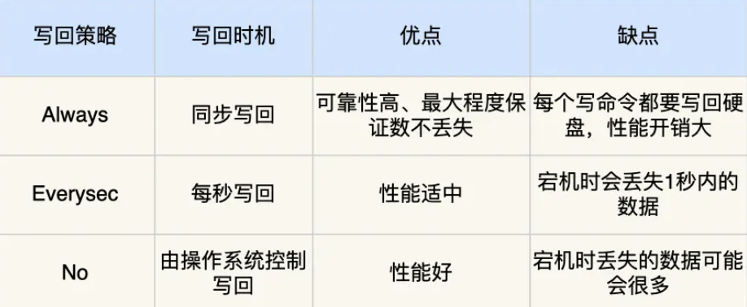

为了避免 AOF 日志文件**过大**所导致的**性能问题**，Redis 提供了 **AOF 重写机制**，它会**读取同一个键最新的值**，然后在新的 AOF 文件中**只记录最新的键值对**，之前的历史命令就会被丢弃，重写工作完成后再用新的 AOF 文件替换旧的 AOF 文件，从而缩小 AOF 文件的大小，重写的过程是由**后台子进程 `bgrewriteaof`** 来完成的，不会阻塞主进程，主进程仍然可以正常处理命令

使用子进程而不是线程的原因是，多线程之间会共享内存，在**修改共享内存数据**时就需要通过**加锁**来保证数据的安全，导致性能下降，而使用子进程，在创建时父子进程是共享内存数据的，但这个共享的内存**只能以读的方式访问**，当父子进程任意一方修改了该共享内存，就会发生**写时复制**，让父子进程各自有了独立的数据副本，从而避免了加锁带来的性能损耗

为了避免写时复制导致的**数据不一致问题**，Redis 设置了一个 **AOF 重写缓冲区**，在子进程创建之后开始使用，在重写 AOF 期间，当 Redis 执行完一个写命令，它会**同时**把这个写命令写入到 AOF 缓冲区和 AOF 重写缓冲区中，当子进程重写完成后，子进程会向主进程发送一条**信号**（进程间的一种异步通讯方式），主进程收到信号后会调用一个**信号处理函数**，在这个函数中会**将 AOF 重写缓冲区中的所有内容追加的新的 AOF 文件中**，使新旧两个 AOF 文件所保存的数据库状态一致，再将新的 AOF 文件改名，覆盖现有的 AOF 文件，从而完成 AOF 重写操作

#### RDB 快照是如何实现的？

**RDB 快照**记录的是某一个瞬间的**实际内存数据**，在恢复数据时直接将 RDB 文件读入内存就可以，Redis 提供了 **save 和 bgsave** 两个命令来生成 RDB 文件，save 是在**主线程**执行的，所以如果写入 RDB 文件的时间太长，就会阻塞主线程，bgsave 会创建一个**子进程**来生成 RDB 文件，所以可以避免主线程的阻塞

Redis 的快照是**全量快照**，每次执行都会把内存中的**所有**数据都记录到磁盘中，在执行 bgsave 过程中，基于**写时复制**技术，Redis 可以继续处理操作命令，数据是能被修改的，被修改的数据会复制一份副本，由 bgsave 子进程把该副本数据写入 RDB 文件

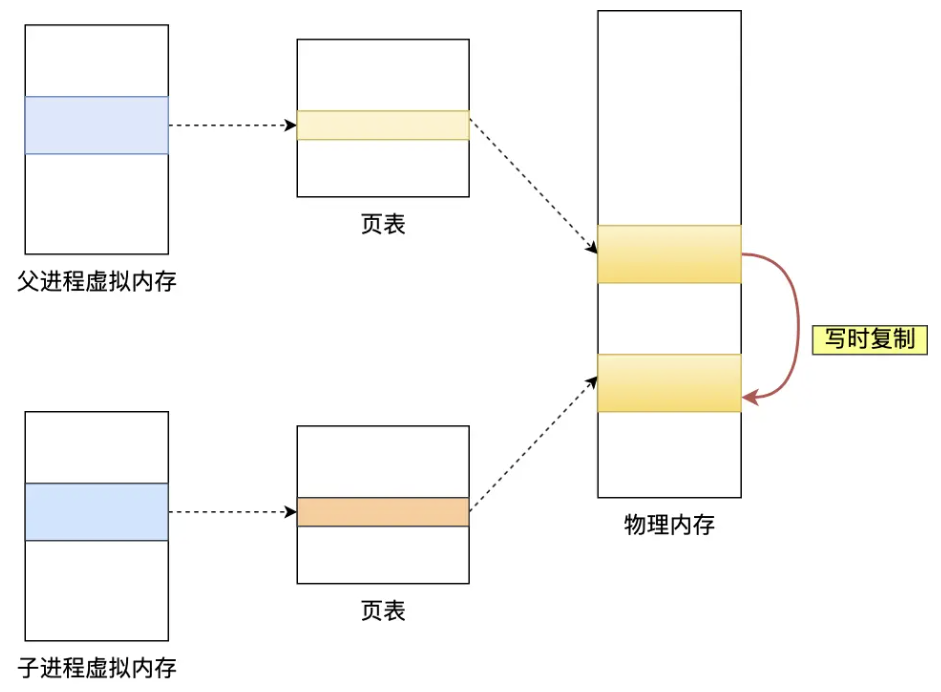

#### 为什么会有混合持久化？

混合持久化集成了 AOF 日志和 RDB 快照的优点，混合使用它们，它工作在 AOF 日志的重写过程，fork 出来的重写**子进程**会先将与主进程共享的内存数据**以 RDB 方式写入 AOF 文件**，主线程处理的操作命令会被记录到 AOF 重写缓冲区中，里面的增量命令会以 AOF 方式写入到 AOF 文件，所以如果使用了混合持久化，AOF 文件的**前半部分**就是 RDB 格式的全量数据，**后半部分**是 AOF 格式的增量数据

这样加载时速度会很快，数据丢失风险也会降低，但会导致 AOF 文件的可读性变得很差

#### Redis 是如何实现服务高可用的？

Redis 通过多个服务节点的主从复制、哨兵和切片集群来保证服务的高可用

**主从复制：**

主从复制是 Redis 高可用服务最基础的保证，将一台 Redis 服务器的数据同步到多台 Redis 服务器上，也就是**一主多从**的模式，主从服务器之间采用**读写分离**，主节点可以进行读写操作，当发生写操作时会自动将写操作同步给从节点，从节点一般是只读

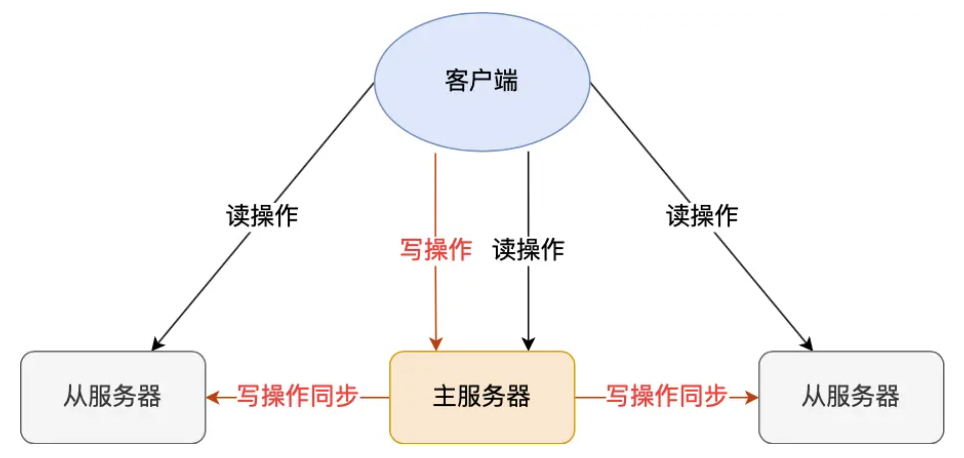

所有的数据修改都只在主节点上进行，主从节点之间的命令复制**异步**进行，主节点自己在本地执行完命令后，不会等待从节点的响应就直接返回给客户端，这样可以提高主节点的性能，但也会带来**数据不一致的问题**，也就是无法实现强一致性保证

**哨兵模式：**

当主从节点出现故障宕机时，**哨兵节点**可以**监控主从节点的状态**，当发现主节点宕机时，会自动将某个从节点升级为新的主节点，并通知其他从节点切换到新的主节点，从而保证 Redis 服务的高可用，也就是提供**主从节点故障转移**的功能

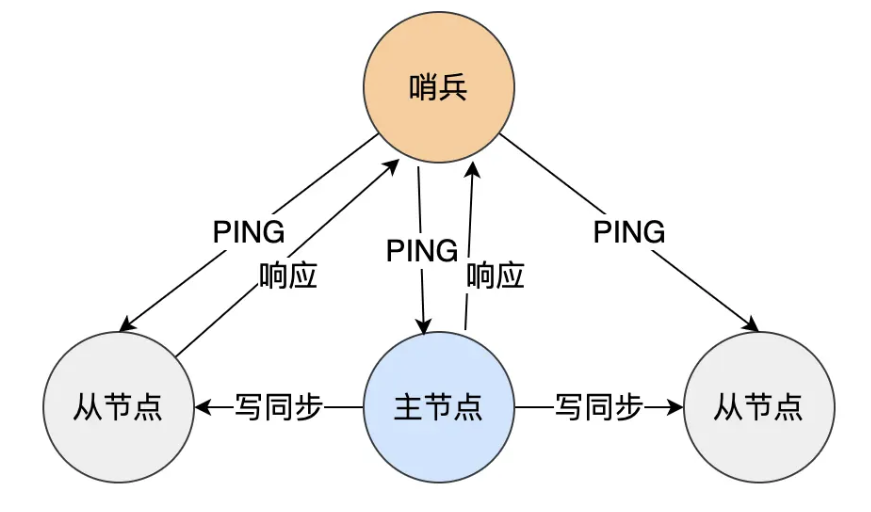

**切片集群：**

切片集群方案将数据分布在不同的服务器上，以此**降低系统对单一主节点的依赖**，它采用**哈希槽**的方式来处理数据和节点之间的映射关系，一个切片集群共有 16384 个哈希槽，这些哈希槽类似**数据分区**，每个键值对会根据它的 key 被映射到一个对应的哈希槽中

映射的过程主要是通过 CRC16 算法来计算 key 的一个 16 bit 的哈希值，然后用这个 16 位的哈希值对 16384 取模，得到的结果就是该 key 对应的哈希槽编号

在使用 **cluster create** 命令创建集群时，Redis 会自动把所有哈希槽平均分布到集群节点上，或者也可以通过 **cluster meet 和 cluster addslots** 命令手动分配哈希槽，前者是手动建立节点之间的连接，后者是手动分配每个节点上的哈希槽数量，但在手动分配哈希槽时需要把 16384 个哈希槽全部分配完，否则集群无法正常工作

#### 集群脑裂导致数据丢失是什么？该怎么解决？

如果在一主多从的部署方式下，**主节点和从节点之间的网络出现故障**，导致主节点与所有的从节点都失联了，但主节点与客户端的网络还是正常的，客户端也不知道 Redis 内部已经出现了网络故障，所以它仍然会**继续**向主节点发送写操作命令，主节点也会继续执行这些写操作命令，并返回给客户端成功的响应，但因为主从节点之间的网络问题，主节点**无法**将这些写操作命令**同步**给从节点

此时哨兵也发现主节点失联，那它会认为主节点**挂了**，于是在从节点之间选举一个 leader 作为新的主节点，这样就有了**两个主节点**，如果后续网络恢复，**哨兵就会把原本的主节点降级为从节点**，它会先**清空本地的所有数据**，再向新的主节点做**全量同步**，这样之前客户端写入的数据就丢失了，也就是**集群脑裂的情况下丢失数据**

在 Redis 的配置文件中有 **`min-slaves-to-write` 和 `min-slaves-max-lag`** 这两个参数，前者表示**主节点必须要有多少个从节点连接**，后者表示**主从数据的复制和同步不能超过多少秒**，如果这两个有一个不能满足，那**向主节点写入数据的请求就会被拒绝**，也就是通过**限制原本的主节点的写入操作**，来避免脑裂情况下的数据丢失问题，但这也会带来主节点不可用的问题，所以需要根据实际业务场景来权衡选择

#### Redis 使用的过期删除策略是什么？

每当我们对一个 key 设置了过期时间后，Redis 会在内部维护一个**过期字典**，用来存储所有设置了过期时间的 key 和它们对应的过期时间，Redis 使用的过期删除策略是惰性删除和定期删除的配合使用

**惰性删除**指的是 Redis **不会主动删除过期键**，而是每次从数据库访问 key 时都检测它是否过期，如果过期了就删除它并返回空值给客户端，如果没有过期就正常返回对应的值，它会消耗很少的系统资源，但可能导致内存空间的浪费

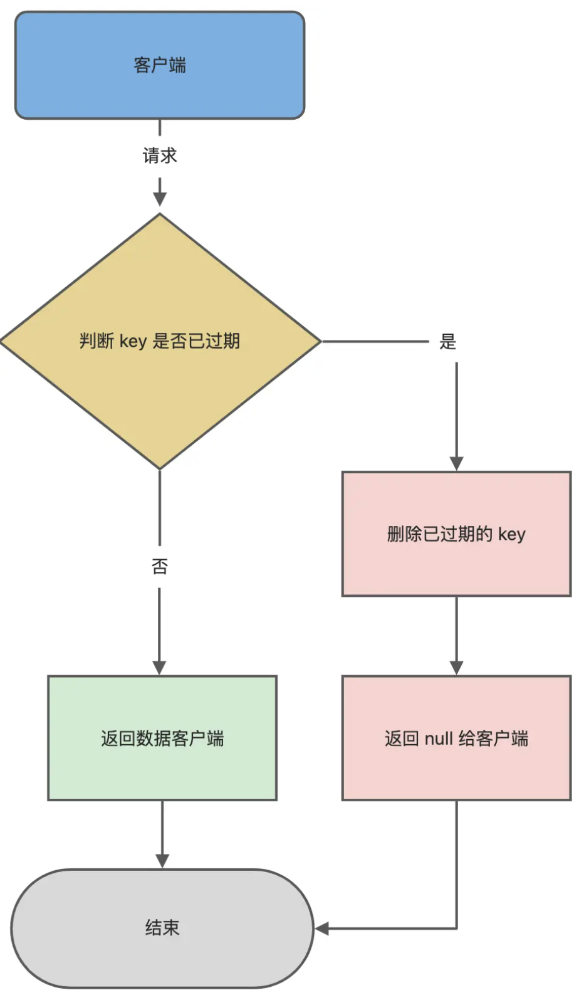

**定期删除**指的是每隔一段时间就随机从数据库中取出一定数量的 key 进行检查，删除其中的过期 key，如果在检查过程中发现过期 key 的比例超过一定的阈值，就会继续进行下一轮检查，直到过期 key 的比例**低于**该阈值为止，这样通过限制操作执行的时长和频率，减少了删除操作对 CPU 的影响，减少内存空间的浪费，但难以确定删除操作执行的时长和频率

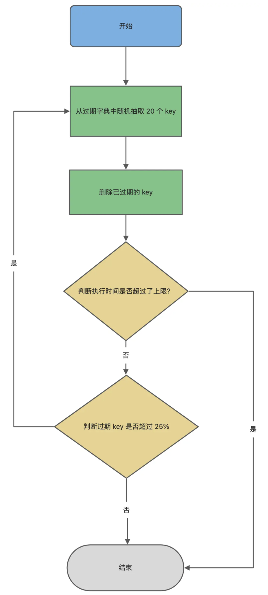

#### Redis 持久化时会如何处理过期键？

**RDB 文件生成阶段**会对 key 进行**过期检查**，过期的键不会被保存到新的 RDB 文件中，**RDB 加载阶段**则分为主从服务器，如果是**主**服务器，那在载入 RDB 文件时会对过期键进行检查，过期的键不会被加载到内存中，如果是**从**服务器，那在载入 RDB 文件时不会对过期键进行检查，所有的键都会被加载到内存中，从服务器会在之后的同步过程中删除过期键

也就是说，**从节点是不会进行过期扫描的**，它对过期的处理是被动的，只有主库只在 key 到期时**追加**了 AOF 文件的 DEL 命令之后，同步到所有的从库里，才会删除过期键

**AOF 文件写入阶段**会保留过期键，当这个过期键被删除后，Redis 会向 AOF 文件追加一条 DEL 命令来显式地删除该键，**AOF 重写阶段**会检查过期键值对，已过期的键不会被保存到重写后的 AOF 文件中

#### Redis 内存淘汰策略有哪些？

当 Redis 的运行内存达到了我们设置的 maxmemory 最大运行内存阈值时，就会触发内存淘汰机制

* **不进行数据淘汰**的策略
  * noeviction
    * 表示当运行内存超过最大设置内存时，不淘汰任何数据
    * 而是不再提供服务，直接返回错误
* **进行数据淘汰**的策略
  * 在**设置了过期时间**的数据中淘汰
    * volatile-random：随机淘汰设置了过期时间的任意键值对
    * volatile-ttl：优先淘汰更早过期的键值对
    * volatile-lru：优先淘汰最近最少使用的键值对
    * volatile-lfu：优先淘汰最近最不经常使用的键值对
  * 在**所有**数据中淘汰
    * allkeys-random：随机淘汰任意键值对
    * allkeys-lru：优先淘汰最近最少使用的键值对
    * allkeys-lfu：优先淘汰最近最不经常使用

#### Redis 是如何使用 LRU 和 LFU 算法的？

Redis 使用的是一种**近似 LRU 算法**，它会在对象结构体里添加一个额外的字段，用于**记录此数据的最后一次访问时间**，它不会为所有数据维护一个大链表，也不用在每次数据访问时都移动链表项，它使用**随机采样**的方式来淘汰最久没有使用的数据，但它没办法解决**缓存污染**问题

**LFU** 在 Redis 中的实现相比于 LRU 多了**数据的访问频次**这一信息，Least Frequently Used，最近最不常用的，当一个数据被访问时就会增加该数据的访问次数，就解决了偶尔被访问一次之后数据在缓存中停留很长时间的缓存污染问题

Redis 对象头中的 24 bit 的 lru 字段，如果是在 LRU 算法中，就是用来记录 key 的访问时间戳，如果是在 LFU 算法中，高 16 bit 用来记录访问频次，低 8 bit 用来记录上次访问的时间戳

#### 如何避免缓存雪崩、缓存击穿和缓存穿透？

**缓存雪崩：**

当大量缓存数据在**同一时间**过期失效时，如果此时有大量的用户请求失效的缓存数据，由于无法在 Redis 中处理，就会直接访问数据库，导致数据库的压力骤增，甚至可能会导致数据库宕机，形成一系列连锁反应，这种现象就叫做**缓存雪崩**

为了解决这个问题，我们可以通过**设置不同的过期时间**来避免大量缓存数据在同一时间过期失效，比如在原有的失效时间基础上增加一个随机值，降低缓存集体失效的概率，或者**设置缓存不过期**，比如通过后台服务**异步**更新缓存数据

**缓存击穿：**

在业务层面会被频繁访问的数据称为**热点数据**，比如秒杀活动，当缓存中某个热点数据过期了，大量请求又刚好访问该热点数据，就会导致数据库很容易被高并发的请求冲垮，这就是**缓存击穿**，它跟缓存雪崩很类似，可以说是缓存雪崩的一个子集

我们可以使用**互斥锁**，比如使用 setNX 方法设置一个状态位，表示这是一种锁定状态，从而保证同一时间只有一个业务线程请求缓存，其他未能获取互斥锁的请求要么等待锁释放后重新读取缓存，要么返回空值或者默认值，或者也可以同样的不给热点数据设置过期时间，让后台异步更新缓存，或者在热点数据准备过期之前**提前通知**后台线程更新缓存并重新设置过期时间

**缓存穿透：**

当用户访问的数据既不在缓存中，也不在数据库中，导致无法构建缓存数据，数据库压力骤增，这就是缓存穿透，一般会发生在**业务误操作**，也就是缓存中的数据和数据库中的数据都被误删除了，或者是**恶意攻击**，故意大量访问不存在的数据

我们可以**限制非法请求**，比如判断请求参数是否合理、含有非法值和字段是否存在，如果是恶意请求就直接返回错误，也可以**针对查询的数据在缓存中设置空值或默认值**，或者使用**布隆过滤器**快速判断数据是否存在，避免大量请求直接打到数据库上，这样即使发生了缓存穿透，大量请求也只会查询布隆过滤器

#### 如何设计一个缓存策略能动态缓存热点数据？

可以通过**数据最新访问时间**来做排名，过滤掉不常访问的数据，只留下经常访问的数据

例如**电商平台**场景中，只缓存用户经常访问的 top 1000 的商品，先通过缓存系统做一个排序队列，根据商品的访问时间更新队列信息，**越近访问的商品排名越靠前**，并**定期过滤**队列中排名最靠后的 200 个商品，再从数据库中**随机读取** 200 个商品加入到缓存中，这样每次请求到达时，会先从队列中获取商品 ID，如果命中，再根据 ID 从另一个缓存数据结构中读取实际的商品信息返回

在 Redis 中可以使用 **zadd 和 zrange** 方法来完成**排序队列和获取 200 个商品**的操作

#### 常见的缓存更新策略有哪些？

主要有 **Cache Aside 旁路缓存、Read/Write Through 读穿/写穿、Write Back 写回**这三种策略

**旁路缓存策略**是**最常用**的，应用程序直接与数据库和缓存交互，它可以细分为**读**策略和**写**策略，**写策略**是先更新数据库中的数据，再删除缓存中的数据，**读策略**是先从缓存中读取数据，如果命中就直接返回，如果未命中就从数据库中读取数据，然后将数据写入缓存中

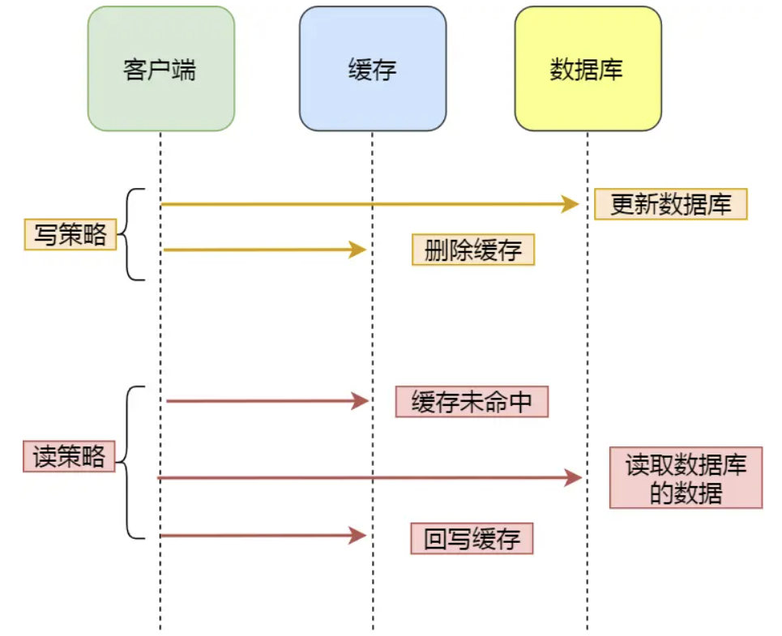

写策略的**先改库再删缓存的顺序是不能修改的**，即使两种顺序下都有可能出现缓存和数据库的数据不一致的问题，但**缓存的写入要远远快于数据库的写入**，这种策略只适合**读多写少**的场景，当写入比较频繁时会**影响缓存的命中率**，可以在更新数据时也更新缓存，在更新缓存前先加一个**分布式锁**，在同一时间内只允许一个线程更新缓存，就不会有并发问题了，只是对于写入的性能有一些影响，或者也可以给缓存加一个**较短的过期时间**，这样即使出现缓存不一致，也会很快过期

**读穿/写穿策略**是应用程序只与缓存交互，由缓存代理更新数据库的策略，**读穿**会先查询缓存中数据是否存在，存在就直接返回，不存在就由缓存从数据库查询数据并写入到缓存，缓存再将数据返回

**写穿**是在有数据更新时，会先查询要写入的数据在缓存中是否已经存在，存在的话就更新缓存中的数据，由缓存更新到数据库中，再告知应用程序更新完成，如果不存在就直接更新数据库然后返回


**写回策略**是指在更新数据时只更新缓存，然后将缓存数据设置为**脏**的就立即返回，再通过**异步**的方式批量更新数据库，它适合**写多读少**的场景，但**数据不是强一致性的**，也会有数据丢失的风险，主要是用在 CPU Cache 和操作系统中的文件缓存

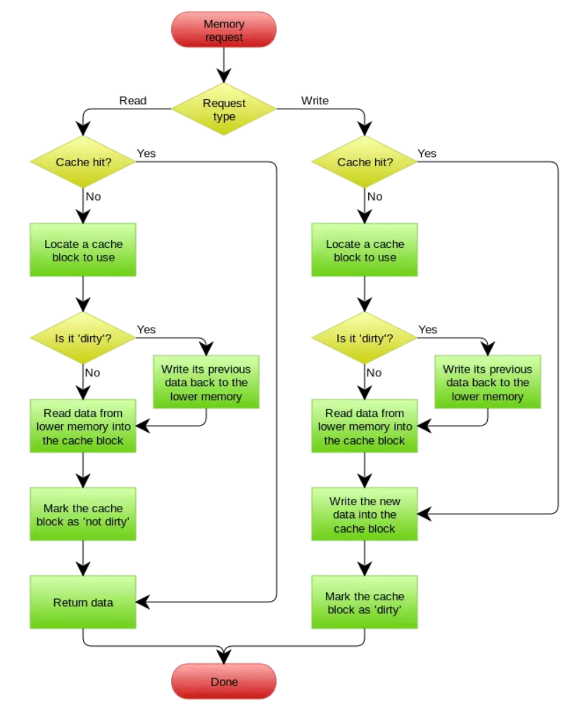

由于我们经常使用的 redis 这种缓存组件一般都**不提供**写入数据库和自动加载数据库中的数据的功能，所以在实际应用中，更多使用的是旁路缓存策略

#### Redis 如何实现延迟队列？

延迟队列是指**把当前要做的事情往后推迟一段时间再做**，常见的使用场景为已经下单的订单为付款被自动取消、打车时一定时间内没有司机接单被平台自动取消、点外卖下单之后商家没有接单等

在 redis 里可以使用 **ZSet** 来实现**延迟消息队列**，它有一个 **Score** 属性可以用来存储延迟执行的时间，通过 **`zadd score1 value1`** 就可以一直往内存中生产消息，再利用 **`zrangebyscore`** 来查询符合条件的所有待处理的任务，通过循环执行

#### Redis 中的大 key 是什么？会导致什么问题？

大 key 指的是 **key 对应的 value 很大**，一般来说，**string** 类型的值**大于 10 KB** 或者 **Hash/List/Set/ZSet** 类型的**元素数量超过 5000 个**，就会被称为大 key

由于操作大 key 比较耗时，Redis 又是单线程执行命令，所以会导致**客户端超时阻塞**，还会引发**网络阻塞**，因为每次获取大 key 产生的网络流量较大，另外还会导致**工作线程的阻塞和内存分布不均**，比如使用 del 删除大 key，集群模型在 slot 分片均匀的情况下会出现数据和查询倾斜的情况，部分有大 key 的 Redis 节点会占用更多的内存，QPS 也会更大

#### 该如何找到 Redis 中的大 key？

我们可以通过 **`redis-cli --bigkeys`** 命令来扫描 Redis 实例中的大 key，例如 **`redis-cli -h 127.0.0.1 -p 6379 -a "password" --bigkeys`**，使用时最好**在从节点上执行**，否则会阻塞主节点，或者在业务压力的低峰阶段执行，可以使用 -i 参数控制扫描间隔，这个命令会**返回每种类型中最大的那个 key**，但无法得到大小排在前几位的 key，并且对于集合来说它只能统计**元素个数的多少**，而不是实际占用的内存量，即使元素个数多，占用的内存不一定多

也可以使用 **`SCAN`** 命令，再用 **`TYPE`** 命令获取 key 的类型，然后根据不同类型使用 `STRLEN`（获取字符串长度）、`HLEN`、`LLEN`、`SCARD`、`ZCARD` 等命令来获取元素个数，对于集合类型，如果能在业务层预先知道集合元素的平均大小，就可以得到集合占用的总内存大小，或者使用 **`MEMORY USAGE key`** 命令来获取一个键值对实际占用的内存大小

或者可以使用 **Rdb Tools** 这种第三方开源工具来**解析 RDB 快照文件**，分析快照中的大 key，例如 **`rdb dump.rdb -c memory --bytes 10240 -f redis.csv`** 就会将大于 10 KB 的 key 输出到一个表格文件

#### 该如何删除 Redis 中的大 key？

删除操作需要**释放内存**，操作系统要把释放掉的内存块插入一个空闲内存块的链表，所以删除操作本身就是需要时间并且**可能造成 Redis 主线程阻塞**的，为了更好地释放内存，主要有**分批次**删除和**异步**删除两种方式

**分批次删除**，顾名思义就是分成多次删除，对于 Hash/List/Set/ZSet 的大 key，可以通过 **`hscan`、`ltrim`、`sscan`、`zremrangebyrank`** 等命令来分批次地获取元素，然后再通过 **`hdel`、`srem`** 等命令来删除这些元素，基本上都是先获取 100 个元素，再每次删除几个元素这样

**异步删除**指的是用 **`unlink`** 命令代替 del 来删除，Redis 会将 key 放到一个**异步线程**中进行删除，这样就不会阻塞主线程，也可以配置参数来实现在达到某些条件时自动地异步删除：

* `lazyfree-lazy-eviction`
  * 当 Redis 运行内存超过 maxmemory 限制时，是否开启 lazyfree 机制删除
* `lazyfree-lazy-expire`
  * 表示设置了过期时间的键值对，当 key 过期时，是否开启 lazyfree 机制删除
* `lazyfree-lazy-server-del`
  * 在执行有些带有隐式 del 键的命令时，是否开启 lazyfree 机制删除
  * 比如 rename 命令，当目标键已存在，如果不配置的话就会先删除
* `slave-lazy-flush`
  * 针对从节点进行全量数据同步的场景，当从节点执行 flushdb 或 flushall 命令时，是否开启 lazyfree 机制删除

一般来说前三个都是建议**开启**的，可以有效提升主线程的执行效率

#### Redis 管道是什么？

Redis 的管道指的是客户端提供的一种**批量处理**技术，可以一次性处理多个 Redis 命令

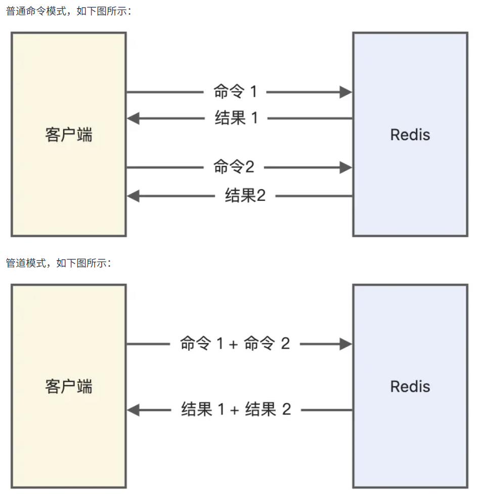

管道可以避免多个命令执行时的网络等待，但要避免发送的命令过大，或管道内数据太多而导致的网络阻塞，它本质上并**不是** Redis 服务器端提供的功能

#### Redis 的事务支持回滚吗？

Redis 中是**没有回滚机制**的，只提供了 **`DISCARD`** 命令来放弃事务中的所有命令，清空暂存的命令队列，但起不到回滚的效果

在事务执行过程中，如果命令在入队时没有报错，但事务提交后实际执行时报错了，正确的命令仍然可以正常执行，所以 **Redis 并不一定保证原子性**

不支持回滚的主要原因是，Redis 在执行事务时，通常都只有编程错误，大部分情况下都是出现在**开发环境**中，很少在生产环境出现，并且事务回滚这种复杂的功能和 Redis 追求的**简单高效**的设计主旨不符，所以 Redis 不支持事务运行时错误的事务回滚

#### 如何利用 Redis 实现分布式锁？

分布式锁是用于**分布式环境下并发控制**的一种机制，用于控制某个资源同一时刻只能被一个应用使用

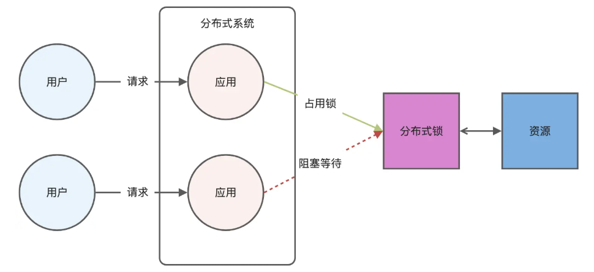

我们可以通过 Redis 的 **SET** 命令的 **NX** 参数实现 **key 不存在时才插入的分布式锁**，如果 key 不存在，就显示插入成功，表示加锁成功，反之就是加锁失败

对于加锁操作，我们需要满足加锁时包括了**读取锁变量、检查锁变量值和设置锁变量值**这三个步骤是**原子操作**，**锁变量需要设置过期时间**，以免客户端拿到锁之后发生异常导致锁一直无法释放，并且**锁变量的值要能区分来自不同客户端的加锁操作**，以免释放锁时出现误释放

满足上面几个条件的命令例子为：**`set lock_key unique_value nx px 30000`**，其中 `lock_key` 是 key 键，`unique_value` 是一个**唯一标识**，区分来自不同客户端的锁操作，`nx` 表示只有当 key 不存在时才设置成功，`px 30000` 表示锁的过期时间为 30 秒

解锁的过程就是将 `lock_key` 这个键删除，需要先判断锁的 `unique_value` 是否为加锁客户端，是的话才删除，由于解锁有两个操作，我们可以用 **Lua 脚本**来保证**解锁的原子性**，脚本内容如下：

```lua
if redis.call("get",KEYS[1]) == ARGV[1] then
    return redis.call("del",KEYS[1])
else
    return 0
end
```

这样基于 Redis 实现的分布式锁**性能非常高效**，实现起来也很方便，还可以避免单点故障，因为 Redis 是跨集群部署的

但也有一些缺点，它的**超时时间不好设置**，如果过长会影响性能，过短就没办法保护共享资源，比如业务代码的执行时间超过了锁的超时时间，这时我们就可以基于**续约**的方式设置超时时间，设置超时之后启动一个**守护线程**，让其在一定时间后，在锁快失效时重新设置这个锁的超时时间，主线程执行完之后再销毁续约锁

另外 Redis 主从复制模式中的数据是**异步赋值**的，这会导致**分布式锁的不可靠**，如果主节点获取到锁后没有及时同步到其他节点就宕机了，新的主节点仍然可以获取锁

#### Redis 该如何解决集群场景下分布式锁的可靠性问题？

官方设计了 **Redlock 红锁**的分布式锁算法，它是基于多个 Redis 节点的分布式锁，即使有节点发生了故障，锁变量也仍然存在，官方推荐至少部署 5 个独立的主节点，这个算法的基本思路是**让客户端和多个独立的 Redis 主节点依次申请加锁**，如果能和**半数以上**的节点成功完成加锁操作，就认为客户端成功获得分布式锁，否则加锁失败

客户端会首先**获取当前时间**，然后**按顺序依次向多个主节点执行加锁操作**，命令还是 `set lock_key unique_value nx px 30000`，为了在某个节点故障的情况下算法仍能继续运行，**加锁操作这个操作本身会有一个超时时间**，这个时间远远小于锁的过期时间，最后一旦客户端从超过半数的节点上成功获取到了锁，就**再次获取当前时间**，计算整个加锁过程的总耗时，如果小于锁的过期时间，就认为加锁成功，否则就认为加锁失败

也就是说，加锁成功需要满足**从超过半数的节点上成功获取锁**，并且**加锁过程的总耗时小于锁的过期时间**这两个条件，在加锁成功在之后，客户端会重新计算这把锁的有效时间，也就是锁的过期时间减去加锁过程的总耗时，作为这把锁的实际有效时间，如果新的时间已经来不及完成共享数据的操作，就会释放锁，当然加锁失败的话也会向所有节点都发起释放锁的操作，也是执行 Lua 脚本
