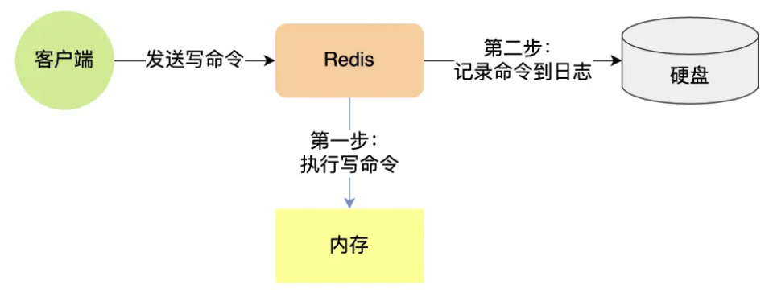
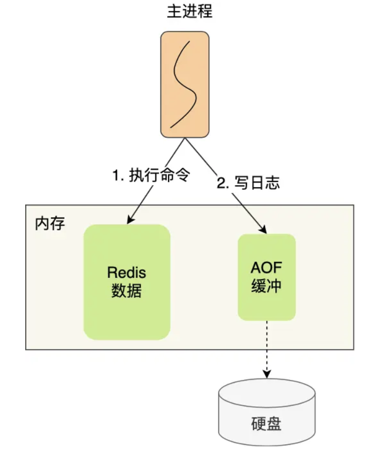
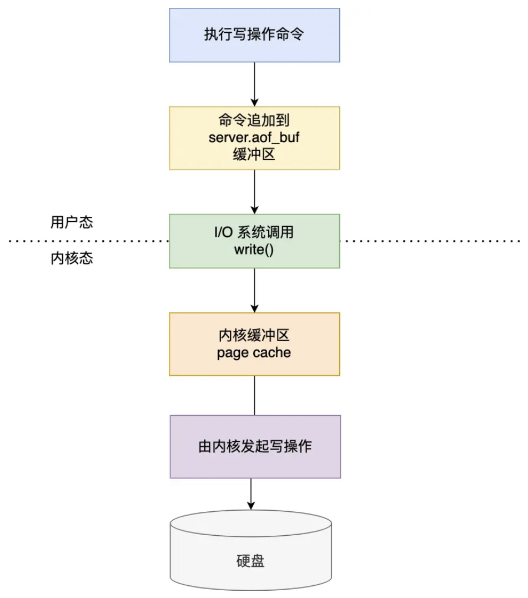
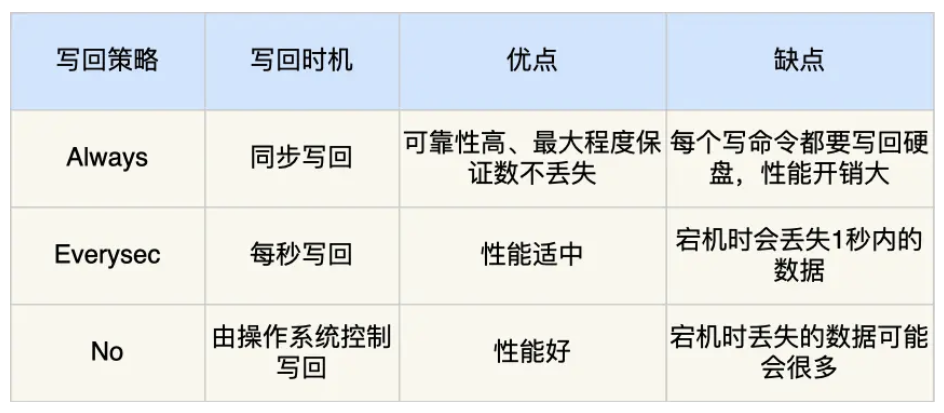
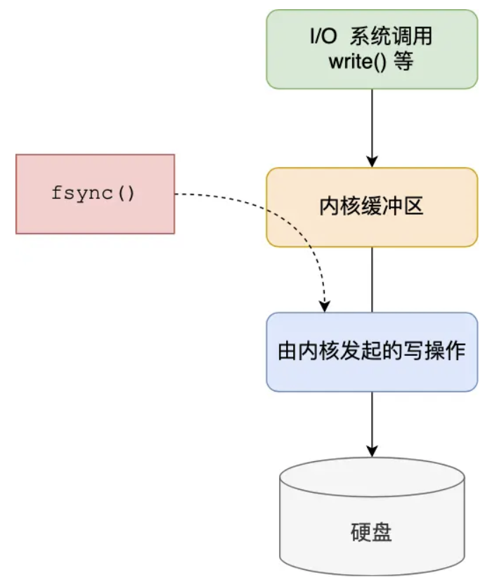
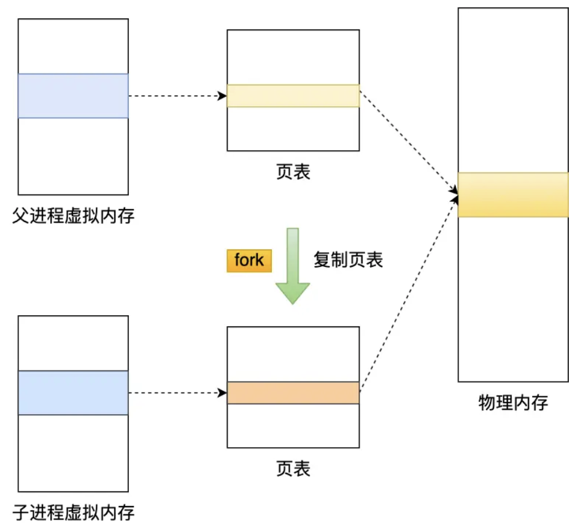
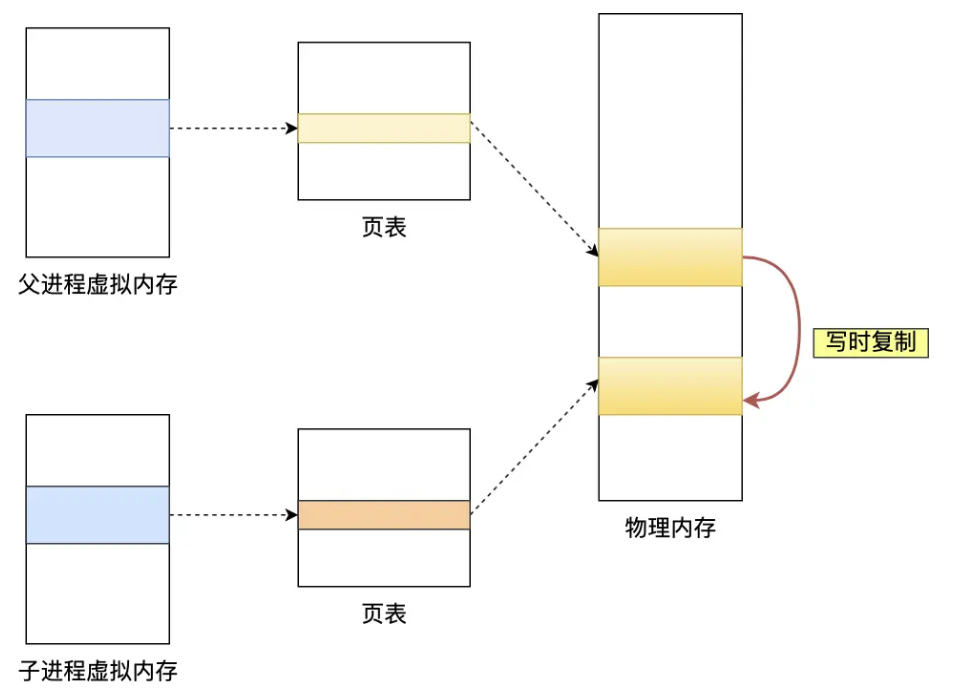
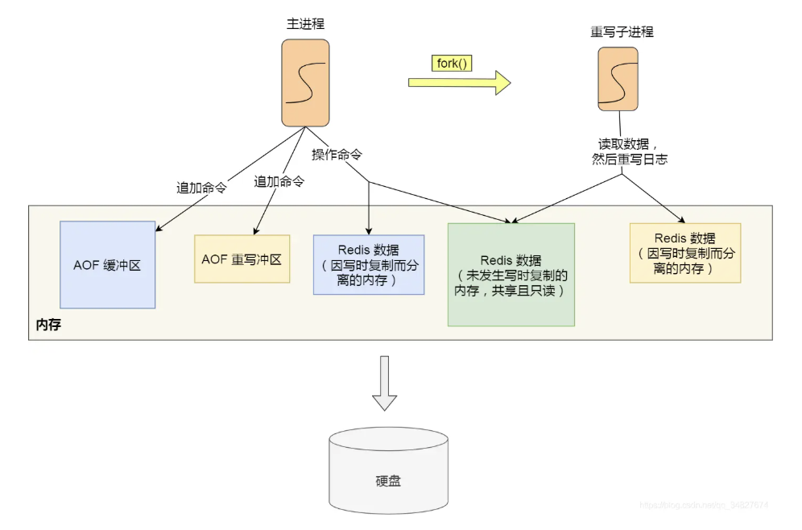

## 持久化
#### AOF 持久化是怎么实现的？

Redis 里的 AOF（Append Only File）持久化功能只会记录写操作命令，当 Redis 执行写操作时，这些命令会被追加写入到 AOF 文件的末尾，形成一条**日志记录**，这样即使 Redis 宕机重启，也可以通过重新执行 AOF 文件中的命令来恢复数据



AOF 持久化功能默认是不开启的，可以通过修改配置文件 `redis.conf` 中的 `appendonly` 和 `appendfilename` 两个参数来启用和配置 AOF 持久化功能：

```conf
appendonly yes
appendfilename "appendonly.aof"
```

我们可以通过 `cat` 命令查看 AOF 文件的内容，在先执行完写操作命令后再将其记录到 AOF 日志里，可以避免额外的检查开销，相当于只有命令的语法没有问题执行成功后才会被写入 AOF 文件，并且还不会阻塞当前写操作命令的执行，但在 Redis 还没有来得及把命令写入硬盘时服务器就宕机了，就可以会丢失数据，或者可能会阻塞下一个命令的执行，因为将命令写入到日志的操作和执行命令一样都是在主进程执行的，是同步操作



Redis 在执行完写操作命令后，会先将命令追加到 `server.aof_buf` 缓冲区，然后通过 `write()` 系统调用将缓冲区的数据写入到 AOF 文件中，此时数据并没有写入到硬盘，而是拷贝到了内核缓冲区的 page cache 页缓存中，再由内核决定什么时候具体把数据写入到硬盘，`redis.conf` 配置文件中的 `appendfsync` 参数控制的就是什么时候将内核缓冲区的数据写入到硬盘



`appendfsync` 参数有三个可选值，分别是 `Always`、`Everysec` 和 `No`，`Always` 表示每次写操作命令执行后都会调用 `fsync()` 系统调用将内核缓冲区的数据写入到硬盘，这样可以最大程度保证数据的安全性，但会带来较大的性能开销；`Everysec` 表示每秒钟调用一次 `fsync()` 系统调用将内核缓冲区的数据写入到硬盘，这样在性能和数据安全性之间取得了一个平衡，是默认的配置选项；`No` 表示从不调用 `fsync()` 系统调用将内核缓冲区的数据写入到硬盘，由操作系统决定何时将缓冲区写入硬盘，这样可以获得最高的性能，但也可能会丢失更多的数据



这三种策略控制的只是 `fsync()` 系统调用的调用时机



为了避免 AOF 文件越写越大，Redis 提供了 AOF 重写机制，它会在 AOF 文件的大小超过所设定的阈值后，读取当前数据库中的所有键值对，然后将每一个键值对用其对应的最新的命令记录到一个新的 AOF 文件，全部记录完之后就用新的替换掉原有的 AOF 文件，从而减小 AOF 文件的大小

即使某个键值对被多条写命令反复修改，在重写过程中也只需要根据这个键值对当前的最新状态生成一条写命令即可，另外在重写时不复用旧的 AOF 文件的原因是，如果重写过程失败了，原本的 AOF 文件就会造成污染，可能无法用于恢复数据，而写到新的如果失败，就直接删除新的 AOF 文件即可，原有的 AOF 文件仍然可以继续使用

写入 AOF 日志的操作是在主进程完成的，但 AOF 重写是通过后台子进程 bgrewriteaof 来完成的，这样可以避免阻塞主进程，子进程也会带有主进程的数据副本，使用子进程而不是线程是因为，如果使用线程，多线程之间会共享内存，在修改共享内存数据时需要通过加锁来保证数据的安全，这样就会降低性能，而子进程跟父进程共享的内存是只读，父子任意一方修改了该共享内存时就会触发写时复制，让父子进程各自拥有独立的数据副本

主进程在通过 `fork()` 系统调用创建子进程时，操作系统会把主进程的页表复制一份给子进程，这个页表记录着虚拟地址和物理地址的映射关系，但不会复制物理内存



这样可以节约物理内存资源，页表对应的页表项属性会标记该物理内存的权限为只读，在父子进程中的一个向该内存发起写操作时，CPU 就会触发写保护中断，操作系统会通过写保护中断处理函数进行物理内存的复制，并重新设置其内存映射关系，将父子进程各自的内存读写权限设置为可读写，这个过程就叫做写时复制（Copy On Write）



但还是有两个阶段有可能会导致父进程的阻塞，分别是创建子进程的过程和写时复制的过程，阻塞的时间跟页表和内存的大小有关，页表越大，创建子进程的时间就越长，内存修改得越多，写时复制的时间就越长

在子进程重写过程中，主进程仍然可以正常处理命令，如果此时主进程修改了已经存在的键值对，就会发生写时复制，但这里只会复制主进程锁修改的物理内存数据，未修改的物理内存还是与子进程共享的，如果修改的是一个 bigkey，就有可能阻塞主进程

另外被修改的键值对数据在父子进程里也会不一致，为了解决这个问题，Redis 设置了一个 AOF 重写缓冲区，它在子进程被创建之后开始使用，在重写 AOF 期间，主进程会执行客户端发来的命令，然后将执行后的写命令追加到 AOF 缓冲区，再把执行后的写命令追加到 AOF 重写缓冲区



当子进程完成 AOF 重写工作后，会向主进程发送一条信号（进程间的一种异步通讯方式），主进程收到该信号后会调用一个信号处理函数，会将 AOF 重写缓冲区中的所有内容追加到新的 AOF 文件中，让新旧两个 AOF 文件所保存的数据保持一致，最后再用新的 AOF 文件替换掉旧的 AOF 文件，这个过程中也会阻塞主进程，其他时候主进程都是可以正常处理命令的

#### RDB 持久化是怎么实现的？

