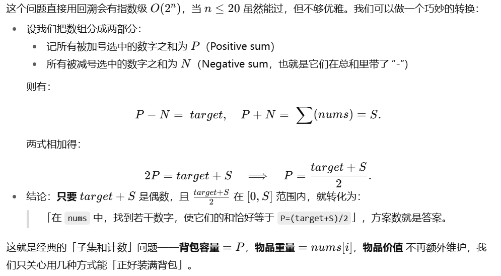
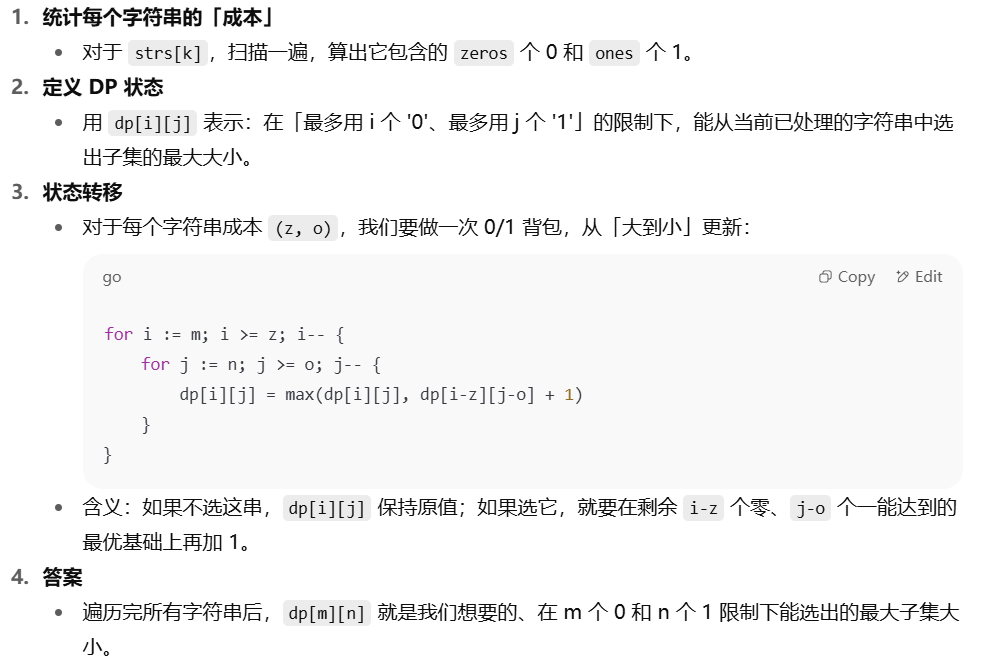
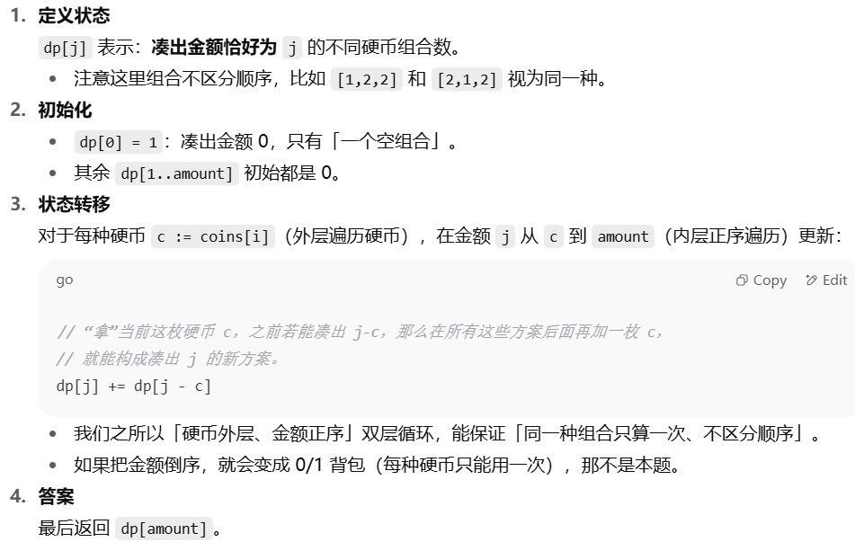
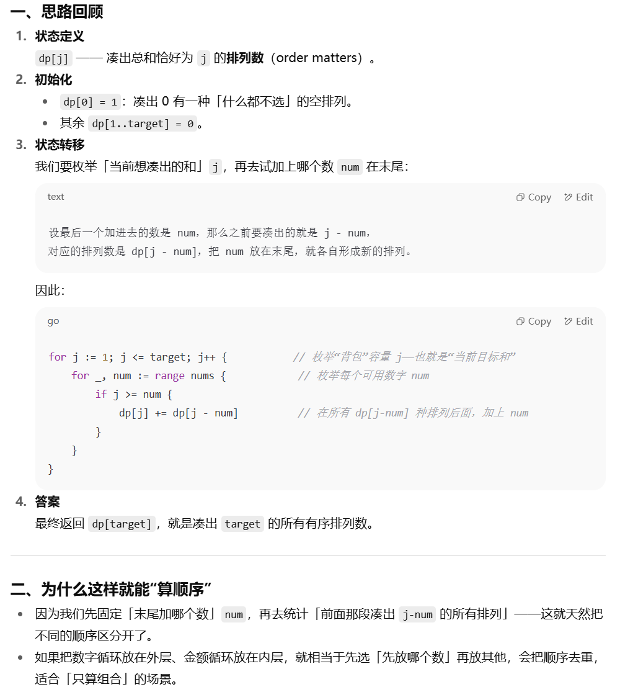

### 509. 斐波那契数
#### 题目：https://leetcode.cn/problems/fibonacci-number/description/

[我的解答](https://github.com/EthanQC/my-learning-record/blob/main/data-structure-and-algorithm/problems-record/dynamic-programming/509-fibonacci-number.md)

非常经典的动态规划的入门题，迭代就行，用两个变量，题目也把递推公式给出来了，动态规划的思路就是：最优子结构（递推式、多个规模更小的问题）-记忆化存储-状态转移

### 70. 爬楼梯
#### 题目：https://leetcode.cn/problems/climbing-stairs/description/

[我的解答](https://github.com/EthanQC/my-learning-record/blob/main/data-structure-and-algorithm/problems-record/dynamic-programming/70-climbing-stairs.md)

这道题就是斐波那契数列，最基本的想法就是找规律，见过就行，详细一点的思路推导就是如果要爬到第 `i` 阶，最后一步要么是从 `i−1` 阶跨 `1` 阶上来，要么是从 `i−2` 阶跨 `2` 阶上来

### 746. 使用最小花费爬楼梯
#### 题目：https://leetcode.cn/problems/min-cost-climbing-stairs/description/

[我的解答](https://github.com/EthanQC/my-learning-record/blob/main/data-structure-and-algorithm/problems-record/dynamic-programming/746-min-cost-climbing-stairs.md)

这道题也是一样的，还是斐波那契数列，但就是要加上一个花费，需要取最小，本质并不难

### 62. 不同路径
#### 题目：https://leetcode.cn/problems/unique-paths/description/

[我的解答](https://github.com/EthanQC/my-learning-record/blob/main/data-structure-and-algorithm/problems-record/dynamic-programming/62-unique-paths.md)

这道题是我们第一次接触二维 dp，嗯还是以学方法为主就好，是要用一个二维数组，不要忘记对第一行和第一列都进行初始化，然后直接从第二行第二列的元素开始

### 63. 不同路径 II
#### 题目：https://leetcode.cn/problems/unique-paths-ii/description/

[我的解答](https://github.com/EthanQC/my-learning-record/blob/main/data-structure-and-algorithm/problems-record/dynamic-programming/63-unique-paths-ii.md)

这道题跟上一题的思路是完全一样的，也是二维 dp，但要注意初始化的方式有略微的改变，以及如何分别计算二维数组行和列的长度也要熟悉

### 343. 整数拆分
#### 题目：https://leetcode.cn/problems/integer-break/description/

[我的解答](https://github.com/EthanQC/my-learning-record/blob/main/data-structure-and-algorithm/problems-record/dynamic-programming/343-integer-break.md)

定义 `dp[n]` 是把整数 `n` 拆成至少两个正整数后所能得到的最大乘积，当我们定义 `i` 从 `2` 开始遍历到 `n` 时，变量 `j` 就代表我们在 `1` 到 `i` 之间切分的一刀，第一块就是 `j` 本身，第二块就是我们拆分出来的子问题，我们可以让它不继续切分，也可以继续切分，继续切的话得到的最优值就刚好是提前算过的 `dp [i - j]`，然后我们再取最大值就可以解决这道题了

### 96. 不同的二叉搜索树
#### 题目：https://leetcode.cn/problems/unique-binary-search-trees/description/

[我的解答](https://github.com/EthanQC/my-learning-record/blob/main/data-structure-and-algorithm/problems-record/dynamic-programming/96-unique-binary-search-trees.md)

定义动态规划数组 `dp[i]` 是恰好能组成的不同二叉搜索树的种数，在 `1` 到 `i` 中选定某个节点 `j` 为根，`1 <= j <= i`，所以根左边有 `j - 1` 个节点，根右边有 `k - i` 个节点，又因为左右子树的形态是独立的（在选定 `i` 时就已经确保了左子树的所有值小于根，右子树的所有值大于根），所以就是他们俩乘起来 `dp[j - 1] * dp[i - j]`，再累加即可

### 416. 分割等和子集
#### 题目：https://leetcode.cn/problems/partition-equal-subset-sum/description/

[我的解答](https://github.com/EthanQC/my-learning-record/blob/main/data-structure-and-algorithm/problems-record/dynamic-programming/416-partition-equal-subset-sum.md)

是第一次接触背包问题，这是一个 **0/1 背包问题**，即元素不能重复用，所以在内层循环我们需要从大到小遍历，否则就会重复用到刚更新过的动态规划数组

`dp[j]` 表示是否能凑出和 `j`，如果之前能凑出 `j-num`，那么加上当前这个 `num` 就能凑出 `j`

先把数组和求出来然后除 `2` 得到目标值，再对目标值动态规划，如果目标值是奇数则直接返回 `false`

### 1049. 最后一块石头的重量 II
#### 题目：https://leetcode.cn/problems/last-stone-weight-ii/description/

[我的解答](https://github.com/EthanQC/my-learning-record/blob/main/data-structure-and-algorithm/problems-record/dynamic-programming/1049-last-stone-weight-ii.md)

这道题其实跟上一题差不多，也是分成两堆和最接近的子集，所以前面的操作都说一样的，只是最后在返回值的时候要找一下最接近 `cap` 的可达 `j`，然后返回的是两个子集的差值

### 494. 目标和
#### 题目：https://leetcode.cn/problems/target-sum/description/

[我的解答](https://github.com/EthanQC/my-learning-record/blob/main/data-structure-and-algorithm/problems-record/dynamic-programming/494-target-sum.md)

这道题也是差不多，都是子集和的 0/1 背包计数问题，处理方式也大差不差

### 474. 一和零
#### 题目：https://leetcode.cn/problems/ones-and-zeroes/description/

[我的解答](https://github.com/EthanQC/my-learning-record/blob/main/data-structure-and-algorithm/problems-record/dynamic-programming/474-ones-and-zeroes.md)

这道题挺难的，是二维 dp 的 0/1 背包问题，比较抽象，以学思路为主

### 518. 零钱兑换 II
#### 题目：https://leetcode.cn/problems/coin-change-ii/description/

[我的解答](https://github.com/EthanQC/my-learning-record/blob/main/data-structure-and-algorithm/problems-record/dynamic-programming/518-coin-change-ii.md)

本题是我们第一次接触完全背包（元素可以重复利用），并不算很难，甚至跟前面的动态规划不涉及背包时的问题的思路有点像，只是要正序遍历了，学会思路即可

### 377. 组合总和 Ⅳ
#### 题目：https://leetcode.cn/problems/combination-sum-iv/description/

[我的解答](https://github.com/EthanQC/my-learning-record/blob/main/data-structure-and-algorithm/problems-record/dynamic-programming/377-combination-sum-iv.md)

这道题跟上一题非常像，就是要算顺序了而已，相当于上一题是组合，这一题是排列，并不难

### 322. 零钱兑换
#### 题目：https://leetcode.cn/problems/coin-change/

[我的解答](https://github.com/EthanQC/my-learning-record/blob/main/data-structure-and-algorithm/problems-record/dynamic-programming/322-coin-change.md)

这道题跟前面两题还是有点区别的，遍历方式跟 518 是一样的，也是 `j` 在 `c` 到 `amount` 之间遍历，但初始化时要先将 `dp` 的所有值（除了 0）初始化为一个较大的值（一般为 `amount + 1`），这样方便我们后面取最小，如果凑出了 `dp[j - c]`，那再 `+1` 就是 `dp[j]`，要学会方法

### 279. 完全平方数
#### 题目：https://leetcode.cn/problems/perfect-squares/description/

[我的解答](https://github.com/EthanQC/my-learning-record/blob/main/data-structure-and-algorithm/problems-record/dynamic-programming/279-perfect-squares.md)

这道题也是完全背包，其实已经入门了，想到 `i` 来遍历，`j` 在 `i` 和 `n` 之间之后，就要进一步想到 `j * j` 是最后放进去的数，所以对应的就是 `dp[i - j * j]`，然后再加上这次的 `1` 就是要更新的 `dp` 值，动态规划相关问题的难点就在于找递推式，主要是要通过建模，大胆假设就肯定能推出来

### 279. 完全平方数
#### 题目：https://leetcode.cn/problems/perfect-squares/description/

[我的解答](https://github.com/EthanQC/my-learning-record/blob/main/data-structure-and-algorithm/problems-record/dynamic-programming/279-perfect-squares.md)

